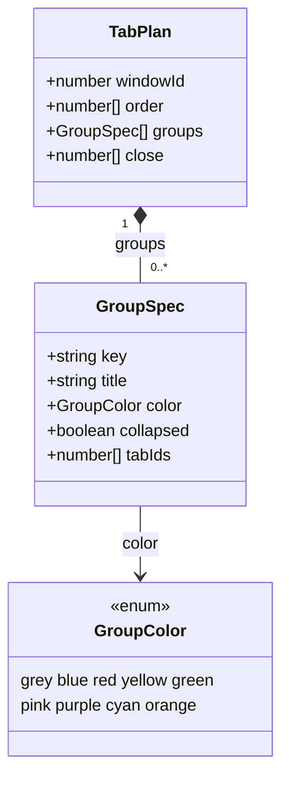
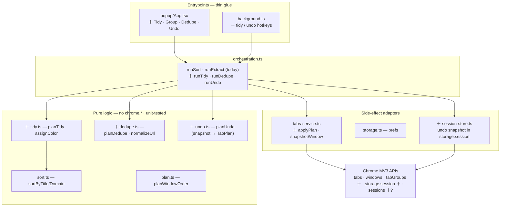
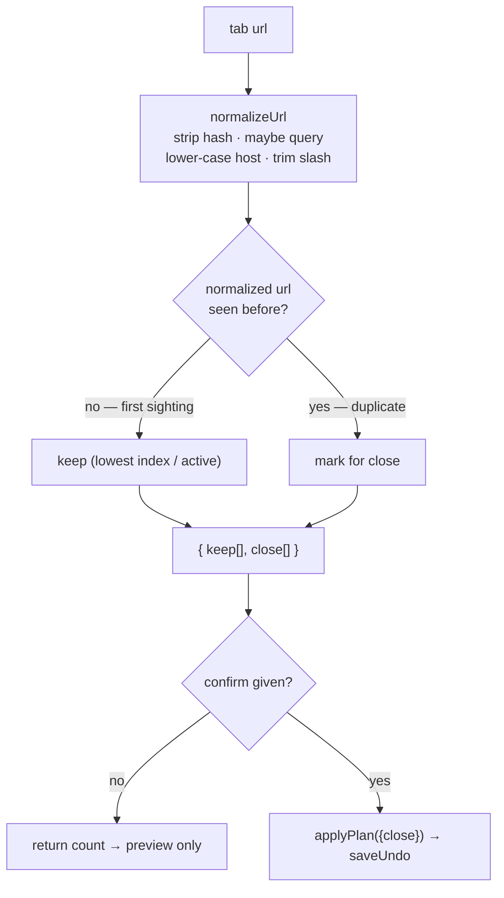
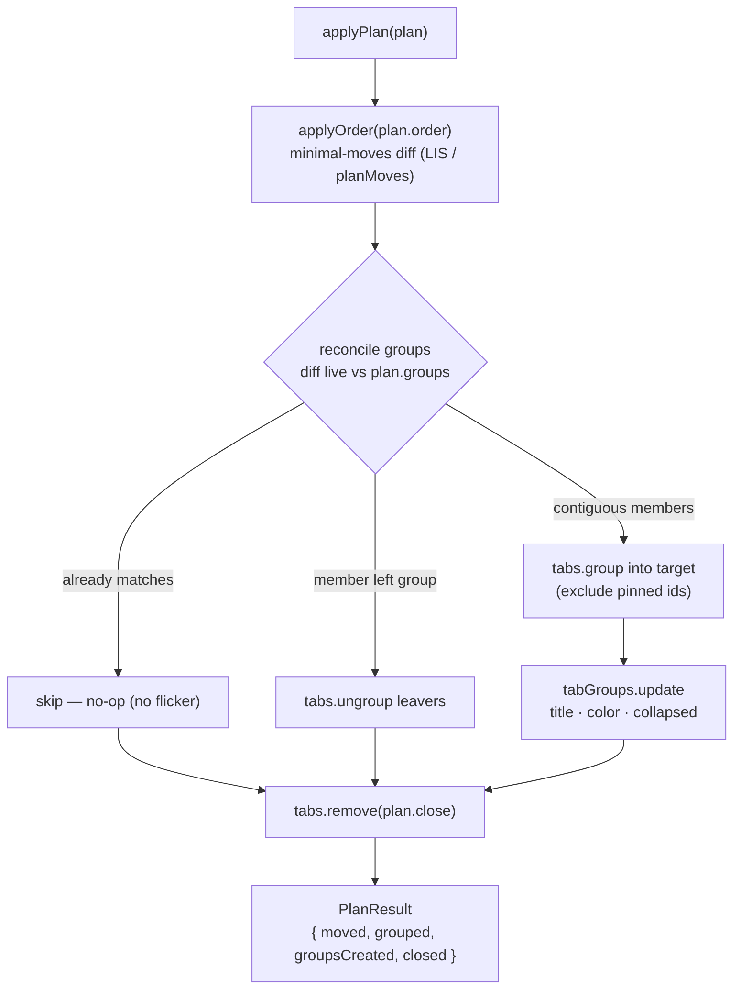
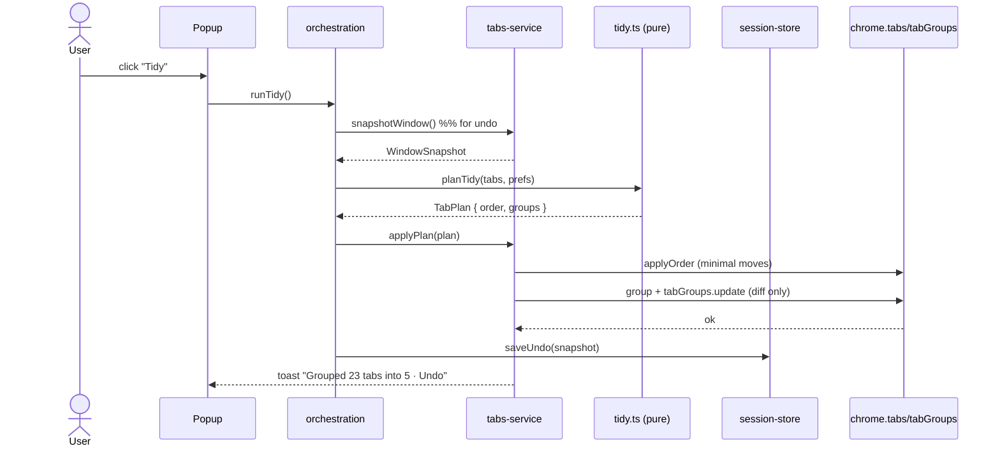
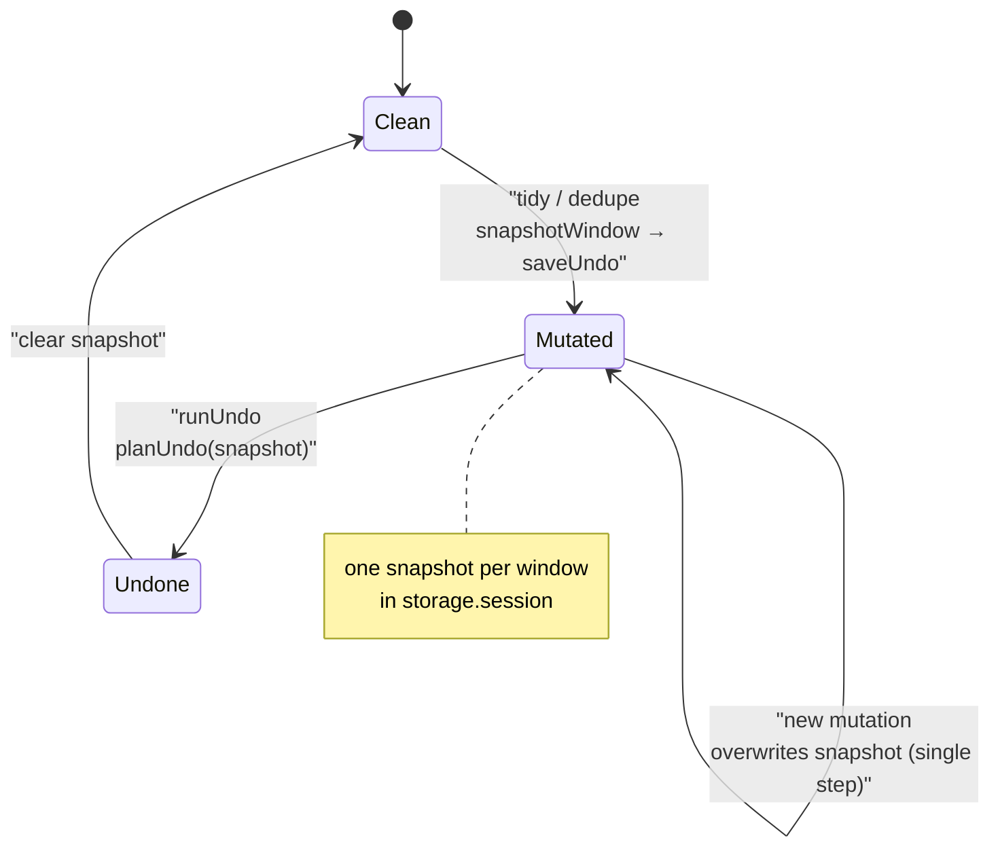

# Layer 1 — Tidy, Tab Groups & Undo (implementation spec)

- **Date:** 2026-06-21
- **Status:** Shipped v1 (2026-07-10) — see [`docs/adr/0002-tabplan-realize.md`](../adr/0002-tabplan-realize.md). Proposed types below are the *original design*; where the shipped code deviates (realize order, `TabPlan.ungroup`, undo's save-not-clear, `windowId` omission), the ADR is authoritative.
- **Parent vision:** [`2026-06-21-tab-intelligence-vision.md`](2026-06-21-tab-intelligence-vision.md) — this is its **Layer 1**.
- **PRD index / roadmap:** [`README.md`](README.md) — the dependency-ordered map of Layer 1 + all six downstream surfaces, plus the fact-check [Verification log](README.md#verification-log).
- **Builds on:** the shipped MVP ([`../superpowers/specs/2026-06-18-tab-sorter-extension-design.md`](../superpowers/specs/2026-06-18-tab-sorter-extension-design.md)) and the domain glossary ([`../../CONTEXT.md`](../../CONTEXT.md)).
- **Verify-before-build flags:** ⚠️ marks the 3 channel/version-dependent facts an implementer should confirm against the live `chrome.*` contract first.

---

## 1. Goal

Turn the one-shot **sorter** into a one-key **organizer**, entirely locally — no network, no AI, no new privacy surface beyond one permission. Ship three things on top of the existing sort:

1. **Group** — native `chrome.tabGroups`: collapsible, colored, domain-named groups.
2. **Tidy** — one verb = sort + group (+ collapse noise), fully **undoable**.
3. **Undo** + **Dedupe** — a universal undo snapshot, and a *separate, confirmed* duplicate-closer.

This is the prerequisite for every later surface (CLI, MCP, AI): it widens the seam from `number[]` to **`TabPlan`** *once*, so those surfaces become thin producers later.

---

## 2. Locked decisions

| # | Decision | Choice | Rationale |
|---|----------|--------|-----------|
| 1 | Seam shape | Widen `number[]` → **`TabPlan`** (order + groups + close) | One generalization unlocks CLI/MCP/AI as producers. `runSort` becomes the degenerate single-verb case — backward compatible. |
| 2 | Tidy is **non-destructive** | sort + group only; never closes a tab | Fully undoable, safe to bind to a hotkey. Closing lives in a separate confirmed verb. |
| 3 | Respect the user's own groups | Tidy only touches **ungrouped, unpinned** tabs by default | Never reshuffles a group the human hand-built. Opt-in "regroup everything." |
| 4 | Pinned stay out of groups | Groups contain **unpinned ids only**, and the adapter must **exclude pinned ids from `tabs.group()`** | ✅ fact-checked: Chrome does **not refuse** pinned tabs — `tabs.group()` *silently unpins* them, then groups them ([chromium #40639773](https://issues.chromium.org/issues/40639773)). So passing a pinned id would drop its pinned state. Excluding pinned ids from group calls is what preserves both pinned state and the pinned-front invariant. |
| 5 | Min group size | Default **2** (singletons stay ungrouped) | A group of one is just noise. |
| 6 | Undo depth | **Single step**, per window, stored in `chrome.storage.session` | Covers "oops"; survives a worker restart within the session; no quota cost. |
| 7 | Dedupe is confirmed | Preview count → explicit confirm; undo reopens by URL (best-effort) | Closing is the one near-irreversible op; never silent. |
| 8 | Scope | **Current window only** (unchanged from MVP decision #3) | Cross-window is a later layer. |
| 9 | New permission | **`tabGroups`** only (optionally `sessions` for better dedupe-undo) | Stage permissions; justify each. |

---

## 3. The `TabPlan` IR (proposed — `lib/types.ts`)

A clean **superset** of today's `number[]` window order. `runSort` produces a `TabPlan` with `order` set and `groups`/`close` empty.

```ts
// 9 values Chrome accepts for chrome.tabGroups color  ⚠️ confirm the exact union
type GroupColor =
  | "grey" | "blue" | "red" | "yellow" | "green"
  | "pink" | "purple" | "cyan" | "orange";

interface GroupSpec {
  key: string;        // stable plan-local identity (the domain, for tidy)
  title: string;      // group label shown in the strip
  color: GroupColor;
  collapsed: boolean;
  tabIds: number[];   // desired order WITHIN the group; appears contiguously in `order`
}

interface TabPlan {
  windowId: number;   // Layer 1: a single window
  order: number[];    // full desired order of EVERY tab id, pinned-first (today's seam, widened)
  groups: GroupSpec[];// unpinned-only; every member id also appears in `order`, contiguously
  close: number[];    // ids to remove (dedupe); [] for tidy
}
```



*The `TabPlan` IR: one window order plus zero-or-more `GroupSpec`s, each carrying a contiguous slice of `order` and a palette color.*

**Invariants the pure layer guarantees** (the test surface):
- `order` is a permutation of the live tab ids **minus** `close`.
- Pinned ids form a contiguous prefix of `order` (the never-interleave construction, generalized).
- Each `GroupSpec.tabIds` is a contiguous slice of `order`, and contains no pinned ids.
- `groups` partition only the *grouped* unpinned ids; ungrouped unpinned ids sit after pinned and may interleave between groups only as whole singletons.

---

## 4. Architecture (where each piece lands)

Keeps the MVP's discipline: **pure planning core → one side-effect adapter → thin glue.** New boxes marked **＋**.



### Pure additions (testable on plain arrays — the `plan.test.ts` model)
- **`tidy.ts`**
  - `planTidy(tabs: TabLite[], prefs: TidyPrefs): TabPlan` — split pinned/unpinned; for ungrouped unpinned tabs, bucket by `getDomain`; drop buckets below `minGroupSize` (stay ungrouped); sort within each bucket by title (reuse `sortByTitle`); order buckets (alpha or size-desc per pref); flatten to `order` keeping pinned-first and group members contiguous; assign `collapsed` per pref.
  - `assignColor(domain: string): GroupColor` — deterministic hash → 9-color palette. Pure ⇒ a "stable + well-distributed" unit test.
- **`dedupe.ts`**
  - `normalizeUrl(url, opts): string` — strip hash and (optionally) query; lower-case host; drop trailing slash. Pref-driven.
  - `planDedupe(tabs, opts): { keep: number[]; close: number[] }` — group by normalized URL; keep the lowest-index (or active) tab, mark the rest `close`. Pure ⇒ exhaustively testable.



*Dedupe decision flow: normalize each URL, keep the first sighting and mark the rest, then gate the actual close behind an explicit confirm.*
- **`undo.ts`**
  - `planUndo(snapshot: WindowSnapshot, current: TabLite[]): TabPlan` — produce the plan that restores order + group membership/metadata; ids that vanished are dropped; ids in the snapshot that are *missing now* (closed by dedupe) become `reopen` hints (URL list) the adapter best-effort re-creates.

### Adapter additions (the only files touching `chrome.*`)
- **`tabs-service.ts`**
  - `snapshotWindow(windowId): Promise<WindowSnapshot>` — capture `{ tabId, index, pinned, groupId }[]` + per-group `{ title, color, collapsed }` + each tab's URL (for reopen). Taken **before** any mutation.
  - `applyPlan(plan): Promise<PlanResult>` — the realize layer, in order:
    1. `applyOrder(plan.order)` — **reuse today's minimal-moves diff** (LIS / `planMoves`), immune to a stale pinned boundary. Group members are now contiguous.
    2. **Reconcile groups** — diff live groups vs `plan.groups`: ungroup tabs leaving a group, `tabs.group` contiguous members into the target group, `tabGroups.update` title/color/collapsed. Skip groups already matching (a minimal-diff for groups, mirroring `planMoves`' philosophy — don't re-create what's already right). ⚠️ confirm `tabs.group` preserves member order.
    3. `tabs.remove(plan.close)`.
    Returns `{ moved, grouped, groupsCreated, closed }`.



*The realize layer runs strictly in order — reorder first (so members sit contiguously), then a minimal group diff, then close — and skips any group already correct.*
- **`session-store.ts`** — `saveUndo(windowId, snapshot)` / `loadUndo(windowId)` over `chrome.storage.session` (in-memory, per-session, no quota, no extra permission).

### Orchestration additions (`orchestration.ts`)
- `runTidy()` → snapshot → `planTidy` → `applyPlan` → `saveUndo`; returns counts.
- `runDedupe({ confirm })` → `planDedupe`; if `confirm` not yet given, return the count for a preview; else snapshot → `applyPlan({close})` → `saveUndo`.
- `runUndo()` → `loadUndo` → `planUndo(snapshot, currentTabs)` → `applyPlan` (re-creating closed tabs by URL). Clears the snapshot after.

---

## 5. Data flow — `tidy`



Undo reverses it: `planUndo` rebuilds the snapshot's order + groups; a popup "Undo" pill (and a hotkey) trigger `runUndo()`.



*The undo state machine: a single-step snapshot is captured on every mutation, consumed by `runUndo`, then cleared — a fresh mutation overwrites the prior snapshot.*

---

## 6. UI & commands delta

**Popup** (Soft Editorial tokens unchanged):
- Primary **"Tidy this window"** (sort + group + collapse-noise).
- Secondary row: **"Group by domain"**, existing **A→Z** / **By domain** sort, **"Find duplicates (N)"** → confirm → close.
- An **Undo** pill that appears for ~10s after any mutating action (and persists as a button while a snapshot exists).

**Options** (new `TidyPrefs` on `Prefs`):
- `collapseAfterTidy: boolean` (default false), `minGroupSize: number` (default 2), `groupOrder: "alpha" | "sizeDesc"`, `regroupExisting: boolean` (default false), dedupe `ignoreQuery` / `ignoreHash` (default ignoreHash true, ignoreQuery false).

**Background / manifest:**
- New commands: `tidy` (suggested `Alt+Shift+Space`), `undo` (suggested `Alt+Shift+Z`). ⚠️ confirm these don't collide with OS/Chrome defaults.
- Manifest `permissions += ["tabGroups"]` (and `"sessions"` only if we implement closed-tab restore via `sessions.restore` instead of re-create-by-URL).

---

## 7. Edge cases

| Case | Handling |
|------|----------|
| Pinned tabs | Never grouped; stay a contiguous prefix. The adapter must **exclude pinned ids from `tabs.group()`** — Chrome auto-unpins (not refuses) any pinned id passed to grouping, which would silently drop pinned state. |
| Tab already in a user-made group | Left untouched unless `regroupExisting`. Tidy only claims **ungrouped** tabs by default. |
| Single-tab domain | Stays ungrouped (`minGroupSize`). |
| Many domains > 9 colors | Hash collisions accepted; title disambiguates. |
| Tab closed mid-tidy | `applyPlan` re-queries a fresh snapshot (reuse `applyOrder`'s stale-id drop). |
| Undo after closing tabs | Best-effort re-create by URL (loses scroll/history) — or `sessions.restore` if that permission is taken. State the limitation in the toast. |
| Group already matches desired | Reconciler is a no-op for it (no flicker), mirroring `planMoves`. |
| `chrome://` / `file://` / ext pages | `getDomain` already buckets as `(scheme)`; groupable like any domain. |

---

## 8. Testing (matches the repo's pure-core + fake-browser pattern)

- **Pure, fixture arrays (high-value, cheap):** `planTidy` (pinned-first, contiguity, min-size, ordering), `assignColor` (stable + distributed), `normalizeUrl` / `planDedupe` (keep-rule, normalization), `planUndo` (restores order+groups, drops vanished, emits reopen hints).
- **Invariant regression guards** (the `plan.test.ts` spirit): *no pinned id ever lands in a group*; *every `GroupSpec.tabIds` is a contiguous slice of `order`*; property-test over random windows.
- **Adapter** (`@webext-core/fake-browser`): `applyPlan` issues minimal moves + minimal group ops; reconciler skips already-correct groups; `snapshotWindow`/`session-store` round-trip.
- **Manual E2E checklist:** load unpacked, tidy a messy window, undo, dedupe-with-confirm, undo dedupe.

---

## 9. Open questions

1. **Closed-tab undo:** re-create-by-URL (no new permission) vs `chrome.sessions.restore` (adds `sessions`, restores history/scroll)? Recommend start with re-create-by-URL; add `sessions` only if users miss history.
2. **Group ordering default:** alpha (predictable) vs size-desc (biggest clusters first)? Recommend alpha to match existing sort semantics.
3. **Should `tidy` collapse groups by default?** Leaning no (collapsing hides tabs the user just organized); expose as a pref.
4. **`runSort` migration:** refactor it to emit a `TabPlan` through `applyPlan` now, or keep `applyOrder` and add `applyPlan` alongside? Recommend the former so there's one realize path — but it's the one change that touches tested code, so do it test-first.

---

## 10. Why this is the right first step

- **Pure local value, zero new privacy surface** beyond `tabGroups` — keeps the MVP's review-friendly posture.
- **Widens the seam exactly once.** After this, `tabctl`, the MCP server, and the AI command bar are *producers of `TabPlan`*, not rewrites.
- **`tidy` + undo is a flagship feature on its own** — the one-key "make my window make sense" button, safely reversible.
