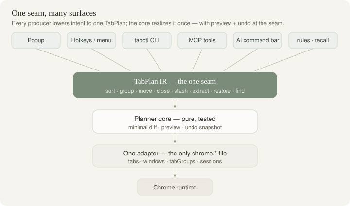
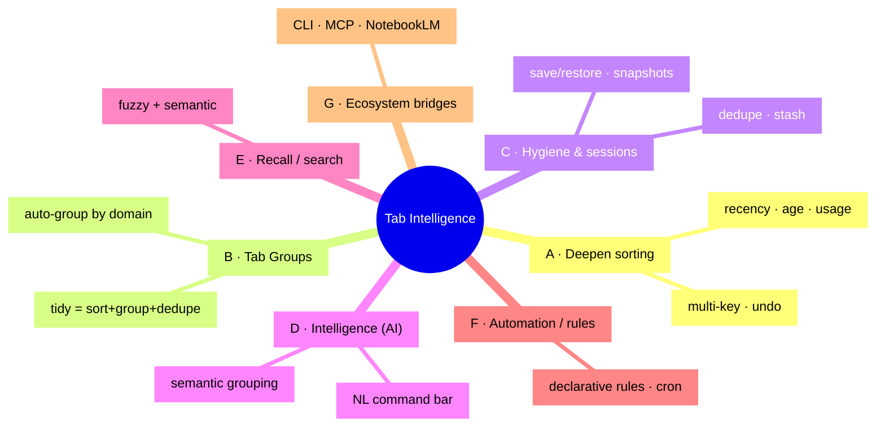
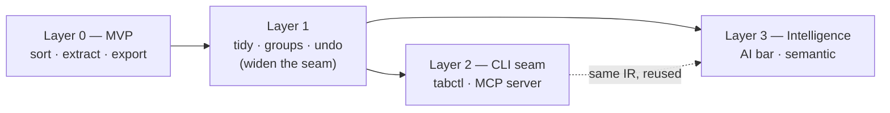

# Tab Sorter → Tab Intelligence — Vision & Forward PRD

- **Date:** 2026-06-21
- **Status:** Vision / exploratory PRD. No code committed against it yet. This is a *map of the possible*, not an approved build.
- **Relationship to existing docs:** Extends [`docs/superpowers/specs/2026-06-18-tab-sorter-extension-design.md`](../superpowers/specs/2026-06-18-tab-sorter-extension-design.md) (the shipped MVP) and answers its own **open question #12**: _"Is move-to-new-window the right primitive vs native Tab Groups?"_ — the answer here is "both, plus a third surface: a command layer."
- **Audience:** future me / a future agent picking up the project.
- **PRD index / roadmap:** [`README.md`](README.md) — navigable map of this vision + Layer 1 + the six build-ready surface specs (`tabctl` CLI, MCP server, AI command bar, sessions/time-travel, rules engine, recall/bridges), with a dependency-ordered roadmap and a fact-check [Verification log](README.md#verification-log) (127 API claims checked; 18 refuted, 4 uncertain).

---

## 0. One-paragraph thesis

The tab strip is not a list to alphabetize — it is the user's **working memory**, the surface where attention lives. "Sort tabs A→Z" is the smallest possible expression of a much larger capability: **declaratively rearranging your attention**. If we widen the one architectural seam the MVP already has — the bare `number[]` window order between the pure planner and the side-effect adapter — into a richer **TabPlan IR**, then *every* new way of driving the browser (a CLI, an MCP tool an agent calls, a natural-language command bar, a nightly cron job) becomes **just another producer of the same plan**. One deep core, many thin mouths. That is how a tab *sorter* becomes a **command layer for Chrome**.

---

## 1. Reframe: from "sorter" to "command layer"

| | Today (v0) | North star |
|---|---|---|
| **Unit of work** | reorder current window | arrange tabs / groups / windows / sessions |
| **Who drives it** | a human clicking the popup | human, CLI, agent, schedule, rule |
| **Verb set** | sort, extract, export | sort, **group**, move, close, **stash**, **dedupe**, **restore**, **find** |
| **Intelligence** | none (deterministic) | optional planner: heuristic → on-device AI → cloud AI |
| **Mental model** | a button | a **language** for talking about tabs |

The user's stated aim — _"help me more conveniently use Google Chrome"_ — is an *attention-management* aim. Sorting is one move in that game. The others (grouping, recall, hygiene, sessions, automation) are worth at least as much.

---

## 2. The unifying idea — one seam, many surfaces

The MVP's `CONTEXT.md` already names the key seam:

> _"The seam between pure planning and the side-effect adapter is this bare `number[]`, anchored at index 0."_

That `number[]` is secretly an **intermediate representation (IR)**: a declarative statement of *desired end state* that the adapter realizes with a **minimal diff** (the LIS-based `planMoves`). The whole vision is one move:

> **Widen the seam from `number[]` (one window's order) to a `TabPlan` (desired arrangement across windows/groups/sessions + a verb list). Then bolt new producers onto that seam.**



*Every producer (popup, hotkeys, `tabctl`, MCP, AI bar, rules, recall) emits the same `TabPlan`; the pure core realizes it once, with preview + undo at the seam.*

Why this matters:

1. **AI is not a special code path.** The LLM's only job is *natural language → TabPlan*. It never touches `chrome.*`. Same for the CLI, same for the agent. They all emit the same IR, so they all inherit the same preview, the same minimal diff, the same undo.
2. **The deep-module discipline survives growth.** The pure planning core stays unit-testable on plain arrays (today's `plan.test.ts` / `tab-moves.test.ts` model); only the adapter widens.
3. **Safety is centralized.** "Never silently move 80 tabs" is enforced once, at the seam (preview + undo), not re-implemented per surface.

This is the spine. Everything below is a feature hanging off it.

---

## 3. Capability map (the divergent brainstorm)

Grouped by pillar. Not all of this ships — this is the option space.



*The option space as seven pillars; Layer 1 ships B + C first, then the surfaces light up D–G.*

### Pillar A — Deepen sorting itself
- **More sort keys:** last-accessed (recency), age opened, **memory/CPU** (heuristic via `tabs.discard` candidacy; true stats need dev-channel `processes`), audible/media-playing, load state, duplicate-rank, URL path depth, reading-time estimate, tab-group membership.
- **Composable multi-key sort:** primary domain → secondary recency. A small comparator pipeline rather than two hard-coded modes.
- **Reversible / undo.** Snapshot the pre-sort order; one keystroke restores it. *(Biggest convenience-per-line-of-code win in the whole doc.)*
- **Cross-window sort & window merge/split.**

### Pillar B — Tab Groups (the most under-used lever) ⭐
The MVP deliberately skipped `chrome.tabGroups`. It is the single biggest jump in perceived power. "Sorting" becomes "**organizing**": colored, named, collapsible groups.
- **Auto-group by domain**, deterministic color assignment, collapse-all-but-active to kill clutter.
- **`tidy` = sort + group + dedupe** in one command — the flagship one-click verb.
- Foundation for AI-named groups (Pillar D).

### Pillar C — Hygiene & sessions
- **Dedupe:** exact + near-dup (same path, different query/anchor); "keep newest, close rest."
- **Stash** (OneTab-style): collapse N tabs to a stored list, reclaim memory (`tabs.discard`), restore later.
- **Named sessions:** save/restore a whole window+groups+order. `chrome.sessions` for recently-closed recall.
- **Auto-snapshots:** periodic, so "give me my tabs from this morning" is real (time-travel).

### Pillar D — Intelligence (AI)
- **Semantic clustering → groups:** send `{title, url}` (cheap, low-risk) to a model; get named clusters; create tab groups. "40 tabs → I see 5 projects."
- **Natural-language command bar:** _"close everything except work," "group the AI papers," "move youtube to a new window," "find the tab about the postgres index."_ LLM compiles NL → TabPlan IR.
- **Window/session summarize:** "what was I doing across these 30 tabs?" → paragraph + next actions.
- **Stale / bankruptcy assistant:** at 100+ tabs, triage into keep / stash / close *with reasons*, preview-first.
- **Privacy posture is the product, not a footnote** — see §6.

### Pillar E — Recall / search
- **Fuzzy + semantic tab search** across all windows (better than Chrome's built-in tab search). Omnibox keyword `t ` and/or side-panel.
- Optional content indexing (consent-gated) for "the tab where I read about X."

### Pillar F — Automation / rules
- **Declarative rules file** (`~/.config/tabctl/rules.toml`, dotfile-friendly): `*.figma.com → group "Design", purple`; `idle > 3d → stash`; `> N youtube tabs → warn`.
- **Scheduled hygiene** via `chrome.alarms` and/or launchd/cron: nightly dedupe + group + session snapshot.

### Pillar G — Bridges to the rest of the user's stack (see §5)
CLI, MCP server, branch-linked sessions, export-to-NotebookLM/markdown.

---

## 4. Staged roadmap

Each layer is independently shippable and *earns the right* to the next by laying data foundations.



*Layer 0 shipped. Layer 1 widens the seam once; Layers 2 and 3 are independent producers of the same `TabPlan`, so whichever ships second is mostly wiring.*

### Layer 1 — "Organize, not just sort" (no network, no AI)
**→ Build-ready spec: [`2026-06-21-layer1-tidy-groups-undo.md`](2026-06-21-layer1-tidy-groups-undo.md).**
**Goal:** make the local tool genuinely more useful and lay the IR/data foundation.
- Generalize the seam: `number[]` → `TabPlan` (sort/group/move/close/stash/extract).
- **Tab Groups** (Pillar B): auto-group by domain; `tidy` verb.
- **Undo** (snapshot + restore) — the safety primitive every later layer reuses.
- **Dedupe** + **stash** (Pillar C).
- **Export-as-JSON / JSONL** — the machine-readable seam the CLI will consume (today's `buildUrlExport` already does Markdown/text; add structured).
- New permissions: `tabGroups`, `sessions`, `alarms` (each staged + justified).

### Layer 2 — "The CLI seam" (local, scriptable)
**Goal:** drive every Layer-1 verb from the terminal and from agents.
- **Native-messaging host + `tabctl` CLI** (§5.1).
- **MCP server** exposing the same verbs as tools (§5.2) — so Claude Code / Droid can organize live tabs.
- Unix-composable: `tabctl ls --json | rg … | tabctl close -`; `tabctl jump` piped through `fzf`.
- New permission: `nativeMessaging`.

### Layer 3 — "Intelligence" (optional, consent-gated)
**Goal:** natural-language and semantic organization, compiled down to Layer-1 verbs.
- **NL command bar** + **semantic grouping** (Pillar D), **on-device first** (§6).
- The LLM emits a TabPlan; the user sees a **preview**; nothing moves without confirmation; undo always available.
- Reuses Layer-2's MCP tools verbatim for the agent path — no second integration.

> **Sequencing rule:** Layer 1 is pure value with zero privacy/network cost and is the natural next sprint. Layers 2 and 3 are independent — either can come second. The CLI (Layer 2) is the most *novel* and most *on-brand* for this user; AI (Layer 3) is the most *demo-able*.

---

## 5. The three new surfaces, in detail

### 5.1 `tabctl` — a CLI for your tabs

**Transport.** An MV3 service worker is ephemeral and cannot host a long-lived socket. Two viable bridges:
- **Native messaging (recommended):** the extension declares `nativeMessaging`; a tiny local host binary (Bun/Rust) relays stdio ↔ extension. `tabctl` talks to the host. Canonical, no debug flags, survives worker sleep via wake-on-message.
- **CDP fallback:** a CLI can already list/move/close tabs over the DevTools Protocol if Chrome runs with `--remote-debugging-port`. No extension needed, but requires the debug flag and is a bigger security surface. Good as an *alternative* `tabctl` backend for power users, not the default.

**Shape (Unix-composable, tabs-as-stream):**
```
tabctl ls --json                       # every tab as a JSON line  → pipe to jq/rg/fzf
tabctl sort --by domain,recency        # multi-key sort
tabctl group --by domain               # native tab groups
tabctl tidy                            # sort + group + dedupe, one shot
tabctl extract 'github|docs'           # regex → new window (today's runExtract)
tabctl close --stale 7d --dry-run      # hygiene, preview by default
tabctl jump                            # fuzzy-pick a tab (fzf) and focus it  ← daily driver
tabctl save work && tabctl restore work
tabctl ls | rg youtube | tabctl close -    # compose with the user's existing Rust CLIs
```
**Why it lands for this user specifically:** terminal-native (Ghostty/Zsh), already lives in `rg`/`fd`/`fzf`/`jq`/`bun`. `tabctl jump | fzf` is a teleport-to-any-tab command that pays for the whole project on day one. Ships with shell completions + a man page (matches their dotfile discipline).

### 5.2 MCP server — tabs as agent-addressable objects ⭐

Given how much the user lives in Claude Code / MCP, the highest-leverage AI integration is **not** a bespoke NL parser inside the extension — it's an **MCP server** exposing the Layer-1 verbs as tools:
```
list_tabs · search_open_tabs · sort_tabs · group_tabs ·
close_tabs · extract_to_window · stash · save_session · restore_session
```
Then any agent already in the user's workflow can read and reshape **live** tabs as part of a larger task:
> _"Claude, group my open tabs by project, close anything I haven't touched in a week, and turn the 'research' group into a markdown reading list."_

This is the convergence point of the whole vision: **CLI + AI meet at the IR.** The agent doesn't need special browser code; it calls MCP tools that emit the same TabPlan the popup button does. (Same host process can serve both `tabctl` and MCP.)

### 5.3 AI command bar (in-extension)

For non-terminal moments: a single text box in the popup/side-panel. Type intent, get a **previewed plan**, confirm. LLM output is constrained to the TabPlan schema (structured output), so a hallucination becomes an invalid plan that's rejected, not a destructive action.

---

## 6. AI design & privacy posture (the adoption gate)

Privacy *is* the feature. Defaults, in order of trust:

1. **Heuristic, no model** (default for grouping/dedupe/stale): domain rules, recency, URL structure. Zero data leaves the device. Covers most value.
2. **On-device model** (default when AI is wanted): Chrome's built-in **Prompt API (Gemini Nano)** — free, private, offline. Great for classification/clustering/naming over titles+URLs. *(Availability is channel/hardware-dependent — treat as progressive enhancement, detect and fall back.)*
3. **Bring-your-own-key cloud** (opt-in, for the heavy lifts): Anthropic / OpenAI / Gemini. User supplies the key; we never proxy.

Hard rules:
- **Titles + URLs only by default.** Page *content* is never read without an explicit, per-action consent (and that needs `scripting`/host permissions — a separate, later, opt-in capability).
- **Preview before mutate, always.** Every AI plan is shown as a diff; nothing moves without confirmation.
- **Undo is universal.** Every mutating verb (AI or not) writes an undo snapshot.
- **No telemetry.** Consistent with the repo's "no secrets/PII" stance and the MVP's review-friendly posture.

---

## 7. Signature workflows (the "wow" scenarios)

1. **One-key tidy.** `Alt+Shift+Space` → tabs sorted, grouped by domain with sensible colors, duplicates closed. Undo with `Ctrl+Z`.
2. **Terminal teleport.** `tabctl jump` → fuzzy-find any tab across all windows in `fzf` → it focuses. Never alt-tab hunt again.
3. **Agent housekeeping.** "Claude, my browser is a mess — group by project and stash the dead ones." Claude calls the MCP tools, shows the plan, you approve.
4. **Branch-linked context.** `git checkout feature/x` triggers `tabctl restore feature/x` — your browser context follows your code context. (launchd/git-hook + `tabctl`.)
5. **Research → report.** Extract a window of research tabs → `tabctl export --json` → feed into a markdown vault / NotebookLM notebook for synthesis. (Bridges the user's existing NotebookLM/Lark/markdown tooling.)
6. **Nightly hygiene.** A scheduled job dedupes, groups, and snapshots a session every night, so mornings start clean and nothing is ever truly lost.

---

## 8. Constraints, risks, open questions

| Area | Reality | Implication |
|---|---|---|
| MV3 service worker | Ephemeral; no long-lived sockets | CLI needs native-messaging host or external daemon, not an in-worker server |
| Native messaging | Requires installing a host manifest + binary | A setup step; fine for a power user, a wall for mass-market. Document it well. |
| Permissions creep | `tabGroups`, `nativeMessaging`, `sessions`, `alarms`, later `scripting`/host | Each is a Web-Store-review + trust cost. **Stage them**; justify each; never request page content until Layer 3+. |
| On-device AI | Gemini Nano availability is channel/hardware-gated | Progressive enhancement: detect, else fall back to heuristic or BYO-key. |
| Cloud AI | Latency, cost, privacy | Opt-in, BYO-key, titles+URLs only. |
| Determinism vs AI | An LLM can propose moving 80 tabs wrongly | Preview + undo at the seam is non-negotiable. |
| Distribution | Power-user features (CLI/native host) may not pass easy Web-Store review | Possibly a "power" build (unpacked / self-distributed) alongside a clean Store build. |

**Open questions:**
- Is the MCP server worth shipping *before* the in-extension AI command bar? (For this user: likely yes.)
- Does `tabctl` standardize on native messaging, CDP, or support both backends?
- How much of "sessions" should be local vs `chrome.storage.sync` vs a file the CLI owns?

---

## 9. Non-goals (for now)

- Not a full session-manager/bookmark replacement; we complement, not replace.
- Not a cloud service. No accounts, no server we run, no telemetry.
- Not reading page content by default. Titles + URLs are the contract until explicitly widened.
- Not abandoning determinism: AI is an *optional planner over the same verbs*, never a parallel destructive path.

---

## 10. Smallest valuable next step

If only one thing happens next, do **Layer 1's `TabPlan` + Tab Groups + Undo**:
- It is pure local value (no privacy/network cost).
- It widens the seam exactly once, which is the prerequisite for *both* the CLI and the AI surfaces.
- `tidy` (sort + group + dedupe, with undo) is a flagship feature on its own.

After that, the fork is **CLI/MCP first (most novel, most on-brand)** vs **AI command bar first (most demo-able)** — and because both consume the same IR, whichever comes second is mostly wiring, not rework.
