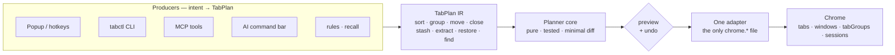
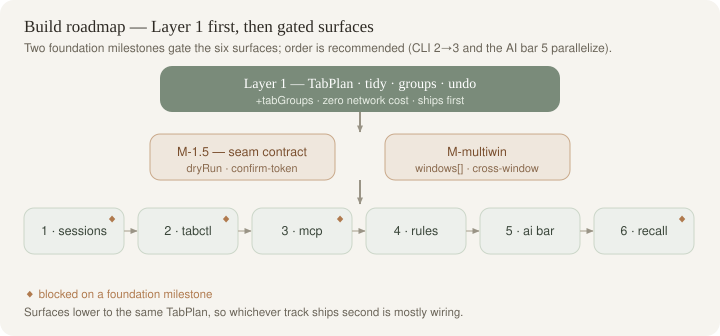
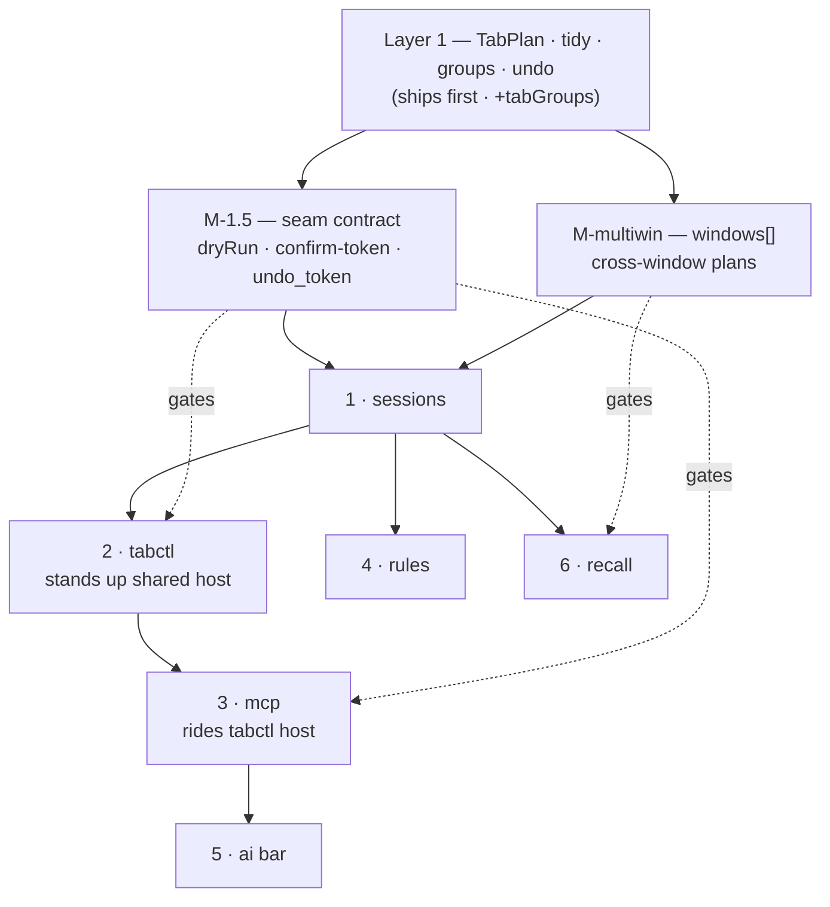

# Tab Sorter PRD Index — The Command Layer for Chrome

- **Date:** 2026-06-21
- **Status:** PRD index. Ties the vision + Layer 1 + six designed surfaces into one navigable map. No surface is approved-to-build beyond Layer 1; this index records what each surface needs, what blocks it, and where its factual claims stand.
- **Audience:** future me / a future agent picking up the project.

---

## 0. Thesis — one IR seam, every surface is a producer

The tab strip is the user's working memory. "Sort A→Z" is the smallest expression of a much larger capability: **declaratively rearranging attention**. The whole architecture rests on a single move the MVP already half-made — widening the bare `number[]` window order between the pure planner and the side-effect adapter into a richer **TabPlan IR**.

> **The seam is the product.** Widen `number[]` → `TabPlan` (desired arrangement across order/groups/close, plus a verb list) **once**, and every new way of driving the browser — a CLI, an MCP tool an agent calls, a natural-language bar, a nightly cron, a declarative rules file, a recall index — becomes **just another producer of the same plan**. One deep core, many thin mouths.

Three properties fall out of this seam and are non-negotiable across every surface:

1. **AI / CLI / agents are not special code paths.** Each producer's only job is *intent → TabPlan*. None touches `chrome.*`. They all inherit the same preview, the same minimal diff, the same undo.
2. **Deep-module discipline survives growth.** The pure planning core stays unit-testable on plain arrays; only the adapter widens.
3. **Safety is centralized.** "Never silently move 80 tabs" / "never silently close" is enforced once, at the seam (preview + undo), not re-implemented per surface.

Everything below hangs off this spine.

---

## 1. Document map

| Doc | What it is | Link |
|---|---|---|
| **Vision / Forward PRD** | The "map of the possible" — reframes sorter → command layer, names the seam, the seven pillars, the staged roadmap, and the privacy posture. | [`./2026-06-21-tab-intelligence-vision.md`](./2026-06-21-tab-intelligence-vision.md) |
| **Layer 1 — Tidy, Groups & Undo** | The chosen first step and the *only* build-ready foundation. Widens `number[]` → `TabPlan`; ships tidy, group-by-domain, dedupe, single-step undo. Every surface below depends on it. | [`./2026-06-21-layer1-tidy-groups-undo.md`](./2026-06-21-layer1-tidy-groups-undo.md) |

### The six surfaces (all pure TabPlan producers)

| Key | Surface | Link |
|---|---|---|
| `tabctl-cli` | tabctl — CLI + native-messaging host | [`./surfaces/2026-06-21-tabctl-cli.md`](./surfaces/2026-06-21-tabctl-cli.md) |
| `mcp-server` | MCP server — tabs as agent-addressable tools | [`./surfaces/2026-06-21-mcp-server.md`](./surfaces/2026-06-21-mcp-server.md) |
| `ai-command-bar` | AI command bar — natural language → TabPlan | [`./surfaces/2026-06-21-ai-command-bar.md`](./surfaces/2026-06-21-ai-command-bar.md) |
| `sessions-time-travel` | Sessions, Time-Travel & Branch-Linked Sessions | [`./surfaces/2026-06-21-sessions-time-travel.md`](./surfaces/2026-06-21-sessions-time-travel.md) |
| `rules-engine` | Declarative rules engine & scheduled hygiene | [`./surfaces/2026-06-21-rules-engine.md`](./surfaces/2026-06-21-rules-engine.md) |
| `recall-bridges` | Recall / Semantic Search & Ecosystem Bridges | [`./surfaces/2026-06-21-recall-bridges.md`](./surfaces/2026-06-21-recall-bridges.md) |

> **Cross-reference drift to fix:** the recall-bridges spec refers to two sibling files that do not exist on disk — `surfaces/2026-06-21-tabctl-mcp-bridge.md` and `surfaces/2026-06-21-ai-planner.md`. The real files are `2026-06-21-tabctl-cli.md` and `2026-06-21-ai-command-bar.md`. Those internal links must be repointed, and recall's "closing fact-check link" to this index's [Verification log](#verification-log) now resolves.

---

## 2. Capability matrix

Every surface is a *producer*; none touches `chrome.*` directly — they lower intent through Layer 1's `applyPlan` adapter, inheriting preview + minimal-diff + undo.

| Surface | New permissions added | Depends on (beyond Layer 1) | Privacy posture | Ship-effort |
|---|---|---|---|---|
| **tabctl-cli** | `nativeMessaging` | Layer-1 IR + `applyPlan`/snapshot; native-messaging host + relay daemon; **Layer-1.5 dry_run/confirm/undo-token contract** (gap C) | Titles + URLs leave the browser only to a same-user local host; no network. CDP fallback forfeits preview+undo and widens attack surface. | **High** — host install/relay/process-identity, stdio framing, full command grammar, cross-OS manifests. |
| **mcp-server** | (none new — **shares tabctl's** `nativeMessaging` host) | tabctl host (one host, two frontends); Layer-1.5 token contract; **multi-window IR widening** for `extract_to_window` / `restore_session{new_window}` (gap J) | Titles + URLs only; dry_run-by-default; destructive ops gate on one-shot confirm token. Same-user host trust boundary (gap G). | **Medium-High** — 10 tools over an existing host; main cost is the token/confirm + concurrency machinery, not transport. |
| **ai-command-bar** | `sidePanel`; `storage` (BYO key in `storage.local`); `host_permissions` for `api.anthropic.com` / `api.openai.com` / `generativelanguage.googleapis.com` (cloud BYO only) | Layer-1 `applyPlan`/preview/undo; on-device Prompt API (Gemini Nano) as progressive enhancement | On-device-first (nothing leaves device); titles + URLs only; BYO-key cloud never proxied; schema-constrained output + preview-before-mutate. | **Medium** — model routing + availability detection + golden NL→plan eval; no host, no native code. |
| **sessions-time-travel** | `sessions` (read-only, higher-fidelity reopen); `alarms` (auto-snapshots); `unlimitedStorage` (lift `storage.local` 10 MB cap) | Layer-1 IR + undo; **multi-window TabPlan widening** (gap J — its *default* `new_window` restore needs it); native host file-of-record + git post-checkout hook for branch-link | Local-only `storage.local` source of truth; titles + URLs; `chrome.sessions` read-only. | **Medium-High** — SessionDoc model, ring-buffer retention, branch-link hook, multi-window restore. |
| **rules-engine** | `alarms` (sweep trigger) | Layer-1 IR + undo; sessions surface for snapshot-before-destructive; shared host if CLI can push `rules.toml` | Titles + URLs + coarse tab signals only; never reads page content; dry-run defaults; local audit log. | **Medium** — TOML→JSON schema, three triggers, first-match-wins, destructive caps. |
| **recall-bridges** | `sidePanel`; `omnibox` (keyword `t`); optional runtime-gated `scripting` + host (content reading); optional `history`; `downloads` (artifact export) | Layer-1; new read-only **`find` verb** on TabPlan; IndexedDB for embedding index; bundled Transformers.js MiniLM (semantic opt-in) | Fuzzy+frecency by default (no content); semantic is on-device; page-content reading gated behind per-origin consent. | **Medium-High** — omnibox + side panel + embedding index + four bridges (JSON/Obsidian/NotebookLM/read-it-later). |

---

## 3. Dependency-ordered build roadmap

*Layer 1 → two foundation milestones → six surfaces; dotted edges mark a milestone gate. Solid edges are build-order dependencies.*

**Layer 1 ships first, always.** It is the only doc that is build-ready today, it carries zero net-new privacy/network cost (one permission: `tabGroups`), and it widens the seam exactly once — the prerequisite for *all six* surfaces. Nothing below should start until `TabPlan` + `applyPlan` + single-step undo exist.

Two cross-cutting *foundation milestones* surfaced by the completeness critic must be sequenced **between Layer 1 and the surfaces**, because multiple surfaces silently assume them:

- **M-1.5 — Seam contract widening (Layer-1.5).** Layer 1 §4 specs `applyPlan(plan): Promise<PlanResult>` with `PlanResult = {moved, grouped, groupsCreated, closed}` and a non-token undo pill. But tabctl, MCP, and sessions all assume `applyPlan(plan, {dryRun:true}) → PlanPreview` (with `confirm_token` + `expires_at`) and an `undo_token` in `PlanResult` — none of which Layer 1 defines. Add: a `dryRun` path returning `PlanPreview`, an extension-side **one-shot, time-boxed token store** that pins the exact id-set + a window-version, and `undo_token` in `PlanResult`. Until this lands, MCP decisions #4/#5 and tabctl decision #6 are **blocked-on**, not build-ready. (Critic gap C.)
- **M-multiwin — Multi-window TabPlan widening.** Layer 1 locks `TabPlan` to a single `windowId` (decision #8); order is a permutation within one window. But MCP `extract_to_window` and `restore_session{new_window}` (its *default, "safe"* mode), sessions' multi-window restore, recall's all-windows scope, and the AI bar's move/extract all need cross-window plans. Sequence `windows: WindowPlan[]` + cross-window moves + `reopen[]` semantics as an explicit prerequisite, and tag every op that needs it. Until it lands, constrain those ops to the `moveTabsToNewWindow` degenerate path and say so. (Critic gap J.)

Two more cross-surface concerns are **system-level specs**, not per-surface, and should be owned before the surfaces that touch them:

- **Undo model reconciliation** (gap A) — single-slot vs tokenized multi-producer undo. Pin in the Layer-1 spec.
- **Host lifecycle & provisioning** (gap F) + **client-authorization model** (gap G) — owned once, consumed by tabctl + MCP + sessions(branch hook) + rules(push).

### Recommended build order and rationale

| # | Surface | Why here / what it unblocks |
|---|---|---|
| 0 | **Layer 1** (foundation, not a surface) | The seam. Prerequisite for everything. Ship `TabPlan` + `applyPlan` + undo, **plus the M-1.5 token contract and the undo-model decision baked in** so downstream surfaces don't each re-invent confirm/undo. |
| 1 | **`sessions-time-travel`** | Build first among surfaces. It **owns the stash/session store-of-record** (gap D: stash must be a thin alias over the sessions store so MCP/rules/tabctl all see the same entries) and the **snapshot-before-destructive** primitive rules-engine defers to. It also forces **M-multiwin** early (its default restore is multi-window). Establishing the durable store and the cross-window IR here de-risks four downstream surfaces. Caveat: its `new_window` default restore is blocked-on M-multiwin; ship single-window restore first. |
| 2 | **`tabctl-cli`** | First terminal producer; **stands up the shared native-messaging host, relay daemon, and the host-lifecycle/provisioning system** (gap F) and the same-user client-auth model (gap G) that MCP then reuses. Most novel and most on-brand for this user. Blocked-on M-1.5 for its `undo <token>` / dry-run grammar. |
| 3 | **`mcp-server`** | Adds **zero new permissions** — rides tabctl's host (one host, two frontends). Cheapest high-leverage AI integration once the host + token contract exist. Blocked-on M-1.5 (confirm tokens) and partially on M-multiwin (`extract_to_window`). Must land the per-window lock / window-version etag (gap B) so two concurrent agents don't drift. |
| 4 | **`rules-engine`** | Needs Layer-1 + `alarms` + the sessions store (for stash target and snapshot-before-destructive). Independent of the host, so it can parallelize with #2/#3, but its `stash{into:...}` target and audit-log honesty depend on the sessions store-of-record (gap D) and signal-availability UX (gap H) being decided first. |
| 5 | **`ai-command-bar`** | Reuses Layer-1 preview/undo and, ideally, the MCP tool surface verbatim for the agent path — so it benefits from #3 landing first (no second integration). Self-contained otherwise (on-device-first; no host). Most demo-able; can slot earlier if a demo is the priority, since it shares no host with the CLI track. |
| 6 | **`recall-bridges`** | Adds a read-only `find` verb (smallest IR addition) but the **largest net-new permission surface** (`omnibox`, `sidePanel`, optional `scripting`/host, `downloads`) and a bundled embedding model. Ship last: it benefits from the cross-surface command/keyword budget (gap E) being fixed so it can cleanly own the single omnibox keyword `t`, and its bridges (NotebookLM/Obsidian) are additive polish, not foundation. |

> The CLI track (#2→#3) and the AI track (#5) are independent after Layer 1 + M-1.5; whichever ships second is mostly wiring because both consume the same IR. The ordering above optimizes for *de-risking the shared substrate* (store-of-record, host, tokens, multi-window) before the surfaces that lean on it.

---

## Verification log

Every factual claim in the six surface specs was fact-checked. Below is the honest ledger, grouped by surface. **Confirmed** claims are summarized as counts; every **REFUTED** and **UNCERTAIN** claim is listed individually with its correction and source, because shipping decisions hang on them. Several refutations recur across surfaces (native-messaging cannot wake an idle worker; Chrome auto-unpins rather than refusing pinned tabs in groups; `lastAccessed`/`tabGroups` *do* exist on modern Firefox) — these are systemic and called out as "Recurring corrections" at the end.

### tabctl-cli — 24 confirmed, 2 refuted, 0 uncertain

| Verdict | Claim | Correction + source |
|---|---|---|
| **REFUTED** | Receiving a native message can wake an idle MV3 service worker. | Native messaging only keeps an *already-running* worker alive; it cannot wake a dormant one. The extension must initiate `connectNative()` from a running worker; no event lets a host push into a terminated worker. **This invalidates the CLI's cold-worker wake strategy — the relay must rely on a documented wake source (`chrome.alarms`, ≥30s) or keep the worker held alive.** Source: developer.chrome.com/docs/extensions/develop/concepts/service-workers/lifecycle |
| **REFUTED** | Extension→host native messages may be up to 4 GB. | The 4 GB figure is the **Firefox/MDN** limit. Chrome's documented cap is **64 MiB** extension→host (and 1 MB host→extension). Source: developer.chrome.com/docs/extensions/develop/concepts/native-messaging |

Notable confirmations worth carrying into the build: the host manifest shape (`name`/`description`/`path`/`type:"stdio"`/`allowed_origins`), `allowed_origins` requiring the trailing slash and forbidding wildcards, host-name `[a-z0-9._]` rules (reverse-DNS is convention, not enforced; lowercase-only is Chrome-specific), per-OS install paths (macOS/Linux directories, Windows registry), uint32-LE/JSON framing, the 1 MB host→extension cap, CDP `/json` endpoints existing but unable to create/modify tab groups (so group/tidy degrade on the CDP backend), and CDP's no-auth localhost+DNS-rebind security posture.

### mcp-server — 13 confirmed, 3 refuted, 0 uncertain

| Verdict | Claim | Correction + source |
|---|---|---|
| **REFUTED** | An incoming native message wakes an ephemeral MV3 worker so the handler can process it even if idle/terminated. | Same as tabctl: ports are extension-initiated; `connectNative()` only *keeps alive*. When the worker terminates the port closes; there is no inbound channel/`onConnectNative` to revive a dormant worker. Source: developer.chrome.com/docs/extensions/develop/concepts/service-workers/lifecycle |
| **REFUTED** | `Tab.lastAccessed` exists but may be unavailable on **Firefox**. | The field exists (Chrome 121+, epoch ms). The Firefox caveat is wrong: **Firefox has supported `lastAccessed` since Firefox 56** — earlier than Chrome. The engine that lacks it is **Safari**. Still guard for `undefined` on pre-121 Chrome. Source: github.com/mdn/browser-compat-data (webextensions/api/tabs.json) |
| **REFUTED** | Chrome refuses to add pinned tabs to a group, so groups contain only unpinned tabs. | Chrome does **not** refuse. `tabs.group()` **silently unpins** pinned tabs, then groups them. Pinned and grouped are mutually exclusive via auto-unpin, not rejection. **Affects any plan that assumes pinned tabs are skipped.** Source: issues.chromium.org/issues/40639773 |

Confirmations include the MCP TS SDK (`tools/list`/`tools/call`, `InMemoryTransport`), stdio JSON-RPC 2.0 transport (with the nuance that `StdioServerTransport` is server-side and stdio is "canonical" only for *local* servers — MCP also defines Streamable HTTP), Claude Code `.mcp.json` / `claude mcp add`, the 9-color tabGroups enum, `groupId === -1` for ungrouped, `chrome.sessions.restore`, `storage.session` semantics, and CDP as an alternative backend.

### ai-command-bar — 16 confirmed, 2 refuted, 0 uncertain

| Verdict | Claim | Correction + source |
|---|---|---|
| **REFUTED** | Before Chrome 138, the Prompt API origin trial in extensions was enabled via the manifest `trial_tokens` field. | The `trial_tokens` field **does** exist (added Chrome 126) for general origin trials, but the Prompt API extension trial was enabled by the **`aiLanguageModelOriginTrial` permission**, not `trial_tokens`. The claim conflates two distinct mechanisms. (Moot at 138+ where no token is needed, but correct it in any pre-138 guidance.) Source: developer.chrome.com/docs/extensions/ai/prompt-api |
| **REFUTED** | `chrome.tabs.TAB_GROUP_ID_NONE` has value -1 for ungrouped tabs. | Value (-1) and meaning (ungrouped) are right, but the constant lives in **`chrome.tabGroups`**, not `chrome.tabs`. `chrome.tabs` exposes only `TAB_ID_NONE`/`TAB_INDEX_NONE`/`SPLIT_VIEW_ID_NONE`/`MAX_CAPTURE_VISIBLE_TAB_CALLS_PER_SECOND`. Use `chrome.tabGroups.TAB_GROUP_ID_NONE`. Source: developer.chrome.com/docs/extensions/reference/api/tabGroups |

Confirmations include the live `availability()` enum (`available`/`downloadable`/`downloading`/`unavailable`), Prompt API stable at Chrome 138 (no token in extensions), exposure to extension service workers, `responseConstraint` (Chrome 137+) passed to `prompt()` not `create()`, `omitResponseConstraintInput`, session methods (`prompt`/`promptStreaming`/`destroy`/`clone`/`append`/`contextUsage`/`contextWindow`), Gemini Nano hardware requirements, cloud structured-output mechanisms (Anthropic tool_choice/input_schema, OpenAI json_schema strict, Gemini responseSchema), `LanguageModel` global name, `storage.local` (not `sync`) for BYO key, and `host_permissions` for cloud fetch.

### sessions-time-travel — 17 confirmed, 3 refuted, 2 uncertain

| Verdict | Claim | Correction + source |
|---|---|---|
| **REFUTED** | `chrome.alarms` enforces a 1-minute minimum in packed builds and 30s for unpacked. | The packed minimum is **30 seconds (0.5 min)**, not 1 minute; unpacked has **no floor at all**. Only "below 0.5 not honored" is correct. (The 1-min floor was pre-Chrome-120 history.) Source: developer.chrome.com/docs/extensions/reference/api/alarms |
| **REFUTED** | `runtime.connectNative` opens a port and an incoming message on it wakes a sleeping worker. | First half correct. Second half wrong: the open port **keeps the worker alive**; it does not resurrect a dormant/terminated worker. Since Chrome 114 merely opening a port no longer resets timers — sustained traffic does. Source: developer.chrome.com/docs/extensions/develop/concepts/service-workers/lifecycle |
| **REFUTED** | Chrome refuses to add pinned tabs to a group, keeping them ungrouped/pinned-first. | Chrome **unpins then groups** pinned tabs (documented WebExtensions behavior: "Any pinned tabs are unpinned before grouping"). Pinned status is dropped, not the grouping skipped. Source: developer.mozilla.org/.../tabs/group |
| **UNCERTAIN** | A `tabs.Tab.sessionId` from a recently-closed entry stops being valid once it ages out past `MAX_SESSION_RESULTS`. | Surrounding facts confirmed (list bounded at `MAX_SESSION_RESULTS` = 25), but **no doc states sessionId lifetime or what `restore()` does with a stale id**. Plausible inference, not a guarantee. **Verify empirically:** close >25 tabs, capture an early sessionId, call `restore()`. Source: developer.chrome.com/docs/extensions/reference/api/sessions |
| **UNCERTAIN** | `windows.create` accepts `state`/`focused` which the OS may clamp for off-screen positions. | The enum (`normal`/`minimized`/`maximized`/`fullscreen`) and the `state`/`focused` params are confirmed; the **"OS clamps off-screen positions" embellishment is undocumented**. What *is* documented: `minimized`/`maximized`/`fullscreen` cannot be combined with `left`/`top`/`width`/`height`. To confirm clamping, read Chromium `tabs_api.cc`. Source: developer.chrome.com/docs/extensions/reference/api/windows |

Confirmations include `tabs.create` failing on `chrome://` and requiring file-URL access for `file://` (so restore-by-URL must guard reserved schemes), `storage.local` ~10 MB quota (raised from 5 MB in Chrome 114) liftable by `unlimitedStorage`, `chrome.sessions` exposing only recently-closed (no arbitrary named persistence), `restore()` preserving navigation history (**but not documented to restore scroll**), `alarms` waking the worker (not the device), `storage.sync` ~8 KB/item, the git `post-checkout` 3-arg hook contract, and XDG `~/.local/state` (with `%LOCALAPPDATA%` being a de-facto convention, not spec-mandated).

### rules-engine — 15 confirmed, 3 refuted, 0 uncertain

| Verdict | Claim | Correction + source |
|---|---|---|
| **REFUTED** | Firefox's `tabs.Tab` does not expose `lastAccessed`, so idle-since rules are a no-op on Firefox. | Firefox **has** `lastAccessed` since **Firefox 56** (always populated in recent versions). Idle/last-accessed rules are **not** no-ops on Firefox. Guard for `undefined` cross-browser, but do not single out Firefox. Source: developer.mozilla.org/.../tabs/Tab |
| **REFUTED** | Firefox does not implement `chrome.tabGroups`, so group/collapse/grouped rules are no-ops on Firefox. | Firefox **implements** tab groups: grouping via Tabs API in **Firefox 138** (Apr 2025), the dedicated `tabGroups` namespace in **Firefox 139** (May 2025), incl. title/color/collapsed. Not no-ops on modern Firefox (139+); requires the `tabGroups` permission. Only *old* Firefox is unsupported. Source: blog.mozilla.org/addons/2025/04/30/webextensions-support-for-tab-groups/ |
| **REFUTED** | Chrome refuses to add pinned tabs to a group, so group actions can only target unpinned tabs. | Chrome **auto-unpins then groups** ("Any pinned tabs are unpinned before grouping"). Group actions *can* target pinned tabs; they are unpinned, not skipped. Source: developer.mozilla.org/.../tabs/group |

Confirmations include `alarms` having no unpacked floor (but a **30s** packed floor, not 1 min), `lastAccessed` being `undefined` after discard and buggy after move (Chromium 326678907), `tab.audible` being a ~2s window not exact-playing while `mutedInfo.muted` is the reliable mute signal, `storage.sync` quotas, MV3 SW termination after ~30s idle, `chrome.alarms` as the durable scheduler (surviving SW restart, though browser-restart survival needs `persistAcrossSessions`), no native tab-creation timestamp (must record `Date.now()` on `onCreated`), `tab.discarded` being point-in-time, `onUpdated` firing multiple times per navigation, and — importantly — that the **`tabs` permission gates only `url`/`pendingUrl`/`title`/`favIconUrl`**, NOT `pinned`/`groupId` (those are always available); reading page content needs `scripting` + host permissions.

### recall-bridges — 19 confirmed, 5 refuted, 2 uncertain

| Verdict | Claim | Correction + source |
|---|---|---|
| **REFUTED** | NotebookLM has no public API for creating a notebook or adding URL sources, so the bridge must be paste-assisted. | **NotebookLM Enterprise** (Gemini Enterprise / Agentspace, Discovery Engine) exposes a documented REST API: `notebooks.create` and `notebooks.sources.batchCreate` (accepts `{"webContent":{"url":...}}`). So a URL→NotebookLM bridge is *not* required to be paste-only for Enterprise users. Caveat: the **consumer** notebooklm.google.com still has no public API, so the paste path remains accurate there. The blanket "no public API" is wrong. Source: docs.cloud.google.com/gemini/enterprise/notebooklm-enterprise/docs/api-notebooks-sources |
| **REFUTED** | `chrome.sidePanel` requires both the `sidePanel` permission and a manifest `side_panel.default_path` key. | Only the **`sidePanel` permission** is mandatory. `default_path` is **optional** — panels can be configured entirely at runtime via `setOptions()` / `setPanelBehavior()` with no manifest `side_panel` key. Source: developer.chrome.com/docs/extensions/reference/api/sidePanel |
| **REFUTED** | `omnibox.onInputEntered` callback signature is `(content, disposition)`. | The first argument is named **`text`**, not `content` → `(text, disposition)`. (The address-bar value comes from a suggestion's `content`, but the event delivers it as `text`.) All other omnibox event signatures in the claim are correct; there is also a fourth event `onDeleteSuggestion(text)`. Source: developer.chrome.com/docs/extensions/reference/api/omnibox |
| **REFUTED** | MV3 forbids remotely-hosted code, so an embedding model's **weights** must be bundled rather than fetched. | MV3 bans remote *code* (JS/WASM "executed by the browser"), **not data**. Model **weights are inert data** and may be fetched/cached at runtime; what must be bundled is the inference **runtime** (JS/WASM). Bundling weights is a size/offline *choice*, not an MV3 requirement. Source: developer.chrome.com/docs/extensions/develop/migrate/remote-hosted-code |
| **REFUTED** | For small embedding models, Transformers.js WASM is comparable to or faster than WebGPU. | First half confirmed (Transformers.js on ONNX Runtime Web; MiniLM → 384-dim; WASM default, WebGPU opt-in). Second half **not supported** and contradicted by official messaging: Transformers.js v3 advertises WebGPU "up to 100× faster than WASM"; Xenova's embedding benchmark shows ~64× for embeddings. WASM-wins-for-tiny is a single third-party observation, hardware/batch-dependent — **benchmark on target hardware**, don't assume. Source: huggingface.co/docs/transformers.js/guides/webgpu |
| **UNCERTAIN** | Chrome's omnibox shows ~6 extension suggestions plus the default. | Docs confirm exactly **one** default suggestion + a `suggest([])` array, but **state no numeric cap**. Chromium *does* cap matches per provider (`provider_max_matches_`), but the "~6" value is general-knowledge, not documented. **To confirm:** inspect `OmniboxFieldTrial::GetProviderMaxMatches` in Chromium source. Source: developer.chrome.com/docs/extensions/reference/api/omnibox |
| **UNCERTAIN** | `chrome.scripting.executeScript` fails on a discarded tab until reloaded. | Docs confirm the premise (a discarded tab has no live document; content reloads on next activation) but **do not explicitly state injection fails**. Sourced from forums, not docs. **Verify empirically:** `tabs.discard()` then `executeScript()`; observe rejection vs success, and whether reload/activate restores injection. Source: developer.chrome.com/docs/extensions/reference/api/tabs |

Confirmations include `sidePanel.open({windowId})` requiring a user gesture, `setPanelBehavior({openPanelOnActionClick:true})` toggling on action click (caveat: don't also register `action.onClicked`), `sidePanel` since Chrome 114, `setOptions` per-tab config, exactly one manifest omnibox keyword (not API-configurable), the description markup tags `<url>`/`<match>`/`<dim>` with XML-escaping, `onInputEntered` content round-trip (only for selected suggestions), `tabs.query({})` returning all-window tabs under `tabs` permission, focus = `windows.update({focused:true})` + `tabs.update({active:true})`, Prompt API being text-gen-only (no embeddings endpoint — semantic search needs a separate model), `executeScript` blocked on `chrome://` and the Web Store, runtime optional-permission requests via `permissions.request`, MiniLM 384-dim, `downloads.download` of a Blob, IndexedDB availability in MV3 workers with typed-array storage, and Firefox using `sidebar_action` (no `sidePanel`) while `omnibox` is cross-browser.

### Recurring corrections (systemic — fix once, everywhere)

1. **Native messaging cannot wake a dormant MV3 worker** (refuted in tabctl, mcp-server, sessions). `connectNative()` only *keeps alive*. Every host-driven design must rely on a documented wake source (`alarms` ≥30s) or hold the worker alive with sustained traffic. This is the single most load-bearing correction in the set — it touches the entire CLI/MCP/branch-link cold-start story.
2. **Chrome auto-unpins rather than refusing pinned tabs in groups** (refuted in mcp-server, sessions, rules). Layer 1 decision #4 ("Chrome refuses to group pinned") is *factually wrong on the mechanism* — Chrome silently unpins. Plans must not assume pinned tabs are skipped; they will be unpinned-and-grouped unless explicitly excluded.
3. **`lastAccessed` and `tabGroups` exist on modern Firefox** (refuted in mcp-server, rules). Firefox `lastAccessed` since v56; `tabGroups` since v138/139. Firefox capability tiers must be re-derived (gap H) — the actual gap is *old* Firefox and Safari, not Firefox generally.
4. **`chrome.alarms` packed floor is 30s, not 1 min** (refuted in sessions; corrected in rules confirmations). Affects every sweep/auto-snapshot cadence.

---

## Open questions & completeness gaps

This merges each surface's own open questions with the completeness critic's cross-surface gaps. The **critic gaps are listed first** because several are *hard blockers* that no single surface owns.

### Cross-surface gaps (critic) — blockers that need a system-level decision

| ID | Gap | Decision needed |
|---|---|---|
| **A** | **Single-slot undo vs five surfaces minting independent undo/confirm tokens that silently clobber each other.** Layer 1 decision #6 locks undo to ONE snapshot per window in `storage.session`; MCP/tabctl/rules/sessions/AI each hand out tokens that overwrite it. An agent that does tidy (`un_4a`) then stash (`un_5b`) cannot undo the tidy. A background rules-sweep between MCP `dry_run` and `realize` overwrites the very snapshot the token names. | Either (a) widen Layer 1 to a bounded per-window undo **stack** keyed by token with explicit eviction + a defined `undo <stale-token>` result, or (b) make tokens honest: only the most-recent is redeemable, earlier ones return typed `E_UNDO_SUPERSEDED`. **Gate automatic producers (rules sweep, auto-snapshot) into their own snapshot lane** so they never overwrite a human/agent's pending undo. Pin in Layer-1 before any token API ships. |
| **B** | **Concurrency: serializing the apply call does not make a two-phase `dry_run → confirm_token → realize` op atomic.** A rules-sweep or second MCP client can regroup/reorder/close in the window between preview and confirm, staling the pinned id-set. MCP handles only the close-set drift (`E_PLAN_DRIFT`), not reorder/regroup. | Define a per-window **advisory lock** (or an optimistic **window-version/etag** stamped into every `PlanPreview`, re-checked at realize) spanning the *whole* two-phase op. Automated producers must skip/defer a window with an outstanding confirm token. `E_PLAN_DRIFT` must cover *any* window mutation since preview. |
| **C** | **Layer-1's `applyPlan`/`PlanResult` signature lacks the `dryRun`, `confirm_token`, `expires_at`, `undo_token` that three surfaces depend on.** The confirm-gate safety story (MCP's "non-negotiable constraint") rests on Layer-1 features never specced into Layer 1. | Add a **Layer-1.5 addendum** (M-1.5 above): `applyPlan(plan, opts)` with a `dryRun` path → `PlanPreview`; an extension-side one-shot, time-boxed token store pinning id-set + window-version; `undo_token` in `PlanResult`. Until then, mark MCP #4/#5 and tabctl #6 **blocked-on**, not build-ready. |
| **D** | **`stash` has no single store-of-record.** It appears in tabctl, MCP (→`stash_id`, "restore via `restore_session`"), rules (`stash{into:'Idle bucket'}`), and the vision — each with its own/unspecified store. `restore_session{name:'Idle bucket'}` likely can't find a rules stash; `tabctl restore` can't reach an MCP stash. | Make `stash` a thin alias over the **sessions store**: every stash writes a `kind:'stash'` `SessionDoc` to the one keyed store (`storage.local` + host file) so `restore_session`, `tabctl restore`, and the time-travel picker all see it. Define the namespace-collision rule between a session and a stash of the same name. Own this in the sessions spec; reference from MCP/rules/tabctl. |
| **E** | **The 4-command suggested-key cap and single-omnibox-keyword limit are blown across the surface set.** Layer 1 (tidy `Alt+Shift+Space`, undo `Alt+Shift+Z`), rules (`Alt+Shift+R`), recall (`Alt+Shift+F`), sessions (save/restore/time-travel), AI bar (open) — Chrome MV3 allows at most **four** commands with `suggested_key`; the rest must be user-bound in `chrome://extensions/shortcuts`. No spec mentions this ceiling, and recall claims keyword `t` with no arbiter. | Add a **cross-surface command/keybinding budget** to this index: enumerate every command, deliberately assign the 4 `suggested_key` slots (tidy / undo / recall + one), mark the rest manual-bind-only with in-UI discovery. **Reserve omnibox keyword `t` to recall.** Treat command names as a shared namespace to prevent silent overwrite. |
| **F** | **No surface owns the install/upgrade/uninstall lifecycle of the native host, relay, git hooks, and per-profile manifests as a system.** The host is shared (tabctl + MCP + rules push + sessions branch-hook); the extension id differs between unpacked (pinned `key`) and Store builds, so a manifest written for one **silently fails** for the other; multiple Chrome profiles each need their own manifest/nonce; uninstall orphans the relay, hooks, launchd/systemd unit, and `~/.config/tabctl` files. No doctor validates the whole graph; no protocol-version migration story. | Promote a single **"host lifecycle & provisioning" spec** owning: id stability across Store/unpacked + the re-provision flow on build switch; per-profile manifest+nonce layout; relay/host process identity; protocol-version negotiation (reject mismatched relay); a full uninstall that reaps hooks + units + dotfiles. Make `tabctl doctor` validate the cross-surface graph (host, relay, nonce, MCP registration, git hooks, rules push state). |
| **G** | **The shared host is a confused deputy.** Origin-pinning protects extension→host; the *threat* is the reverse — the host/relay's localhost UDS/named pipe (mode 0600) is reachable by any same-user process, which can then issue close/stash/restore plans. The per-launch nonce at `~/.config/tabctl/host.nonce` is world-readable *to that same user*, so it adds nothing over 0600 against a same-user attacker. A rogue npm postinstall / supply-chained CLI / malicious MCP server gets full tab control with no per-client authz, no audit, and data-loss potential via stash/close. CDP fallback is worse (no auth, DNS-rebind history). | Specify a real **client-authorization model**: per-client capability tokens issued via explicit user approval in the extension UI (not a world-readable nonce); a read-vs-mutate allowlist of local clients; a mandatory **audit log** of every host-driven mutation with originating client identity. At minimum, gate destructive verbs (`close`/`stash`/replace-`restore`) behind an in-extension human confirm even when host-driven. |
| **H** | **Derived/age and `lastAccessed` signals power destructive automation but degrade silently.** The `age_opened` map lives in `storage.session` (cleared every browser restart; absent for pre-existing tabs); `lastAccessed` is `undefined` pre-121, after discard, and buggy after move. The fail-safe ("missing → no match") is safe but means a *trusted* nightly-hygiene rule **silently does nothing** after every restart, with no warning. (Note: the Firefox claims here were refuted — see Verification log gap 3 — so the *cross-platform* picture is less bleak-y than the spec implied, but the volatility on Chrome stands.) | Surface signal availability as **first-class UX**, not fail-silent: when a rule depends on a missing/volatile signal, show "this rule is inert here, and why" in the audit log and rules editor. Decide and document **per-surface Firefox capability tiers** (recall: full; rules/group/sessions-groups: degraded on *old* Firefox only). Consider promoting `age_opened` to `storage.local` + a GC job if scheduled-close is a headline feature. |
| **I** | **Tab ids are unstable/non-portable, but tokens, stdin pipes, selections, and the recall index treat them as durable across worker sleeps and process hops.** `tabctl ls \| rg \| close -` pipes ids across separate CLI invocations; confirm-tokens pin an id-set minted in one wake, redeemed in a later wake; the recall IndexedDB store is keyed by `tabId`; MCP `dry_run`/`realize` spans two tool calls. Between any two, Chrome can recycle the window (session restore reassigns ids), discard/reload, or restart the worker — so a captured id may name a **different** tab later. `applyPlan`'s "drop vanished ids" handles deletion but **not id reuse**. | Define a stable **tab-identity check** wherever a reference crosses a process/wake boundary: pair each id with a cheap **fingerprint** (`url + windowId + opened-nonce`), re-validate at redeem; treat a mismatch as drift, not a silent hit. Specify recall-index behavior on session-restart id reassignment (rekey or invalidate). State that stdin id-pipes are best-effort and re-validated, not trusted. |
| **J** | **The cross-window IR widening is an unstated hard dependency.** Layer 1 locks `TabPlan` to a single `windowId` (decision #8). But MCP `extract_to_window` and `restore_session{new_window}` (its *default, "safe"* mode), sessions' multi-window restore, recall's all-windows scope, and the AI bar's move/extract all need cross-window plans. MCP flags this as an open question; **sessions does not** — it just assumes `planRestore` emits a multi-window plan Layer 1's invariants don't cover. So the *safe default* restore path depends on unspecced IR while the riskier replace path got the confirm gate. | Sequence the **multi-window TabPlan widening** (M-multiwin above: `windows: WindowPlan[]`, cross-window moves, `reopen[]` semantics, per-window invariants) as an explicit prerequisite milestone; tag every op that needs it. Until it lands, constrain those ops to the `moveTabsToNewWindow` degenerate path and say so. |

### Per-surface open questions (from the specs)

**tabctl-cli**
- Worker-wake latency: is native-message receipt a reliable SW-wake trigger, or must we depend on a `chrome.alarms` pull loop (≥30s)? Needs a timing spike. *(Note: the Verification log already refutes wake-on-message — the alarms loop is effectively mandatory.)*
- Does `chrome.runtime.onConnectNative` exist as an extension-side listener, or is native messaging strictly extension-initiated via `connectNative` (making the relay's wake strategy the only option)?
- Exact extension→host size cap *(refuted as 64 MiB, not 4 GB)* and the precise failure mode when the 1 MB host→extension cap is exceeded (drop vs port close vs error event).
- CDP tab-group coverage: can group/tidy be realized over CDP at all, or must the CDP backend hard-disable those verbs? *(Verification log: confirmed it must degrade.)*
- Does the relay daemon belong in the same Bun binary (`--host`/`--relay`) or a separate process, given Chrome spawns the `connectNative` host fresh each connection? *(Overlaps gap F.)*
- Should `save`/`restore` sessions live in `chrome.storage`, `chrome.storage.session`, or a CLI-owned file under `~/.config/tabctl`? *(Overlaps gap D — resolve via the sessions store-of-record.)*
- Confirm `allowed_origins` requires the trailing slash and forbids wildcards on current Chrome, and the host-name character set. *(Verification log: confirmed.)*

**mcp-server**
- Expose `undo_last` as a first-class tool, or keep undo human-only so an agent can't undo-thrash its own approved changes? *(Couples to gap A.)*
- Confirm-token lifetime: is ~120s right for an autonomous agent that may pause for approval, or should expiry be configurable/refreshable?
- With two MCP clients concurrent, is serializing at the single worker RPC handler enough, or is an explicit per-window lock needed? *(This IS gap B.)*
- Does `extract_to_window` / `restore_session{new_window}` require the multi-window IR widening first, or can it ship against today's `moveTabsToNewWindow`? *(This IS gap J.)*
- Should the host nonce/auth be shared with tabctl or per-frontend, and where does the nonce file live relative to `~/.config/tabctl/`? *(Overlaps gaps F + G.)*
- Verify the 1 MB host→extension cap and define the paging/chunking protocol for `list_tabs` with `all_windows` over very large sessions.

**ai-command-bar**
- Confirm the live `availability()` enum on the target channel (`available`/`downloadable`/`downloading`/`unavailable` vs legacy `readily`/`after-download`/`no`). *(Verification log: current enum confirmed.)*
- Does Chrome 138+ need zero trial token for the Prompt API in an extension, or is a `trial_tokens` entry still required on the distribution channel? *(Verification log: 138+ needs no token; pre-138 used the `aiLanguageModelOriginTrial` permission, not `trial_tokens`.)*
- Context-window cap + chunking strategy for large windows (>150 tabs): rely on `contextUsage`/`contextWindow`, hard-truncate, or chunk-and-merge plans?
- Low-temperature single-shot only, or add a self-consistency / re-ask loop when confidence is low? (Latency vs accuracy.)
- Where does the model-quality eval run in CI given on-device availability is hardware/channel-gated — recorded-cloud fixtures, self-hosted Chrome with Gemini Nano, or a manual gate?
- Should `find` (read-only focus/highlight) live here at all, or defer to the recall surface to keep this producer mutation-plus-preview only? *(Coordinate with recall's `find` verb.)*
- For cloud routing, confirm each provider's current structured-output mechanism is reliable enough to skip a JSON-repair fallback. *(Verification log: mechanisms confirmed.)*

**sessions-time-travel**
- Auto-snapshot dedup: skip a byte-identical snapshot (hash the doc) vs always write for a dense timeline?
- Default reopen path: prefer history-preserving `sessions.restore` when `recoverSessionId` is live, else create-by-URL — pending sessionId-lifetime confirmation *(Verification log: uncertain — verify empirically)*.
- Should the post-checkout hook save the OUTGOING branch's context on every checkout, or only restore the incoming one? Gate behind `--save-outgoing`.
- CLI restore confirmation model: auto-confirm with undo (no popup in a terminal) vs a `chrome.notifications` "review plan" prompt? *(Couples to gap G — destructive-verb confirm.)*
- Cross-device: is a names-only session index in `storage.sync` (~8 KB/item) worth consistent picker names across machines? Out of scope for v1.
- Worktree identity drift: a moved worktree changes its path-derived key and orphans the branch session — re-key on the git-dir id instead of path? *(Overlaps gap F.)*

**rules-engine**
- Derived `age_opened` durability: `storage.session` (lost on restart) vs `storage.local` (survives, costs quota + a GC job)? Recommend `storage.session` + fail-safe for v1 — *but see gap H: this defeats the marquee nightly-hygiene workflow; reconsider `storage.local`*.
- Run any destructive action on tab events, or only the alarm sweep? Recommend keeping all destructive actions on the sweep.
- Ruleset source of truth when both the Options TOML editor and tabctl can write it: last-writer-wins on `storage.sync`, or does a CLI push make the in-extension copy read-only? *(Defer to the CLI surface + gap F.)*
- Should rules be scopable to a single window via `where.window`? Schema-compatible to add later; out of scope for v1.
- A `content_matches` condition needs scripting/host permissions + per-action consent; confirm it stays deferred until a dedicated consent-gated capability.

**recall-bridges**
- Embedding model choice/size: ship only all-MiniLM-L6-v2 (~23 MB, 384-dim) bundled, or also a larger model — noting MV3 likely forces bundling all variants rather than post-install download. *(Verification log gap 4 refutes the "must bundle weights" premise — weights are data and may be fetched/cached; revisit this assumption.)*
- Should frecency use the `history` permission for true visit counts, or stay tab-only recency with `history` opt-in?
- NotebookLM bridge stays paste-assisted until/unless a public API appears. *(Verification log: NotebookLM **Enterprise** has a public REST API today; the consumer product does not — re-scope the bridge per audience.)*
- If a BYO-key cloud key is configured, should semantic recall optionally offer cloud embeddings (off by default, explicit per-query, titles+urls-only)? Defer to the AI planner surface.
- Read-it-later target format: format-agnostic `.txt`/`.json` URL list vs a specific service API — recommend no service lock-in.
- Place a minimal recall box in the popup, or rely solely on the side panel given the popup blurs closed?
- Confirm the recall hotkey (`Alt+Shift+F`) doesn't collide with OS/Chrome defaults, and that `sidePanel.open` accepts that gesture path. *(Couples to gap E — keybinding budget.)*
- The two sibling surface files referenced (`tabctl-mcp-bridge.md`, `ai-planner.md`) and this index with its Verification log did not exist on disk. *(This index now exists; the sibling links must be repointed to `tabctl-cli.md` / `ai-command-bar.md` — see §1.)*

### Vision-level open questions (still live)

- Is the MCP server worth shipping *before* the in-extension AI command bar? (For this user: likely yes — and the roadmap above sequences MCP at #3, AI bar at #5.)
- Does `tabctl` standardize on native messaging, CDP, or both? (Spec: native default, CDP as a power-user fallback that forfeits preview+undo.)
- How much of "sessions" is local vs `storage.sync` vs a CLI-owned file? (Resolved direction: `storage.local` + host file as store-of-record per gap D; `storage.sync` only for a names-only index, deferred.)
