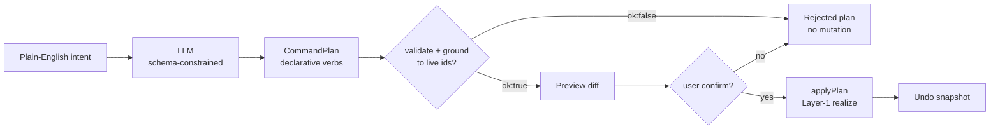
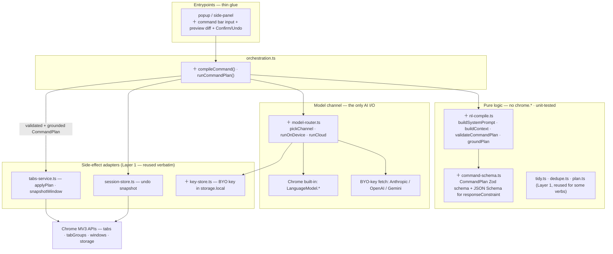
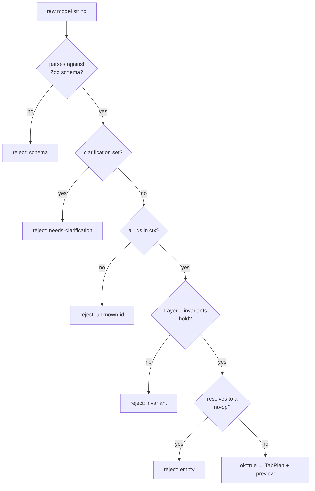
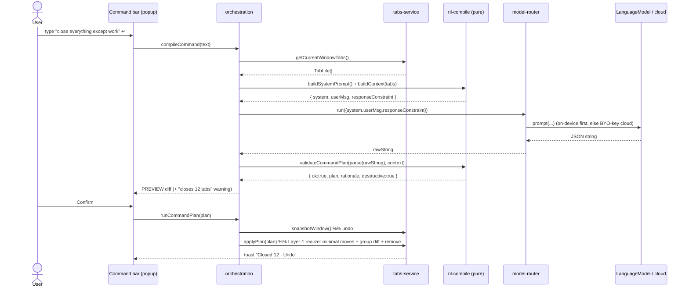
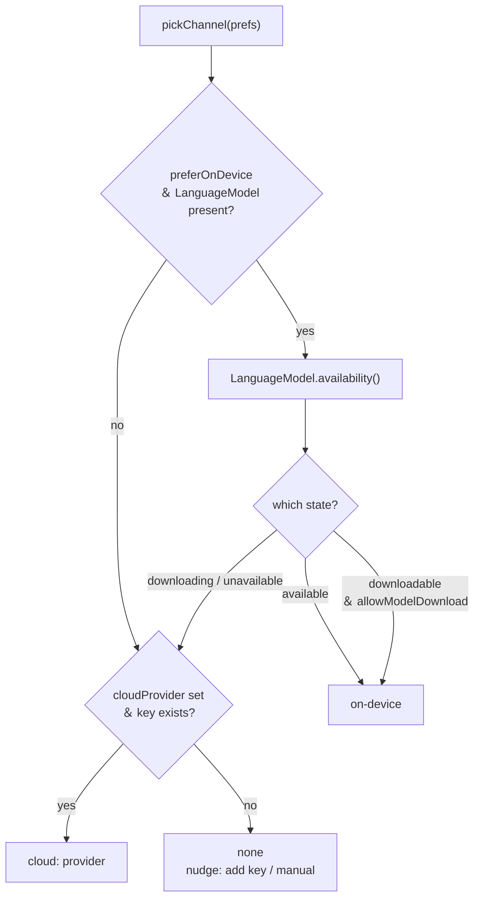
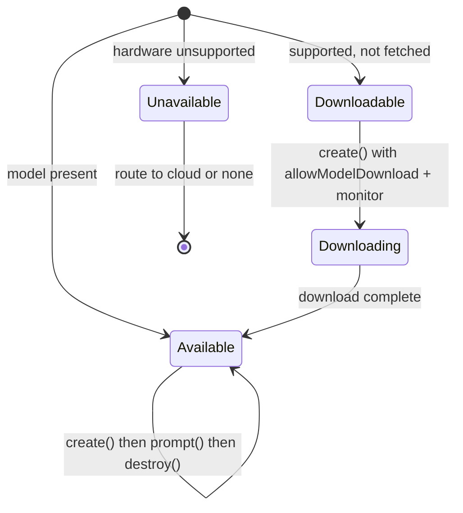
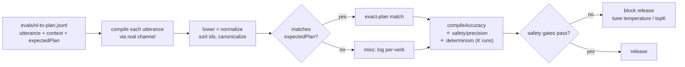
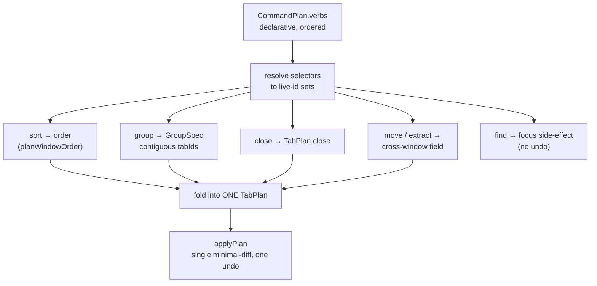

# Surface — AI command bar: natural language → TabPlan

> [!IMPORTANT]
> **Fact-check corrections (2: 2 refuted, 0 uncertain).** Independent verification corrected the claims below in this spec. Full corrections + sources live in the [PRD index Verification log](../README.md#verification-log); treat these lines as the corrected truth, not the body text they amend.
> - **[REFUTED]** Before Chrome 138 stable, using the Prompt API in extensions required enrolling in an origin trial and declaring a token via the manifest 'trial_token… — The parenthetical is correct: the `trial_tokens` manifest field was introduced in Chrome 126 (per the Chrome extensions "What's New" page: "Chrome 126 introduces a new manifest.json field - `trial_tokens`, allowing you to opt into Origin Tr…
> - **[REFUTED]** chrome.tabs.TAB_GROUP_ID_NONE has the value -1, used as the groupId for ungrouped tabs. — The constant is named TAB_GROUP_ID_NONE with value -1 representing ungrouped tabs, but it lives in the chrome.tabGroups namespace, NOT chrome.tabs.


- **Date:** 2026-06-21
- **Status:** Design — build-ready. No code committed yet. Types below are *design*, not edits to `lib/`.
- **Parent vision:** [`../2026-06-21-tab-intelligence-vision.md`](../2026-06-21-tab-intelligence-vision.md) — this is the in-extension **AI command bar** of its **Layer 3** (§5.3).
- **Depends on:** [`../2026-06-21-layer1-tidy-groups-undo.md`](../2026-06-21-layer1-tidy-groups-undo.md) — the **`TabPlan` IR**, `applyPlan`, `snapshotWindow`, and the undo/preview seam it defines. This surface produces nothing the Layer-1 adapter can't already realize.
- **Sibling surfaces (consume the same IR):** `tabctl` CLI and the **MCP server** (vision §5.1, §5.2). All three are *producers* of `TabPlan`; this one is the only producer that runs an LLM. When the sibling specs land they should cross-reference §10 here for the lowering contract.
- **Verify-before-build flags:** ⚠️ marks the channel/version-dependent facts about Chrome built-in AI an implementer must confirm against the live API first (see §9 and the Verification log).

---

## 1. Goal

Add **one text box** to the popup/side-panel where the user types intent in plain English — *"close everything except work,"* *"group the AI papers,"* *"move youtube to a new window"* — and get back a **previewed `TabPlan`** they confirm before anything moves. The LLM's only job is **natural language → `TabPlan`**; it never touches `chrome.*`. A hallucinated or malformed plan becomes a **rejected plan**, never a silent mutation, because preview + undo + schema validation all live at the seam, not in the producer.

Non-goals: no page-content reading (titles + URLs only, §6); no multi-turn agent loop (that is the MCP surface); no cloud proxy (BYO-key only); no telemetry.



*The end-to-end pipeline: intent compiles to a plan, but only validation + preview + confirm can turn it into a mutation — and that mutation is always reversible.*

---

## 2. Locked decisions

| # | Decision | Choice | Rationale |
|---|----------|--------|-----------|
| 1 | What the model emits | A **`CommandPlan`** (a `TabPlan` superset with `rationale` + `clarification`), validated by a schema **before** it can touch the adapter | An invalid plan is rejected; the model can never widen the verb set or invent an id. |
| 2 | Validation is the gate | Zod (or equivalent) parse → **id/permutation/invariant** check against the live tab set → only then preview | Structured-output constraints reduce malformed output but do **not** guarantee referential validity; we re-check. |
| 3 | Preview is mandatory | Every plan renders as a diff; **nothing** mutates without an explicit confirm click | The vision's non-negotiable. Determinism/safety is the seam's job (§6f, Layer-1 undo). |
| 4 | Routing order | **On-device first** (Chrome built-in Prompt API / Gemini Nano) → **detect-and-fall-back** to BYO-key cloud | Free, private, offline by default; cloud only when on-device is `unavailable`/`downloadable` or the user opts in. |
| 5 | Cloud is BYO-key | Anthropic / OpenAI / Gemini; key in `chrome.storage.local`; **we never proxy** | No server, no telemetry, no key custody — matches the repo posture. |
| 6 | Context sent to model | **Titles + URLs only**, plus pinned/group/active flags. Never page content. | Privacy is the product. Content needs `scripting`/host perms — explicitly out of scope. |
| 7 | Where the model runs | On-device: in the **extension service worker** (ephemeral, ok — one-shot call). Cloud: `fetch` from the worker. | ⚠️ Prompt API is exposed to *extension* service workers (Chrome 138+), unlike web-platform workers. |
| 8 | Scope | **Current window only** (matches Layer-1 #8). Cross-window is a later widening. | Keeps the lowered `TabPlan.windowId` single-window for now. |
| 9 | Determinism | LLM output is **temperature-low**, schema-constrained, and **re-grounded** to live ids; identical input ≈ identical plan, but we never trust it — preview decides. | The model proposes; the human disposes; the adapter diffs. |
| 10 | No new mutation permission | This surface adds **zero** mutation capability. It reuses Layer-1's `applyPlan`. | New permissions are only for the *model channel* (§6), not for touching tabs. |

---

## 3. Architecture

The command bar is a **thin producer** bolted onto the Layer-1 seam. The only genuinely new code is `nl-compile.ts` (pure: prompt assembly + schema validation + grounding) and `model-router.ts` (the one file that talks to a model channel). Everything downstream — preview, `applyPlan`, undo — is Layer-1, untouched.



**Boundary rules (inherited, enforced):**
- `nl-compile.ts` is **pure** (no `chrome.*`, no `fetch`) — unit-testable on fixture tab arrays + canned model strings, exactly like `plan.test.ts`.
- `model-router.ts` is the **only** file that calls `LanguageModel.*` or `fetch`. It returns a *string*; it never parses or trusts it.
- The validated, grounded plan is a Layer-1 `TabPlan` — `applyPlan` cannot tell it came from an LLM.

---

## 4. Concrete schemas / types / protocol

### 4.1 The `CommandPlan` (what the model MUST emit)

A `CommandPlan` is a **`TabPlan` superset**: the same `order`/`groups`/`close` the adapter realizes, plus model-only fields (`rationale`, `clarification`) that are stripped before lowering (§10). The model emits a **declarative verb list**; the compiler lowers verbs to the concrete `order`/`groups`/`close`.

```ts
// lib/command-schema.ts  (design)

// The closed verb vocabulary. The model may use ONLY these. Anything else → invalid plan.
type CommandVerb =
  | { kind: "sort"; by: ("title" | "domain" | "recency")[] }
  | { kind: "group"; by: "domain" | "selector"; selector?: TabSelector; title?: string; color?: GroupColor }
  | { kind: "move"; selector: TabSelector; to: "new-window" }            // today's runExtract
  | { kind: "close"; selector: TabSelector }                            // destructive → always confirmed
  | { kind: "stash"; selector: TabSelector }                            // Layer-1 stash (if present)
  | { kind: "extract"; selector: TabSelector; to: "new-window" }        // alias of move/new-window
  | { kind: "find"; selector: TabSelector };                            // read-only: focus/highlight, no mutation

// How the model REFERS to tabs without ever inventing an id. The compiler resolves
// a selector to concrete live ids; the model never emits raw ids it didn't receive.
type TabSelector =
  | { type: "ids"; ids: number[] }                  // only ids present in the supplied context
  | { type: "domain"; domain: string }              // matched by lib/domain.ts getDomain
  | { type: "regex"; source: string; flags?: string } // validated by lib/match.ts validatePattern (safety cap)
  | { type: "titleContains"; text: string }
  | { type: "all" }
  | { type: "allExcept"; selector: TabSelector };   // "everything except work"

interface CommandPlan {
  verbs: CommandVerb[];      // ordered; applied as one composed TabPlan (see §10)
  rationale: string;         // one sentence, shown in preview; NOT lowered
  clarification?: string;    // set ONLY when the model cannot safely plan; verbs MUST be [] then
  confidence?: "high" | "low";
}
```

`GroupColor` and `TabPlan` are the Layer-1 types (`grey|blue|red|yellow|green|pink|purple|cyan|orange`; ⚠️ confirm union). This surface adds no new adapter type.

### 4.2 The `responseConstraint` JSON Schema (passed to the model)

The on-device `LanguageModel.prompt()` and the cloud structured-output calls are both constrained by a JSON Schema generated from the Zod schema above. Shape (abridged — `selector` recurses for `allExcept`):

```jsonc
{
  "type": "object",
  "required": ["verbs", "rationale"],
  "additionalProperties": false,
  "properties": {
    "verbs": {
      "type": "array",
      "items": {
        "type": "object",
        "required": ["kind"],
        "properties": {
          "kind": { "enum": ["sort","group","move","close","stash","extract","find"] },
          "by":   { "type": "array", "items": { "enum": ["title","domain","recency"] } },
          "selector": { "$ref": "#/$defs/selector" },
          "to":    { "enum": ["new-window"] },
          "title": { "type": "string" },
          "color": { "enum": ["grey","blue","red","yellow","green","pink","purple","cyan","orange"] }
        },
        "additionalProperties": false
      }
    },
    "rationale": { "type": "string" },
    "clarification": { "type": "string" },
    "confidence": { "enum": ["high","low"] }
  },
  "$defs": { "selector": { /* discriminated on "type", ids/domain/regex/titleContains/all/allExcept */ } }
}
```

- **On-device:** pass this object as `responseConstraint` to `session.prompt(input, { responseConstraint })`. ⚠️ `responseConstraint` is a `prompt()`/`promptStreaming()` option (not a `create()` option); structured output is Chrome 137+.
- **Cloud:** Anthropic → a **tool** with this as `input_schema` + `tool_choice` forcing the tool; OpenAI → `response_format: { type: "json_schema", json_schema: { strict: true, schema } }`; Gemini → `responseMimeType: "application/json"` + `responseSchema`.
- **Defense in depth:** schema constraint is a *hint that strongly biases* output, **not** a guarantee of referential validity — `validateCommandPlan` + `groundPlan` re-check every id and invariant (§4.4). An invalid plan is rejected, never executed.

### 4.3 The context payload (titles + URLs only)

`buildContext(tabs: TabLite[])` produces exactly this — no page content, no cookies, no history:

```ts
interface TabContext {
  id: number;
  title: string;          // chrome.tabs Tab.title
  url: string;            // chrome.tabs Tab.url (origin+path; NOT page body)
  domain: string;        // lib/domain.ts getDomain(url)
  pinned: boolean;
  active: boolean;
  groupId: number | -1;  // chrome.tabs.TAB_GROUP_ID_NONE === -1 ⚠️ confirm constant
}
// Serialized to a compact JSON array in the user message. ~30-60 tokens/tab.
```

### 4.4 Validation + grounding (the gate)

```ts
type CompileResult =
  | { ok: true; plan: TabPlan; rationale: string; destructive: boolean }
  | { ok: false; reason: "schema" | "unknown-id" | "empty" | "invariant" | "needs-clarification"; detail: string };

// Pure. Never throws. Order: parse → resolve selectors to LIVE ids → enforce Layer-1 invariants.
function validateCommandPlan(raw: unknown, ctx: TabContext[]): CompileResult;
```

Rejection rules (all → `ok:false`, no mutation):
- JSON does not parse against the Zod schema → `schema`.
- `clarification` present (model declined) → `needs-clarification` (UI shows the question; no plan).
- Any `selector.type==="ids"` id **not in `ctx`** → `unknown-id` (the model hallucinated a tab).
- A `regex` selector failing `validatePattern` (safety cap, `lib/match.ts`) → contributes **no** ids (non-throwing, as today).
- Lowered plan violates a Layer-1 invariant (`order` not a permutation of live-ids−`close`; a pinned id inside a group; a `GroupSpec.tabIds` not contiguous) → `invariant`.
- Plan resolves to a no-op (`order` unchanged, `groups`/`close` empty) → `empty` (UI: "nothing to do").



*`validateCommandPlan` is a pure gate: parse, then ground selectors to live ids, then enforce Layer-1 invariants — every failure path returns `ok:false` and never mutates.*

---

## 5. Data flow



If routing yields nothing usable (`unavailable` + no key) the bar shows *"On-device AI isn't ready and no cloud key is set — add one in Options, or use the manual buttons."* It never silently falls through to a mutation.

---

## 6. Privacy, consent & model routing

### 6.1 What is sent
**Per command, to whichever channel is chosen:** the system prompt, the user's typed text, and the `TabContext[]` (titles + URLs + flags). **Never** page DOM/body, form values, cookies, or history. On-device this never leaves the machine. Cloud sends it to the user's chosen provider under the user's own key — disclosed in the preview footer: *"Sent N titles + URLs to Anthropic (your key)."*

### 6.2 Model routing (`pickChannel`)

```ts
type Channel =
  | { kind: "on-device" }
  | { kind: "cloud"; provider: "anthropic" | "openai" | "gemini" };

// On-device first. Fall back to cloud only if on-device can't serve AND a key exists.
async function pickChannel(prefs: AiPrefs): Promise<Channel | { kind: "none" }> {
  if (prefs.preferOnDevice && "LanguageModel" in globalThis) {
    const a = await LanguageModel.availability();        // ⚠️ "available"|"downloadable"|"downloading"|"unavailable"
    if (a === "available") return { kind: "on-device" };
    if (a === "downloadable" && prefs.allowModelDownload) return { kind: "on-device" }; // create() triggers download w/ monitor
  }
  if (prefs.cloudProvider && await hasKey(prefs.cloudProvider)) {
    return { kind: "cloud", provider: prefs.cloudProvider };
  }
  return { kind: "none" };
}
```



*Routing is on-device-first: cloud is reached only when the built-in model cannot serve, and `none` (never a silent mutation) when no channel is usable.*

**On-device surface (the real API ⚠️):**
- Global is **`LanguageModel`** (not `window.ai`/`self.ai`). Stable for **extensions in Chrome 138+**; exposed to **extension service workers** (unlike web-platform workers, where the API is not exposed).
- `LanguageModel.availability()` → `"available" | "downloadable" | "downloading" | "unavailable"`. ⚠️ The older Explainer used `"readily" | "after-download" | "no"`; confirm the live channel's enum before shipping. Pass the *same* options to `availability()` as to `create()`.
- `const session = await LanguageModel.create({ initialPrompts: [{ role: "system", content: SYSTEM }], temperature: 0.2, topK: 3, monitor })` — `temperature`/`topK` are extension-configurable; `monitor` reports download progress for the `downloadable` case.
- `await session.prompt(userMsg, { responseConstraint, omitResponseConstraintInput: false })` then `session.destroy()`. Structured output (`responseConstraint`) is Chrome 137+; `omitResponseConstraintInput` trades schema-in-context tokens for trusting the prompt's own formatting guidance.
- **Hardware/channel caveats (treat as progressive enhancement):** desktop only (Windows 10+/macOS 13+/Linux/ChromeOS); ~22 GB free storage for the model; 16 GB+ RAM / GPU >4 GB VRAM ⚠️. On unsupported hardware `availability()` is `"unavailable"` and we fall back. **Detect, never assume.**



*The four `availability()` states the router branches on; only `available` (or a completed download) yields an on-device session.*

**Cloud surface (BYO-key, never proxied):** `model-router.ts` `fetch`es the provider directly with the user's key from `chrome.storage.local`. Requires `host_permissions` for that provider's API origin (§7). The key is never logged, never sent anywhere but the provider, never synced (`storage.local`, not `storage.sync`).

### 6.3 Consent
- First on-device use: a one-time notice that the model may download (~GBs) on first run.
- First cloud use: an explicit opt-in screen — which provider, that titles+URLs leave the device under their key, and a link to add the key. Until then `cloudProvider` is unset and routing returns `none`.

### 6.4 Determinism / safety at the seam
Preview + undo are Layer-1 primitives, not re-implemented here. An LLM that proposes closing 80 tabs produces a **plan** the user sees as a red "closes 80 tabs" diff and can reject; if confirmed, `snapshotWindow` + `saveUndo` make it reversible (close-undo is best-effort re-create-by-URL per Layer-1). The model has no path to mutation that skips this.

---

## 7. Permissions & setup delta

| Capability | manifest delta | Why | Stage |
|---|---|---|---|
| Mutate tabs/groups | **none new** — reuses Layer-1 (`tabs`, `tabGroups`) | This surface is a producer only | n/a |
| On-device AI | **none** in 138+ (no token); pre-138 needed `"trial_tokens"` for the extensions origin trial | ⚠️ Confirm the live channel: 138+ stable → no token; earlier → trial token | Layer 3 |
| BYO-key cloud | `host_permissions += ["https://api.anthropic.com/*", "https://api.openai.com/*", "https://generativelanguage.googleapis.com/*"]` (only the providers enabled) | `fetch` to the provider under the user's key | Opt-in, per provider |
| Key storage | none (uses existing `storage`) | Key in `chrome.storage.local` (not `sync`) | n/a |
| Side panel (optional) | `permissions += ["sidePanel"]` if the bar lives in a side panel vs popup | Roomier preview for large diffs | optional |

Setup: nothing for on-device beyond a supported Chrome/hardware. Cloud: Options → pick provider → paste key (stored `storage.local`) → accept the data-egress notice.

---

## 8. Edge cases

| Case | Handling |
|------|----------|
| Model invents a tab id | `unknown-id` rejection; plan never runs. |
| Model emits a verb outside the vocabulary | Fails Zod `enum` → `schema` rejection. |
| Model returns prose, not JSON | Parse fails → `schema`; offer retry / manual buttons. |
| On-device `availability()` = `downloadable` | If `allowModelDownload`, `create({monitor})` downloads with a progress UI; else fall back to cloud or `none`. |
| On-device `unavailable` (hardware) + no key | `none` → UI nudges to add a key or use manual buttons. No mutation. |
| Ambiguous command ("clean up") | Model sets `clarification` + empty `verbs` → bar shows the question, no plan. |
| `allExcept{ work }` where "work" is vague | Model resolves to a `domain`/`regex`/`titleContains` selector; the *resolved id set* is shown in preview before any close. |
| Destructive verb (`close`) | Always `destructive:true`; preview shows a red count; confirm required even with autoconfirm off (autoconfirm never applies to `close`). |
| Tab closed between context build and apply | `applyPlan` re-queries a fresh snapshot and drops vanished ids (Layer-1 `applyOrder` behavior). |
| Worker evicted mid-call (MV3) | On-device/cloud call is one-shot from the worker; if evicted before a result, the bar reports a transient error and the user re-runs. No partial mutation (mutation only happens post-confirm via `applyPlan`). |
| Huge window (200 tabs) blows the context window | Truncate `TabContext[]` to a cap (e.g. 150) with a "showing first N" note, or chunk; `session.contextUsage`/`contextWindow` inform the cap ⚠️. |
| Regex from NL is catastrophic | Goes through `validatePattern`'s `MATCH_SAFETY_CAP`; bad/oversized pattern yields no ids (non-throwing). |
| Cloud key present but invalid/expired | `fetch` 401 surfaced as "your key was rejected"; never retried against on-device silently with different privacy posture without telling the user. |
| Multiple providers configured | `prefs.cloudProvider` picks one; routing is deterministic, not racing all three. |

---

## 9. Testing

**Pure (fixture arrays + canned model strings — the `plan.test.ts` model, no browser, no network):**
- `buildSystemPrompt` is stable (snapshot) and lists exactly the verb vocabulary.
- `buildContext` emits titles+URLs+flags and **no** content field (a guard test asserts no extra keys leak).
- `validateCommandPlan`: golden good plans parse + ground; each rejection rule (`schema`/`unknown-id`/`empty`/`invariant`/`needs-clarification`) has a fixture; **invariant guards** reuse Layer-1's (no pinned id in a group; `order` is a permutation of live−`close`; group `tabIds` contiguous).
- `groundPlan`: `unknown-id` and stale-id fixtures; selector resolution (`allExcept`, `regex` via safety cap) matches `lib/match.ts`.
- Lowering (§10): each verb → expected `TabPlan` (e.g. `move/new-window` ≡ today's `runExtract` id set).

**Adapter (`@webext-core/fake-browser`):** `runCommandPlan` issues only Layer-1 ops; `model-router` mocked to return canned JSON; key-store round-trips in `storage.local`; **assert nothing in the worker ever calls `chrome.tabs.move` outside `applyPlan`**.

**Eval — golden NL → plan pairs (compile accuracy):**
- A fixture set `evals/nl-to-plan.jsonl`: `{ id, utterance, context, expectedPlan, mustReject? }`. Includes paraphrases, ambiguous (`mustReject` / expects `clarification`), and adversarial ("delete system32" → no destructive over-reach beyond tabs).
- **Metric — exact-plan match** after lowering + normalization (sort id lists, canonicalize selectors): `compileAccuracy = exactMatches / total`. Report per-verb and overall.
- **Secondary — safety/precision:** false-mutation rate (plans that mutate when `mustReject`), id-hallucination rate (`unknown-id` triggers), over-close rate (closed ids ∉ expected). These gate releases harder than raw accuracy.
- **Determinism:** run each utterance K times at `temperature ≤ 0.2`; report plan-stability (% identical lowered plans). Used to tune temperature/`topK`.
- Run the suite against **both** channels (on-device when available in CI's Chrome; a recorded-cloud or live BYO-key job otherwise) so a routing regression is visible. Cheap and offline by replaying canned model outputs for the pure layer; the model-quality eval is a separate, opt-in job.



*The golden-pairs eval loop: compile, lower, compare to the expected plan, then gate releases on exact-match accuracy plus the harder safety/precision metrics.*

---

## 10. How it lowers to TabPlan

`CommandPlan.verbs` is a *declarative* list; the compiler folds it into **one** Layer-1 `TabPlan { windowId, order, groups, close }` so `applyPlan` realizes it as a single minimal-diff with one undo snapshot. `rationale`/`clarification`/`confidence` are dropped — the adapter never sees them.

**Folding rules (left-to-right; later verbs see earlier results):**
1. Resolve every `selector` to a concrete live-id set against `TabContext`.
2. `sort` → reuse `planWindowOrder` (multi-key extends `lib/sort.ts`); sets `order` (degenerate single-verb case = today's seam).
3. `group` → a `GroupSpec` (title/color from the verb or `assignColor(domain)`); its `tabIds` become a contiguous slice of `order` (Layer-1 invariant).
4. `move`/`extract` `to:new-window` → **not** an in-window `order` change; lowers to the cross-window field of `TabPlan` (the `moveTabsToNewWindow` path) — equivalent to today's `runExtract` over the resolved ids.
5. `close` → appended to `TabPlan.close`; `order` becomes a permutation of `live-ids − close`.
6. `stash` → Layer-1 stash verb (if present) over resolved ids.
7. `find` → **read-only**: no `order`/`groups`/`close` change; lowers to a focus/highlight side-effect (`chrome.tabs.update({active})` / `tabs.highlight`) — still previewed ("focus this tab"), but writes no undo snapshot.



*Heterogeneous verbs fold left-to-right into a single Layer-1 `TabPlan`, so one confirm yields one minimal-diff apply and one undo snapshot.*

Worked examples (window context elided; ids are illustrative):

| # | Utterance | `CommandPlan.verbs` (model) | Lowered `TabPlan` (to `applyPlan`) |
|---|-----------|------------------------------|-------------------------------------|
| 1 | "sort these A to Z" | `[{kind:"sort",by:["title"]}]` | `{ order:[…title-sorted ids…], groups:[], close:[] }` |
| 2 | "group the AI papers" (arxiv/openai/anthropic) | `[{kind:"group",by:"selector",selector:{type:"regex",source:"arxiv\\.org|openai|anthropic"},title:"AI papers",color:"purple"}]` | `{ order:[…members contiguous…], groups:[{key:"ai",title:"AI papers",color:"purple",collapsed:false,tabIds:[…]}], close:[] }` |
| 3 | "move youtube to a new window" | `[{kind:"move",selector:{type:"domain",domain:"youtube.com"},to:"new-window"}]` | `{ close:[], groups:[], order:unchanged }` + cross-window move of youtube ids (≡ `runExtract`) |
| 4 | "close everything except work" | `[{kind:"close",selector:{type:"allExcept",selector:{type:"regex",source:"jira|github|notion"}}}]` | `{ close:[…non-work ids…], order:perm(live−close), groups:[] }` — **destructive**, red preview |
| 5 | "tidy this window" | `[{kind:"sort",by:["domain"]},{kind:"group",by:"domain"}]` | the Layer-1 `tidy` plan (sort + domain groups), one undo snapshot |
| 6 | "find the tab about the postgres index" | `[{kind:"find",selector:{type:"titleContains",text:"postgres"}}]` | no mutation; focus/highlight the matched tab; preview "focus 1 tab", no undo |
| 7 | "dedupe and group by site, biggest first" | `[{kind:"close",selector:{type:"…dupes…"}},{kind:"group",by:"domain"},{kind:"sort",by:["domain"]}]` | dedupe `close` + domain `groups` (size-desc order) + `order` — folded into one plan |
| 8 | "clean things up" (ambiguous) | `[]` + `clarification:"Do you want me to sort, group, or close duplicates?"` | **no plan** — bar shows the question (`needs-clarification`) |

The invariant that makes this safe: whatever the model emits, the **only** thing that reaches `chrome.*` is a Layer-1 `TabPlan` that passed `validateCommandPlan` and the user's confirm. The AI is a mouth on the existing seam — not a new code path to the browser.

---

> Technical claims in this doc are fact-checked in the [PRD index Verification log](../README.md#verification-log).
