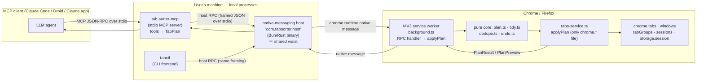
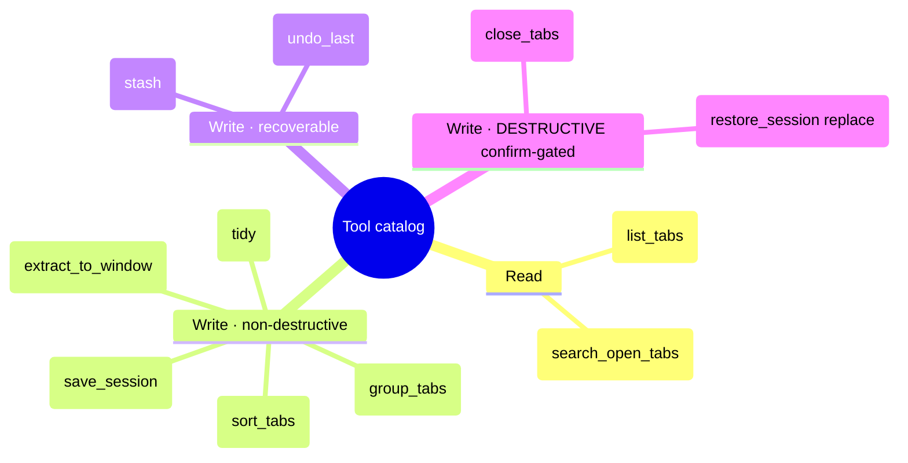
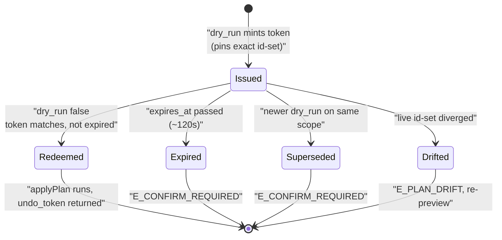
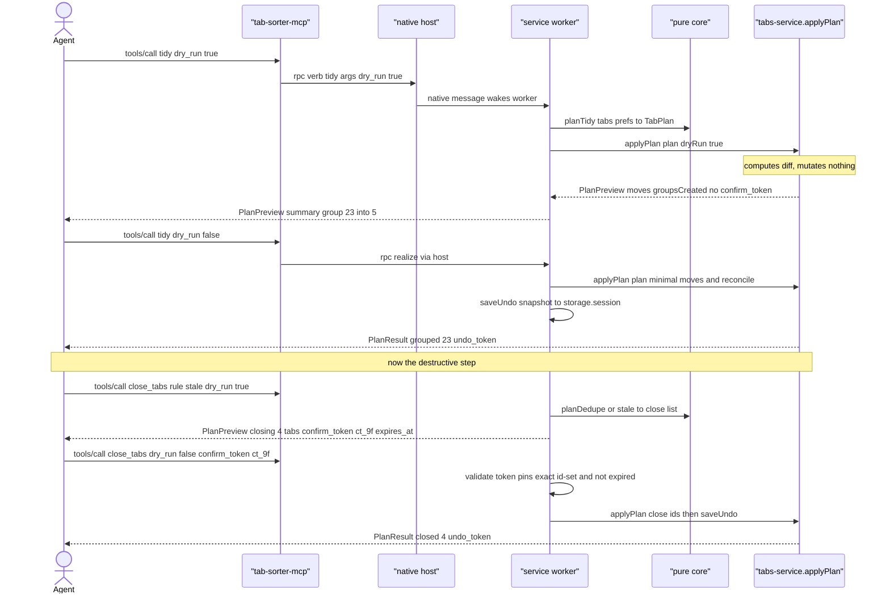
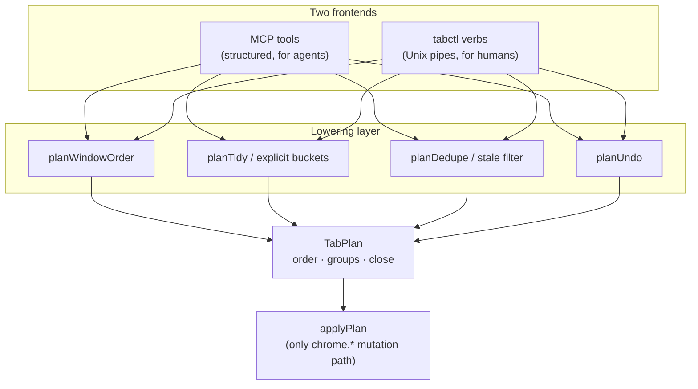

# Surface — MCP server: tabs as agent-addressable tools

> [!IMPORTANT]
> **Fact-check corrections (3: 3 refuted, 0 uncertain).** Independent verification corrected the claims below in this spec. Full corrections + sources live in the [PRD index Verification log](../README.md#verification-log); treat these lines as the corrected truth, not the body text they amend.
> - **[REFUTED]** An incoming native message wakes an ephemeral MV3 service worker so the background handler can process it even if the worker was idle/terminated. — An incoming native message cannot wake a terminated MV3 service worker.
> - **[REFUTED]** chrome.tabs.Tab exposes a lastAccessed timestamp (epoch ms) usable for staleness ranking; it may be unavailable on Firefox. — The first half is correct: Tab.lastAccessed exists and is "the last time the tab became active in its window as the number of milliseconds since epoch" (a number / double), added in Chrome 121, and is a valid signal for staleness ranking.
> - **[REFUTED]** Chrome refuses to add pinned tabs to a tab group, so groups contain only unpinned tabs. — Chrome does not refuse.


- **Date:** 2026-06-21
- **Status:** Design — build-ready. No code committed yet. Types/protocol below are *design*, not edits to `lib/`.
- **Layer:** Layer 2 of the [vision](../2026-06-21-tab-intelligence-vision.md) (§5.2), the AI-facing twin of the `tabctl` CLI surface.
- **Parent vision:** [`../2026-06-21-tab-intelligence-vision.md`](../2026-06-21-tab-intelligence-vision.md)
- **Depends on:** [`../2026-06-21-layer1-tidy-groups-undo.md`](../2026-06-21-layer1-tidy-groups-undo.md) (the `TabPlan` IR, `applyPlan`, undo snapshot, preview).
- **Sibling surface:** [`2026-06-21-tabctl-cli.md`](2026-06-21-tabctl-cli.md) — the CLI surface. **This spec shares its native-messaging host.** Read the tabctl spec for host install, manifest, and framing; everything about the host transport below is the *same binary*.
- **Verify-before-build flags:** ⚠️ marks the channel/version/protocol-dependent facts an implementer must confirm against the live contract first (`chrome.runtime` native messaging, the MCP spec, the TS SDK shape).

---

## 1. Goal

Expose the user's **live browser tabs as MCP tools** so any MCP client already in the user's workflow — Claude Code, Droid, the Claude desktop app, OpenCode — can read and reshape tabs as one step inside a larger task, with **zero bespoke browser code in the agent**.

The agent never sees `chrome.*`. It calls strongly-typed tools (`list_tabs`, `group_tabs`, `tidy`, `close_tabs`, …); each **mutating** tool lowers the agent's intent to a **`TabPlan`** (the one IR from Layer 1) and runs it through the *same* `applyPlan` adapter — same minimal diff, same preview, same universal undo — that the popup button uses. The MCP server is a **producer of `TabPlan`**, nothing more.

The non-negotiable design constraint: **this is built for an autonomous agent that must not nuke the user's tabs.** Therefore every mutating tool defaults to a **preview (`dry_run`)**, and every destructive op (`close_tabs`, `restore_session` with `replace`) is **gated behind a confirm token** minted by the preview. A hallucinated plan becomes a rejected preview, never a silent mutation.

Non-goals: the in-extension NL command bar (that is [the AI command bar surface](2026-06-21-ai-command-bar.md), Layer 3); reading page **content** (titles+URLs only — see §6); any cloud round-trip (the MCP server is a local stdio process).

---

## 2. Locked decisions

| # | Decision | Choice | Rationale |
|---|----------|--------|-----------|
| 1 | What the server *is* | A **producer of `TabPlan`**; tools lower intent → `TabPlan` → existing `applyPlan` | No new mutation path. Inherits Layer 1's minimal diff + undo + preview for free. |
| 2 | Transport | **stdio** MCP server (one process per client) | The canonical MCP local transport; matches how Claude Code / Droid spawn servers. No network listener, no port. ⚠️ |
| 3 | Browser bridge | Server reaches Chrome by **sharing the `tabctl` native-messaging host** (one host, two frontends) | MV3 workers are ephemeral and cannot host a server; the host is the only durable local relay. Reuses the tabctl install — no second permission, no second binary. |
| 4 | Preview-by-default | **Every mutating tool takes `dry_run` (default `true`)** and returns a `PlanPreview` (the diff) | An agent must see the diff before it acts. `dry_run:false` requires a matching `confirm_token` for destructive ops. |
| 5 | Confirm gate on destructive ops | `close_tabs` and `restore_session{mode:"replace"}` **require** a `confirm_token` minted by the immediately-preceding `dry_run` | Closing is near-irreversible. A token that pins the exact tab-id set makes "agent closed the wrong 40 tabs" structurally hard. |
| 6 | Read vs write split | **Read tools** (`list_tabs`, `search_open_tabs`) never mutate and need no token; **write tools** all go through preview | Clear blast-radius boundary the agent (and the user reading a transcript) can reason about. |
| 7 | Idempotency | Mutating tools are **idempotent on already-correct state** (re-running `tidy` on a tidy window = no-op) | Falls out of `applyPlan`'s minimal-diff reconciler; makes agent retries safe. |
| 8 | Scope guard | Every tool is **single-window by default** (`window_id` optional, defaults to the focused window); `all_windows:true` is explicit and capped | Matches Layer 1 scope; prevents an agent from accidentally reshaping every window. |
| 9 | Rate / size limits | Per-tool argument caps (≤ 500 ids/call), a server-side mutation rate limit, and a hard refusal above `MAX_CLOSE` without `force` | An agent in a loop must hit a wall, not the user's whole session. |
| 10 | Auth to the host | The host accepts connections **only from the extension's registered native-messaging origin** + a per-launch nonce file the server reads | Native messaging is already origin-pinned by Chrome; the nonce stops a second local process from driving the browser. ⚠️ |
| 11 | Boundary vs `tabctl` | MCP server = **structured tools for agents**; `tabctl` = **Unix-composable CLI for humans/scripts**. Both lower to `TabPlan` via the **same host**. | Two frontends, one waist. No logic is duplicated; the difference is purely surface ergonomics. |
| 12 | No telemetry / no key proxy | The server logs nothing off-device and holds no API keys | Consistent with the repo's privacy posture; the agent brings its own model. |

---

## 3. Architecture — process topology

The MCP server is a thin **stdio child process** the MCP client spawns. It does **not** talk to Chrome directly; it connects to the **same native-messaging host** the `tabctl` CLI uses. The host is the single durable relay to the ephemeral MV3 service worker.



**Three transport hops, three framings (do not conflate them):**

1. **MCP client ⇄ MCP server** — MCP JSON-RPC 2.0 over **stdio** (the MCP `StdioServerTransport`). ⚠️ confirm against the MCP spec + `@modelcontextprotocol/sdk`.
2. **MCP server ⇄ host** — a small line/length-framed JSON RPC over a **local socket or stdio** to the *already-running* host. This is **the same RPC the `tabctl` CLI uses** (defined in the tabctl spec); the MCP server is just a second client of it. If the host is not running, the server spawns it (idempotent; the host single-instances on a lockfile).
3. **Host ⇄ extension** — Chrome **native messaging**: the host is launched/reached by Chrome via a host manifest, messages are **UTF-8 JSON prefixed with a 32-bit native-byte-order length**, and **Chrome caps a single message to the extension at 1 MB** (host→extension) — large `list_tabs` results must be chunked or summarized. ⚠️ confirm the 1 MB cap and length framing against the native-messaging docs.

**Why a shared host (decision #3):** the MV3 service worker is ephemeral — it cannot itself hold a socket or a server (vision §8). The host is the one long-lived local process; native messaging **wakes the worker on message** even if it was asleep. Running *one* host with *two* frontends (CLI + MCP) means a single install, a single Chrome-side RPC handler in `background.ts`, and zero duplicated browser logic. ⚠️ confirm wake-on-native-message behaviour for MV3.

---

## 4. The tool catalog (JSON-Schema in / out)

All ten tools below. **Convention:** read tools return data; write tools take `dry_run` (default `true`) and return a `PlanPreview`; passing `dry_run:false` realizes the plan and returns a `PlanResult`. Destructive tools additionally require a `confirm_token`.



*Ten tools across three blast-radius tiers: reads need no token, non-destructive writes preview, destructive writes are confirm-gated.*

### 4.0 Shared types

```ts
// Mirrors lib/types.ts TabLite, plus read-only live fields the agent needs.
interface TabView {
  id: number;
  url: string;
  title: string;
  index: number;
  pinned: boolean;
  active: boolean;
  windowId: number;
  groupId: number;        // -1 when ungrouped (chrome.tabGroups.TAB_GROUP_ID_NONE) ⚠️
  lastAccessed?: number;  // epoch ms; present on Chrome, may be absent on Firefox ⚠️
  discarded: boolean;
}

// What every dry_run returns. This IS the Layer-1 preview, serialized for an agent.
interface PlanPreview {
  summary: string;                 // human line, e.g. "Group 23 tabs into 5; close 4 duplicates"
  moves: { id: number; from: number; to: number; title: string }[];
  groupsCreated: { title: string; color: GroupColor; tabIds: number[] }[];
  groupsUpdated: { groupId: number; changes: string[] }[];
  closing: { id: number; url: string; title: string; reason: string }[];
  windowId: number;
  reversible: boolean;             // false only for close without a sessions-restore path
  confirm_token: string | null;    // non-null ⇒ a destructive op the agent must echo back
  expires_at: number;              // epoch ms; token + preview are valid until this
}

// What a realized (dry_run:false) write returns. Superset of Layer-1 PlanResult.
interface PlanResult {
  moved: number;
  grouped: number;
  groupsCreated: number;
  closed: number;
  undo_token: string;              // pass to an undo (see §4.x) — wraps the storage.session snapshot
  windowId: number;
}

type GroupColor =
  | "grey" | "blue" | "red" | "yellow" | "green"
  | "pink" | "purple" | "cyan" | "orange"; // ⚠️ confirm exact chrome.tabGroups.Color union
```

### 4.1 `list_tabs` (read)

> List open tabs (titles + URLs + live metadata). Never mutates.

```json
{
  "name": "list_tabs",
  "inputSchema": {
    "type": "object",
    "properties": {
      "window_id":   { "type": "integer", "description": "Defaults to the focused window." },
      "all_windows": { "type": "boolean", "default": false },
      "include_groups": { "type": "boolean", "default": true }
    },
    "additionalProperties": false
  },
  "outputSchema": {
    "type": "object",
    "properties": {
      "tabs":    { "type": "array", "items": { "$ref": "#/$defs/TabView" } },
      "groups":  { "type": "array", "items": {
        "type": "object",
        "properties": {
          "groupId": { "type": "integer" },
          "title":   { "type": "string" },
          "color":   { "type": "string" },
          "collapsed": { "type": "boolean" },
          "tabIds":  { "type": "array", "items": { "type": "integer" } }
        }
      } },
      "truncated": { "type": "boolean", "description": "true if the 1MB native-message cap forced paging" }
    }
  }
}
```

### 4.2 `search_open_tabs` (read)

> Find open tabs by query (substring/regex over title+URL; optional domain filter). Read-only.

```json
{
  "name": "search_open_tabs",
  "inputSchema": {
    "type": "object",
    "properties": {
      "query":  { "type": "string", "description": "Plain substring unless `regex` is true." },
      "regex":  { "type": "boolean", "default": false },
      "flags":  { "type": "string", "description": "Regex flags; g/y stripped (see match safety cap)." },
      "domain": { "type": "string", "description": "Restrict to this registrable domain." },
      "all_windows": { "type": "boolean", "default": false },
      "limit":  { "type": "integer", "default": 200, "maximum": 500 }
    },
    "required": ["query"],
    "additionalProperties": false
  },
  "outputSchema": {
    "type": "object",
    "properties": {
      "matches": { "type": "array", "items": { "$ref": "#/$defs/TabView" } },
      "count":   { "type": "integer" }
    }
  }
}
```

Reuses `lib/match.ts` `matchPattern` (same `MATCH_SAFETY_CAP`, same g/y-strip rule) so a bad pattern is a non-throwing empty result, never a server crash.

### 4.3 `sort_tabs` (write · non-destructive)

> Reorder a window. Lowers to a `TabPlan` with only `order` set.

```json
{
  "name": "sort_tabs",
  "inputSchema": {
    "type": "object",
    "properties": {
      "by":        { "type": "array", "items": { "enum": ["title","domain","recency"] }, "default": ["title"] },
      "window_id": { "type": "integer" },
      "ignore_pinned": { "type": "boolean", "default": true },
      "dry_run":   { "type": "boolean", "default": true }
    },
    "additionalProperties": false
  },
  "outputSchema": { "oneOf": [ { "$ref": "#/$defs/PlanPreview" }, { "$ref": "#/$defs/PlanResult" } ] }
}
```

### 4.4 `group_tabs` (write · non-destructive)

> Create/assign native tab groups (by domain, or explicit id→label buckets).

```json
{
  "name": "group_tabs",
  "inputSchema": {
    "type": "object",
    "properties": {
      "by":      { "enum": ["domain","explicit"], "default": "domain" },
      "buckets": { "type": "array", "description": "Required when by=explicit.", "items": {
        "type": "object",
        "properties": {
          "title":  { "type": "string" },
          "color":  { "type": "string" },
          "tabIds": { "type": "array", "items": { "type": "integer" } }
        },
        "required": ["title","tabIds"]
      } },
      "min_group_size": { "type": "integer", "default": 2 },
      "collapse": { "type": "boolean", "default": false },
      "regroup_existing": { "type": "boolean", "default": false },
      "window_id": { "type": "integer" },
      "dry_run": { "type": "boolean", "default": true }
    },
    "additionalProperties": false
  },
  "outputSchema": { "oneOf": [ { "$ref": "#/$defs/PlanPreview" }, { "$ref": "#/$defs/PlanResult" } ] }
}
```

### 4.5 `tidy` (write · non-destructive)

> The flagship verb: sort + group (+ optional collapse). Never closes a tab. Idempotent.

```json
{
  "name": "tidy",
  "inputSchema": {
    "type": "object",
    "properties": {
      "window_id": { "type": "integer" },
      "collapse":  { "type": "boolean", "default": false },
      "group_order": { "enum": ["alpha","sizeDesc"], "default": "alpha" },
      "dry_run":   { "type": "boolean", "default": true }
    },
    "additionalProperties": false
  },
  "outputSchema": { "oneOf": [ { "$ref": "#/$defs/PlanPreview" }, { "$ref": "#/$defs/PlanResult" } ] }
}
```

### 4.6 `close_tabs` (write · DESTRUCTIVE — confirm-gated)

> Close tabs by id, query, or duplicate/staleness rule. Always two-phase: dry_run mints a token; realizing requires it.

```json
{
  "name": "close_tabs",
  "inputSchema": {
    "type": "object",
    "properties": {
      "ids":     { "type": "array", "items": { "type": "integer" }, "maxItems": 500 },
      "query":   { "type": "string" },
      "rule":    { "enum": ["duplicates","stale"], "description": "stale uses lastAccessed." },
      "stale_days": { "type": "integer", "default": 7 },
      "window_id": { "type": "integer" },
      "dry_run": { "type": "boolean", "default": true },
      "confirm_token": { "type": "string", "description": "Required when dry_run=false." },
      "force":   { "type": "boolean", "default": false, "description": "Required above MAX_CLOSE." }
    },
    "additionalProperties": false
  },
  "outputSchema": { "oneOf": [ { "$ref": "#/$defs/PlanPreview" }, { "$ref": "#/$defs/PlanResult" } ] }
}
```

Realizing with a `dry_run:false` but absent/expired/mismatched `confirm_token` → tool error `E_CONFIRM_REQUIRED` (no mutation). Above `MAX_CLOSE` (default 25) without `force:true` → `E_TOO_MANY` (no mutation).



*Confirm tokens are one-shot and time-boxed: a token is redeemed exactly once, or it expires, is superseded by a fresher preview, or is rejected on id-set drift.*

### 4.7 `extract_to_window` (write · non-destructive)

> Move matching tabs into a new window. Wraps today's `moveTabsToNewWindow` / `runExtract`.

```json
{
  "name": "extract_to_window",
  "inputSchema": {
    "type": "object",
    "properties": {
      "ids":     { "type": "array", "items": { "type": "integer" } },
      "query":   { "type": "string" },
      "regex":   { "type": "boolean", "default": false },
      "flags":   { "type": "string" },
      "focus":   { "type": "boolean", "default": true },
      "dry_run": { "type": "boolean", "default": true }
    },
    "additionalProperties": false
  },
  "outputSchema": { "oneOf": [ { "$ref": "#/$defs/PlanPreview" }, { "$ref": "#/$defs/PlanResult" } ] }
}
```

### 4.8 `stash` (write · non-destructive — recoverable)

> Collapse N tabs to a stored list and discard/close them, reclaiming memory. Restorable via `restore_session`. Not destructive in the irreversible sense (the stash *is* the backup), so confirm-gated only above `MAX_CLOSE`.

```json
{
  "name": "stash",
  "inputSchema": {
    "type": "object",
    "properties": {
      "ids":     { "type": "array", "items": { "type": "integer" }, "maxItems": 500 },
      "query":   { "type": "string" },
      "rule":    { "enum": ["stale","duplicates"] },
      "name":    { "type": "string", "description": "Stash label; auto-dated if omitted." },
      "close_after": { "type": "boolean", "default": true, "description": "false ⇒ only discard, keep tabs." },
      "window_id": { "type": "integer" },
      "dry_run": { "type": "boolean", "default": true },
      "confirm_token": { "type": "string", "description": "Required when dry_run=false AND count > MAX_CLOSE." }
    },
    "additionalProperties": false
  },
  "outputSchema": { "oneOf": [ { "$ref": "#/$defs/PlanPreview" }, {
    "type": "object",
    "properties": { "stash_id": { "type": "string" }, "stashed": { "type": "integer" }, "undo_token": { "type": "string" } }
  } ] }
}
```

### 4.9 `save_session` (write · non-destructive)

> Snapshot a window (order + groups + URLs) under a name. Read-then-write; does not mutate tabs.

```json
{
  "name": "save_session",
  "inputSchema": {
    "type": "object",
    "properties": {
      "name":      { "type": "string" },
      "window_id": { "type": "integer" },
      "all_windows": { "type": "boolean", "default": false }
    },
    "required": ["name"],
    "additionalProperties": false
  },
  "outputSchema": {
    "type": "object",
    "properties": {
      "session_id": { "type": "string" },
      "tab_count":  { "type": "integer" },
      "group_count":{ "type": "integer" },
      "saved_at":   { "type": "integer" }
    }
  }
}
```

### 4.10 `restore_session` (write · DESTRUCTIVE in `replace` mode — confirm-gated)

> Reopen a saved session. `mode:"new_window"` (default, additive, safe) or `mode:"replace"` (closes the target window's current tabs first — confirm-gated).

```json
{
  "name": "restore_session",
  "inputSchema": {
    "type": "object",
    "properties": {
      "name":    { "type": "string" },
      "session_id": { "type": "string" },
      "mode":    { "enum": ["new_window","replace"], "default": "new_window" },
      "window_id": { "type": "integer", "description": "Target for replace mode." },
      "dry_run": { "type": "boolean", "default": true },
      "confirm_token": { "type": "string", "description": "Required when mode=replace and dry_run=false." }
    },
    "additionalProperties": false
  },
  "outputSchema": { "oneOf": [ { "$ref": "#/$defs/PlanPreview" }, { "$ref": "#/$defs/PlanResult" } ] }
}
```

> **Undo:** there is also an internal `undo` capability (exposed as a tool `undo_last` taking `{ undo_token }`) that replays the Layer-1 `planUndo` snapshot. Every realized write returns an `undo_token`; an agent (or the user, via the popup pill) can reverse the last mutating call. The token wraps the `chrome.storage.session` snapshot from Layer 1 (decision #6), so it survives a worker restart within the session.

---

## 5. Data flow — a mutating call (`tidy`, then `close_tabs`)



The MCP server is stateless about plans; **the confirm/undo tokens are minted and validated inside the extension** (where the snapshot lives), so a restart of the MCP process cannot forge a token.

---

## 6. Permissions & setup delta

**Manifest permissions** (current: `["tabs", "storage", "contextMenus"]` in `apps/extension/wxt.config.ts`):

| Permission | Why | Layer |
|---|---|---|
| `nativeMessaging` | The host bridge — *this surface's defining add* | Layer 2 |
| `tabGroups` | `group_tabs` / `tidy` | Layer 1 (already staged) |
| `sessions` | `save_session` / `restore_session`, best-effort closed-tab recall | Layer 1 opt-in / here |
| `storage` (have) `+ storage.session` | undo + confirm snapshots | Layer 1 |

No `scripting`/host-permission — **titles+URLs only**, never page content (vision §6). The MCP server cannot escalate this: it only calls verbs the extension already exposes.

**Native-messaging host manifest** (installed by the same step as `tabctl`; full detail in the tabctl spec). On macOS, Chrome reads host manifests from `~/Library/Application Support/Google/Chrome/NativeMessagingHosts/com.tabsorter.host.json`; the file names the host binary and pins `allowed_origins` to the extension id. ⚠️ confirm the macOS path and `allowed_origins` format.

```json
{
  "name": "com.tabsorter.host",
  "description": "Tab Sorter native messaging host (tabctl + MCP)",
  "path": "/usr/local/bin/tab-sorter-host",
  "type": "stdio",
  "allowed_origins": ["chrome-extension://<EXTENSION_ID>/"]
}
```

**MCP registration in Claude Code** — `.mcp.json` (project) or `~/.claude.json` / `claude mcp add`:

```json
{
  "mcpServers": {
    "tab-sorter": {
      "command": "tab-sorter-mcp",
      "args": [],
      "env": { "TAB_SORTER_HOST_NONCE": "~/.config/tabctl/host.nonce" }
    }
  }
}
```

⚠️ confirm the `.mcp.json` schema (`mcpServers` map, `command`/`args`/`env`) and the `claude mcp add` invocation against current Claude Code docs.

---

## 7. Edge cases

| Case | Handling |
|---|---|
| Host not running when server starts | Server spawns it; host single-instances on a lockfile. If Chrome isn't running, every tool returns `E_NO_BROWSER` (no hang). |
| Worker asleep | Native message wakes it (decision #3). ⚠️ confirm wake-on-message. |
| `list_tabs` result > 1 MB native cap | Host pages the response; `truncated:true`; agent narrows with `search_open_tabs`. ⚠️ confirm 1 MB cap. |
| Tab ids stale between dry_run and realize | `applyPlan` re-queries a fresh snapshot and drops vanished ids (reuses `applyOrder`'s survivor logic). Confirm token pins the *id set*, so if the live set diverged, realize returns `E_PLAN_DRIFT` and the agent must re-preview. |
| Confirm token reused / expired | One-shot, time-boxed (`expires_at`, ~120 s); validated extension-side. Reuse → `E_CONFIRM_REQUIRED`. |
| Agent loops `close_tabs` | Per-call `MAX_CLOSE` cap + a server mutation rate limit (token-bucket); exceeding → `E_RATE_LIMIT`. |
| Pinned tabs | Never grouped/closed implicitly (inherits the pinned-front invariant); `close_tabs` skips pinned unless ids name them explicitly. |
| User's hand-built groups | `tidy`/`group_tabs` touch only ungrouped tabs unless `regroup_existing:true` (Layer 1 decision #3). |
| `chrome://`, `file://`, extension pages | `getDomain` buckets them as `(scheme)`; groupable; `restore_session` cannot re-create some `chrome://` URLs — flagged `reversible:false`. ⚠️ |
| Firefox | `lastAccessed` may be absent (⚠️), so `stale` rule degrades to "no candidates" rather than guessing; native messaging differs (`browser_specific_settings`). |
| Two MCP clients at once | Both connect to the one host; mutations serialize at the worker (single RPC handler); reads are concurrent. |
| Multiple Chrome profiles | One host manifest per profile dir; the server targets the profile whose host nonce it holds. ⚠️ |

---

## 8. Testing

- **Pure (no browser, no host):** intent → `TabPlan` lowering for each write tool (§10) on fixture `TabLite[]` arrays — same model as `plan.test.ts`. Assert invariants: `close_tabs` never emits a pinned id; `tidy` lowers to `order+groups` with empty `close`; preview `moves` count == Layer-1 `moved`.
- **Schema conformance:** every tool's input/output validated against its JSON-Schema (e.g. Ajv); `dry_run` defaulting; `confirm_token` required-ness on destructive tools.
- **Protocol:** an in-memory MCP client (`@modelcontextprotocol/sdk` `InMemoryTransport`) drives `tools/list` + `tools/call`; assert read tools don't mutate and write tools without `dry_run:false` never reach `applyPlan`. ⚠️ confirm SDK transport names.
- **Host bridge (faked):** the host RPC mocked; assert the server forwards verbs unchanged and surfaces `E_NO_BROWSER`/`E_PLAN_DRIFT`/`E_RATE_LIMIT`.
- **Adapter (`@webext-core/fake-browser`):** the extension-side RPC handler → `applyPlan` issues minimal moves + minimal group ops; confirm-token mint/validate/expire round-trips through `storage.session`.
- **Confirm-gate property test:** for random close sets, realizing without the exact token never closes a tab.
- **Manual E2E:** `claude mcp add` the server; run the §9 transcript end-to-end; verify the preview, the approve, and `undo_last`.

---

## 9. Example agent transcript — "group my open tabs by project and stash the dead ones"

```
User → Claude Code:  group my open tabs by project and stash the dead ones

Claude: [calls list_tabs { all_windows:false }]
  → { tabs:[ 41 tabs ], groups:[], truncated:false }

Claude: [reasons: clusters look like {tab-sorter repo, Chrome ext docs, MCP spec},
         {3 YouTube, 2 HN}, {6 untouched > 7d}]
        [calls group_tabs {
           by:"explicit",
           buckets:[
             { title:"tab-sorter", color:"blue",  tabIds:[12,14,15,19,…] },
             { title:"reading",    color:"green", tabIds:[31,33,…] }
           ],
           dry_run:true }]
  → PlanPreview { summary:"Create 2 groups, move 18 tabs", moves:[…],
                  confirm_token:null, reversible:true }

Claude: I'll create a blue "tab-sorter" group (11 tabs) and a green "reading" group
        (7 tabs), moving 18 tabs. Nothing closes. Apply?

User: yes

Claude: [calls group_tabs { …same buckets…, dry_run:false }]
  → PlanResult { grouped:18, groupsCreated:2, undo_token:"un_4a…" }

Claude: [calls stash { rule:"stale", stale_days:7, name:"dead-2026-06-21", dry_run:true }]
  → PlanPreview { summary:"Stash 6 stale tabs", closing:[6 tabs w/ reasons],
                  confirm_token:"ct_9f…", expires_at:… }

Claude: 6 tabs untouched for 7+ days (e.g. "Old Jira ticket", "search results"):
        stash them to "dead-2026-06-21" and close? Recoverable via restore_session.

User: go ahead

Claude: [calls stash { rule:"stale", name:"dead-2026-06-21",
                       dry_run:false, confirm_token:"ct_9f…" }]
  → { stash_id:"st_77…", stashed:6, undo_token:"un_5b…" }

Claude: Done — 18 tabs in 2 project groups, 6 stale tabs stashed to "dead-2026-06-21".
        Undo the stash with undo_last, or bring them back with
        restore_session { name:"dead-2026-06-21" }.
```

Every mutation was previewed; the destructive one (`stash` closing tabs) was confirm-token-gated; both are reversible.

---

## 10. How each tool lowers to `TabPlan`

The whole surface is a lowering function `intent → TabPlan`, then `applyPlan` (Layer 1). No tool builds its own mutation.



*The convergence point: every tool and every CLI verb lowers to the single `TabPlan` IR, which `applyPlan` realizes — one mutation path, two surfaces.*

| Tool | Lowering to `TabPlan` |
|---|---|
| `list_tabs` / `search_open_tabs` | **No plan** — pure reads (`getCurrentWindowTabs` + `match.ts`). |
| `sort_tabs` | `planWindowOrder(tabs, by, ignorePinned)` → `TabPlan{ order, groups:[], close:[] }`. The degenerate single-verb case (today's `number[]`). |
| `group_tabs` | `planTidy`-style bucketing (or explicit buckets) → `TabPlan{ order (group members contiguous), groups:[GroupSpec…], close:[] }`. |
| `tidy` | `planTidy(tabs, prefs)` → `TabPlan{ order, groups, close:[] }`. Identical to the popup's `runTidy`. |
| `close_tabs` | `planDedupe` / stale filter → `TabPlan{ order: survivors, groups: reconciled, close:[ids] }`. The only verb that fills `close`. |
| `extract_to_window` | Resolve ids → `TabPlan` with a **cross-window** `order` (new window in the widened multi-window IR); today realized via `moveTabsToNewWindow`. |
| `stash` | `TabPlan{ close:[ids] }` **plus** a stash record written first (the close is recoverable because the stash is its backup). |
| `save_session` | **No tab mutation** — `snapshotWindow` → persisted session record (the same `WindowSnapshot` shape undo uses). |
| `restore_session` | `new_window`: build a `TabPlan` that creates a window + re-creates tabs/order/groups. `replace`: prepend a `close:[current window ids]` (the confirm-gated part) then the restore plan. |
| `undo_last` | `planUndo(snapshot, currentTabs)` → `TabPlan` that restores order + group membership; re-creates closed tabs by URL (or `sessions.restore` if `sessions` is granted). |

This is the convergence point of the vision (§5.2): **CLI and AI meet at the IR.** The MCP server adds no new code path into Chrome — it is one more mouth on the one deep core, distinguished from `tabctl` only by surface ergonomics (structured agent tools vs Unix pipes), and from the AI command bar only by living out-of-process (an external agent vs an in-popup text box).

---

> Technical claims in this doc are fact-checked in the [PRD index Verification log](../README.md#verification-log).
