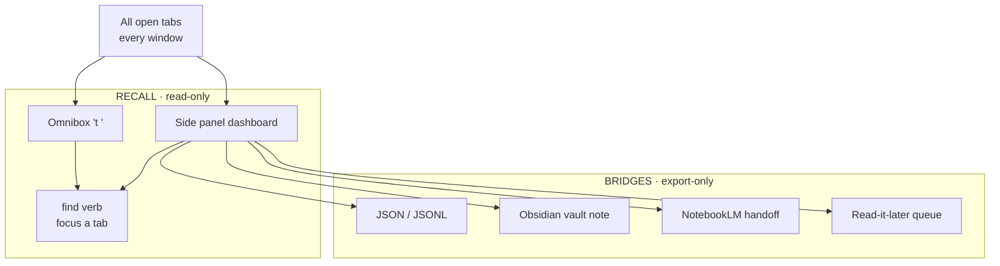
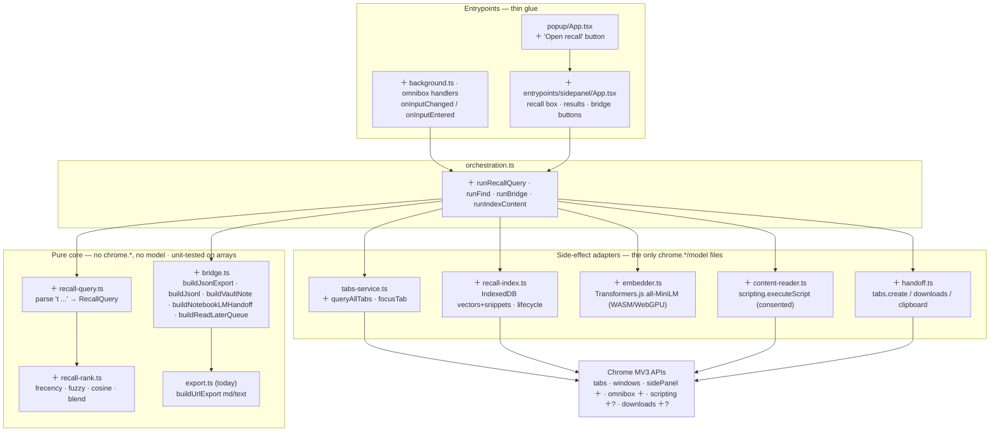
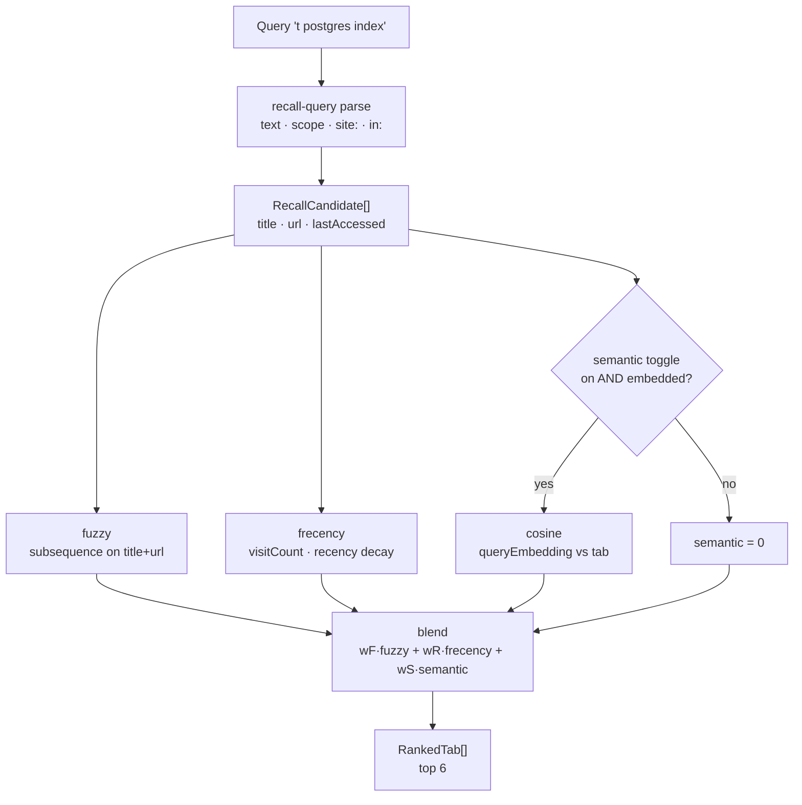
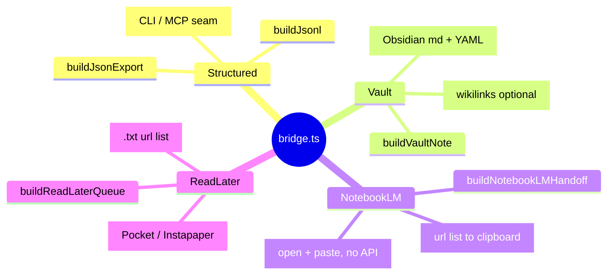
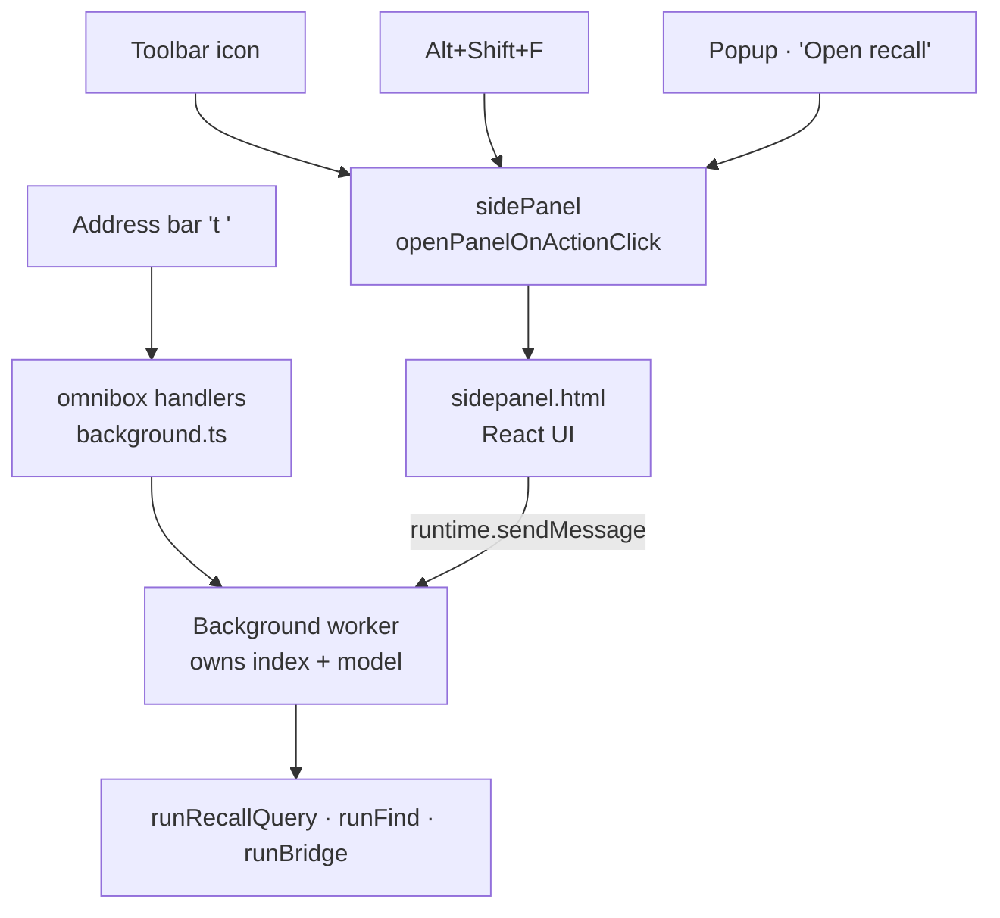
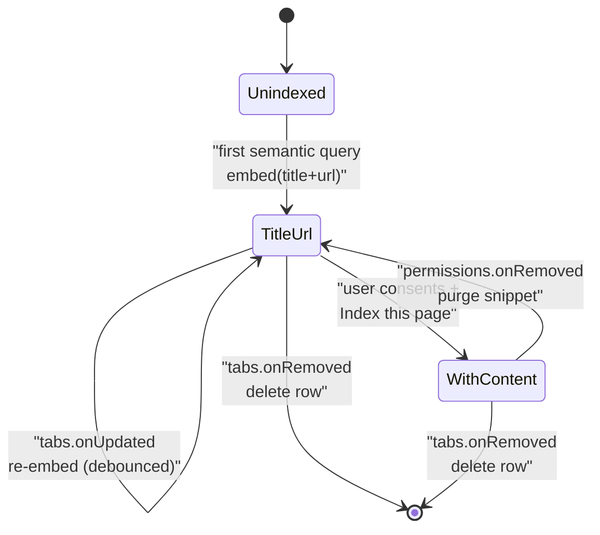
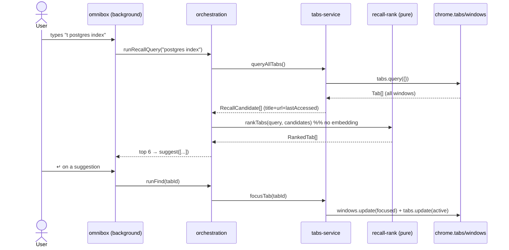
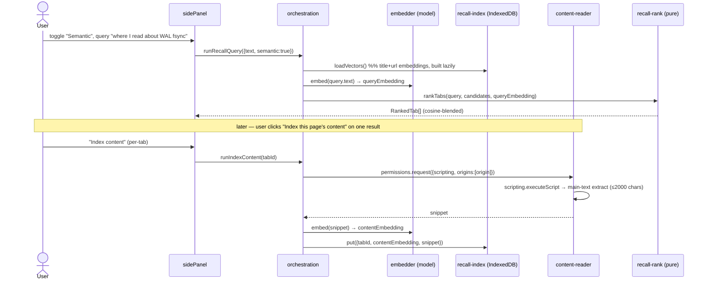
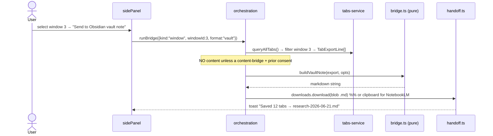
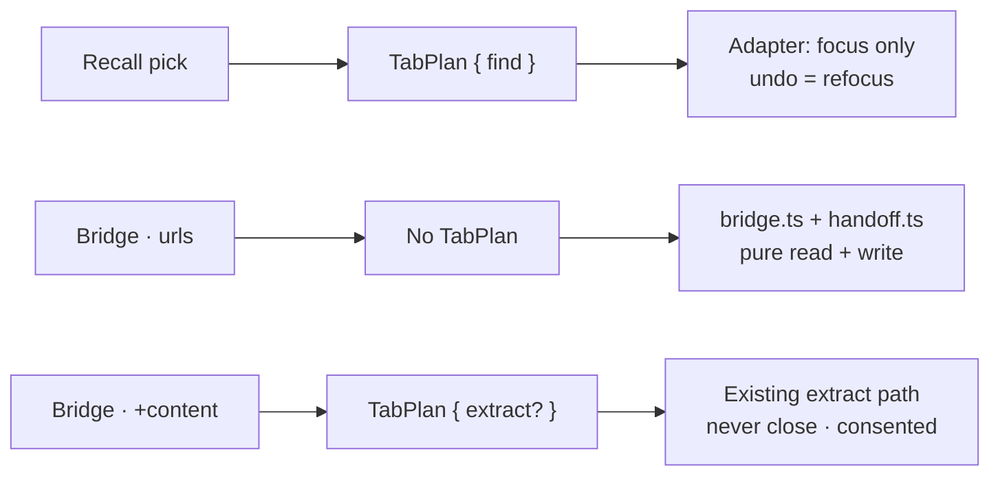

# Surface — Recall / Semantic Search & Ecosystem Bridges (design spec)

> [!IMPORTANT]
> **Fact-check corrections (7: 5 refuted, 2 uncertain).** Independent verification corrected the claims below in this spec. Full corrections + sources live in the [PRD index Verification log](../README.md#verification-log); treat these lines as the corrected truth, not the body text they amend.
> - **[UNCERTAIN]** Chrome's omnibox displays a limited number of extension suggestions (around 6 default suggestions plus the default suggestion). — Authoritative docs do NOT state a specific number.
> - **[UNCERTAIN]** chrome.scripting.executeScript fails on a discarded tab until it is reloaded. — The official Chrome docs do not explicitly state this.
> - **[REFUTED]** NotebookLM has no public API for creating a notebook or adding website sources from a URL list, so a URL-to-NotebookLM bridge must be a paste-assisted… — NotebookLM Enterprise (delivered via Gemini Enterprise / Agentspace on Google Cloud Discovery Engine) does expose an official, documented public REST API that covers both operations the claim denies.
> - **[REFUTED]** chrome.sidePanel requires the 'sidePanel' permission plus a manifest 'side_panel.default_path' key pointing at an extension page. — Only the "sidePanel" permission is mandatory to use the Side Panel API.
> - **[REFUTED]** chrome.omnibox provides onInputStarted, onInputChanged(text, suggest), and onInputEntered(content, disposition) events; onInputStarted fires once per… — Mostly correct, but the parameter name is wrong: onInputEntered's callback is (text, disposition), not (content, disposition) — the first argument is named "text", not "content".
> - **[REFUTED]** MV3 forbids remotely-hosted/executable code, so an embedding model's weights must be bundled in the extension package rather than fetched and executed… — The first half is correct (MV3 prohibits remotely-hosted code), but the conclusion about model weights is wrong.
> - **[REFUTED]** Transformers.js can run all-MiniLM-L6-v2 (384-dim embeddings) in the browser via ONNX Runtime Web on either WASM (CPU) or WebGPU, and for small embedd… — The first half is correct and confirmed: Transformers.js uses ONNX Runtime (Web) to run models in the browser; the default backend is CPU via WASM, and WebGPU is opt-in via `device: 'webgpu'`.


- **Date:** 2026-06-21
- **Status:** Design — build-ready. No code committed yet. Types below are *design*, not edits to `lib/`.
- **Parent vision:** [`../2026-06-21-tab-intelligence-vision.md`](../2026-06-21-tab-intelligence-vision.md) — this is **Pillar E (Recall / search)** + **Pillar G (Bridges)**, the "find any tab fast, then hand a tab-set to my knowledge tools" surface.
- **Builds on:** the seam glossary ([`../../../CONTEXT.md`](../../../CONTEXT.md) — *"Where the seam extends"*) and the **`TabPlan` IR** defined in [`../2026-06-21-layer1-tidy-groups-undo.md`](../2026-06-21-layer1-tidy-groups-undo.md).
- **Sibling surfaces (cross-referenced, lower together):**
  - `tabctl` / native-messaging + MCP — *export piping, the `find` verb, `tabctl export --json`*. See `surfaces/2026-06-21-tabctl-cli.md` (companion spec).
  - AI / on-device planner — *model availability, embedding runtime, BYO-key*. See `surfaces/2026-06-21-ai-command-bar.md` (companion spec).
- **Verify-before-build flags:** ⚠️ marks the channel/version/hardware-dependent facts an implementer must confirm against the live `chrome.*` contract first. Each ⚠️ is in the Verification log.

---

## 1. Goal

Make **finding any open tab instant**, and make **handing a window/group to the user's knowledge stack one command** — both without touching `chrome.*` directly and without reading page content unless the user explicitly consents per action.

Two halves, one surface:

1. **RECALL** — fuzzy search (always on, title+URL) plus *optional* semantic search across **all** open tabs (every window), surfaced two ways:
   - the **omnibox** keyword `t ` (`t postgres index` from the address bar), and
   - a **`chrome.sidePanel`** dashboard (persistent, scrollable, keyboard-driven).
   Optional, consent-gated **page-content indexing** unlocks "the tab where I read about X" instead of only "the tab whose title says X".
2. **BRIDGES** — turn a selection / window / group into an artifact for the user's tools: structured **JSON / JSONL** export (extending today's `buildUrlExport` markdown/text), a **markdown vault note** (Obsidian-flavored), a **NotebookLM** notebook (sources = tab URLs), and a **read-it-later queue**. Every bridge composes with `tabctl export` (sibling spec) so the same artifact is reachable from the terminal.



*Two halves of one read-only surface: recall focuses a tab, bridges emit an artifact — neither ever mutates tab order or groups.*

**Architectural contract:** RECALL is *read-only* — it computes a ranked list and emits a `TabPlan` with a single **`find`** verb (focus/activate a tab; never mutate order/groups). BRIDGES are *export-only* — they produce a file/string artifact and, optionally, a non-destructive **`extract`** + content fetch; no surface here ever calls `chrome.tabs.move/remove/group`. Both are **producers of `TabPlan`** (§10). The index that powers semantic recall is the only new piece of state, and it lives behind the adapter, never in the pure core.

---

## 2. Locked decisions

| # | Decision | Choice | Rationale |
|---|----------|--------|-----------|
| 1 | Recall scope | **All windows** (`browser.tabs.query({})`), not current-window-only | "Find any tab" is worthless if it can't cross windows; this is the one surface that legitimately needs the global view. Sorting/tidy stay current-window. |
| 2 | Default ranking | **frecency + fuzzy** over `title + url`, zero network, zero new permission | Covers the overwhelming majority of "where's that tab" with no privacy cost. Semantic is strictly additive. |
| 3 | Semantic tier | **Opt-in.** Embeddings come from a **bundled Transformers.js model** (`all-MiniLM-L6-v2`, ONNX, WASM default / WebGPU if available), **not** the Prompt API | ⚠️ The Prompt API (Gemini Nano) exposes **no embeddings endpoint** — it is text-generation only. Semantic search needs a real embedding model; we bundle one (MV3 forbids remote code, so weights ship in the package). |
| 4 | What gets embedded | **Title + URL by default.** Page content only with **explicit per-action consent** | Matches the privacy posture verbatim. "Index this page's content" is a deliberate button, never automatic. |
| 5 | Content access | `scripting` + host permission requested **at runtime** (`permissions.request`), per-origin, revocable | Page content is the line we don't cross silently. Optional-permission flow keeps the default install clean and Web-Store-reviewable. |
| 6 | Index storage | Vectors + content snippets in **IndexedDB** (`tabsorter-recall` DB); ephemeral query state in `chrome.storage.session` | Vectors are too big for `storage.sync`/`local` quotas; IndexedDB is the only durable store that holds float arrays. Snippets are wiped when the source tab closes (decision #11). |
| 7 | Omnibox keyword | **`t`** (one keyword per extension; non-configurable by Chrome) | ⚠️ Chrome allows exactly one `omnibox.keyword`. `t ` is short, unclaimed, mnemonic. |
| 8 | Side-panel is the home | The `sidePanel` dashboard is the primary recall + bridge UI; the popup gets only a "Open recall" affordance | Popup closes on blur (bad for search); the side panel persists across tab switches and is keyboard-first. |
| 9 | Bridges never auto-fetch content | A bridge over titles+URLs needs **no** consent; a bridge that includes page text reuses the **same** per-action content consent as semantic indexing | One consent gate, two consumers (index + bridge) — no second mechanism to audit. |
| 10 | NotebookLM / read-it-later are **export handoffs**, not integrations | We emit the artifact (URL list / `.md` / clipboard / `webcal`-style queue file) and **open** the destination; we never hold a NotebookLM token or proxy a key | No accounts, no telemetry, no proxied creds — consistent with the vision's hard rules. |
| 11 | Index lifecycle | Drop a tab's vectors+snippet on `tabs.onRemoved`; re-embed on `tabs.onUpdated` (debounced) | The index is a *cache of what's open now*, not a history store. Closing a tab forgets it. Bounds storage and privacy blast-radius. |
| 12 | Embedding cap | Embed **title+URL always**; content only the first **N=2000 chars** of extracted main text | Bounds model latency and IndexedDB size; mirrors the `MATCH_SAFETY_CAP` discipline of capping unbounded inputs. |

---

## 3. Architecture

Same discipline as the rest of the repo: **pure ranking/format core → one side-effect adapter → thin glue.** New boxes marked **＋**. The pure core never imports `chrome.*` and never imports the model; it receives already-computed embeddings as plain `number[]`.



**Why the embedder is an adapter, not pure:** it touches WebGPU/WASM, ships ~23 MB of ONNX weights, and is non-deterministic across hardware. The pure `recall-rank.ts` takes the *output* (a `Float32Array` reduced to `number[]`) and does deterministic cosine + blend math, so ranking stays exhaustively unit-testable on fixture vectors with no model loaded.

---

## 4. Concrete schemas / types / protocol / config

### 4.1 TypeScript — pure core (`lib/`)

```ts
// recall-query.ts — what 't <text>' parses into
export interface RecallQuery {
  text: string;             // the raw query minus the 't ' keyword
  semantic: boolean;        // user opted into embeddings for this session
  scope: "all" | "current"; // default "all"; 'in:window' token → "current"
  domain?: string;          // 'site:github.com' token, optional prefilter
}

// recall-rank.ts — the rankable view of a tab (superset of TabLite for recall only)
export interface RecallCandidate {
  id: number;
  windowId: number;
  url: string;
  title: string;
  lastAccessed: number;     // epoch ms, from chrome.tabs.Tab.lastAccessed ⚠️
  visitCount: number;       // best-effort; 0 if history not consulted
  embedding?: number[];     // present only when semantic + indexed; else undefined
  snippetMatched?: boolean; // true if a consented content snippet matched lexically
}

export interface RankedTab {
  id: number;
  windowId: number;
  score: number;            // final blended score, 0..1
  parts: { frecency: number; fuzzy: number; semantic: number }; // for debug/UI
}

// Pure: no chrome.*, no model. queryEmbedding is precomputed by the adapter.
export function rankTabs(
  query: RecallQuery,
  candidates: RecallCandidate[],
  queryEmbedding?: number[],
  now?: number,
): RankedTab[];
```

**Ranking math (deterministic, in `recall-rank.ts`):**

```
frecency(tab)  = log2(1 + visitCount) * recencyDecay(now - lastAccessed)
                 recencyDecay(Δ) = 1 / (1 + Δ / HALF_LIFE_MS)   // HALF_LIFE_MS = 3 days
fuzzy(tab)     = subsequenceScore(query.text, title) ⊕ subsequenceScore(query.text, url)
                 // Smith–Waterman-ish: contiguous + word-boundary + prefix bonuses, 0..1
semantic(tab)  = query.semantic && tab.embedding ? cosine(queryEmbedding, tab.embedding) : 0

score = clamp01( wF*fuzzy + wR*frecency + wS*semantic + (tab.snippetMatched ? wSnip : 0) )
        // default weights: wF .50  wR .25  wS .20  wSnip .05  (semantic tier);
        //                  wF .67  wR .33                     (lexical-only tier, renormalized)
```

Lexical-only tier is the default: `wS = 0`, no model loaded, no IndexedDB read. Semantic weight is folded in only when `query.semantic` and the tab has an embedding; tabs without an embedding fall back to fuzzy+frecency, so a half-indexed window degrades gracefully rather than dropping rows.



*The ranking pipeline: fuzzy+frecency always run; the semantic branch only adds a cosine term when the user opted in and the tab is embedded.*

### 4.2 TypeScript — bridge artifacts (`lib/bridge.ts`)

Extends `ExportFormat` (`lib/types.ts`) from `"markdown" | "text"` to add the structured + handoff formats. `buildUrlExport` keeps its current signature; new builders sit alongside.



*The four bridge families, each a pure builder over titles+URLs that composes with `tabctl export`.*

```ts
// types.ts — widened
export type ExportFormat =
  | "markdown" | "text"        // today
  | "json" | "jsonl"           // structured (the CLI/MCP seam)
  | "vault" | "notebooklm" | "readlater"; // bridges

// One JSON line per tab — the JSONL the CLI greps (`tabctl ls --json` shares this shape)
export interface TabExportLine {
  id: number;
  windowId: number;
  groupId: number | null;     // -1 (chrome.tabGroups.TAB_GROUP_ID_NONE) → null
  url: string;
  title: string;
  domain: string;
  pinned: boolean;
  active: boolean;
  lastAccessed: number | null;
  /** present ONLY when the user consented to content capture for this tab */
  content?: { text: string; capturedAt: number };
}

// A full structured export (the `--json` artifact)
export interface TabExport {
  version: 1;
  exportedAt: number;
  source: { kind: "window" | "group" | "selection"; windowId?: number; groupId?: number };
  tabs: TabExportLine[];
}

export function buildJsonExport(tabs: TabExportLine[], source: TabExport["source"]): string;   // JSON
export function buildJsonl(tabs: TabExportLine[]): string;                                       // \n-joined lines
export function buildVaultNote(x: TabExport, opts: VaultOpts): string;                           // Obsidian md
export function buildNotebookLMHandoff(x: TabExport): NotebookLMHandoff;                         // url list + open intent
export function buildReadLaterQueue(x: TabExport): string;                                       // newline url list (.txt)
```

**Vault note format (`buildVaultNote`)** — Obsidian-flavored markdown with YAML front-matter, deterministic + testable:

```markdown
---
created: 2026-06-21T18:04:00Z
source: tab-sorter
window: 3
tags: [tabs, research]
---
# Research session — 2026-06-21

> [!info] 12 tabs captured from window 3

## github.com
- [pgvector/pgvector](https://github.com/pgvector/pgvector)
## postgresql.org
- [CREATE INDEX](https://www.postgresql.org/docs/current/sql-createindex.html)
```

`[[wikilinks]]` are optional (`opts.wikilink: boolean`); default off because raw URLs survive better outside Obsidian. `> [!info]` is a callout — Obsidian-specific but degrades to a blockquote in plain markdown.

**NotebookLM handoff** — NotebookLM has **no public "create notebook from URL list" API**; the handoff is therefore an *assisted manual import*, not an automated one:

```ts
export interface NotebookLMHandoff {
  urls: string[];                 // deduped tab URLs (sources)
  clipboardText: string;         // newline-joined urls, ready to paste into "Add source → Website"
  openUrl: "https://notebooklm.google.com/"; // ⚠️ we tabs.create() this; we do NOT call any private API
  note: string;                  // user-facing: "Paste the copied URLs into Add source → Website"
}
```

### 4.3 Manifest delta (WXT `wxt.config.ts`)

```ts
// added to manifest:
permissions: [
  "tabs", "storage", "contextMenus",   // existing
  "sidePanel",                          // ＋ side-panel dashboard
  "omnibox",                            // declared via the omnibox key below + this is implicit
],
optional_permissions: ["scripting", "downloads"],   // ＋ requested at runtime, per use
optional_host_permissions: ["*://*/*"],             // ＋ for content read; granted per-origin via permissions.request
omnibox: { keyword: "t" },                            // ＋ ⚠️ exactly one keyword allowed
side_panel: { default_path: "sidepanel.html" },       // ＋ WXT emits this from entrypoints/sidepanel/
minimum_chrome_version: "114",                         // ⚠️ sidePanel landed in Chrome 114
```

> Firefox note: Firefox has no `chrome.sidePanel`; it uses `sidebar_action`. WXT can branch the manifest by target. Omnibox exists on both (`browser.omnibox`). The semantic tier (WebGPU) and `scripting` work on both. Recall is therefore **fully functional on Firefox via the sidebar + omnibox**; only the manifest key differs.

### 4.4 Omnibox protocol (the `t ` session)

Real `chrome.omnibox` event surface used:

```ts
browser.omnibox.setDefaultSuggestion({ description: "Search open tabs — type to filter" });

browser.omnibox.onInputStarted.addListener(() => { /* warm the candidate cache */ });

browser.omnibox.onInputChanged.addListener((text, suggest) => {
  const ranked = /* runRecallQuery(text) */;
  suggest(ranked.slice(0, 6).map(r => ({
    content: `tab:${r.id}`,                          // returned to onInputEntered
    description: `<match>${title}</match> <dim>${domain}</dim>`, // url/match/dim markup ⚠️
    deletable: false,
  })));
});

browser.omnibox.onInputEntered.addListener((content /* "tab:123" */, disposition) => {
  // runFind(parseTabId(content)) → focusTab → windows.update(focused) + tabs.update(active)
});
```

`description` supports only the `<url>`, `<match>`, `<dim>` XML-style tags ⚠️ and **must XML-escape** `& < > "` in titles/URLs or the suggestion silently fails to render. The `content` string is what lands in the address bar on accept, so we encode the tab id there and decode in `onInputEntered`.

### 4.5 sidePanel API surface

```ts
// background.ts — open the panel from the toolbar icon
browser.sidePanel.setPanelBehavior({ openPanelOnActionClick: true }); // ⚠️ Chrome 114+

// or open programmatically in response to a user gesture (command/hotkey):
browser.sidePanel.open({ windowId });                                  // ⚠️ requires a user gesture

// optionally scope which path shows per tab:
browser.sidePanel.setOptions({ path: "sidepanel.html", enabled: true });
```

`sidepanel.html` is a normal extension page (React via WXT). It talks to the background worker over `browser.runtime.sendMessage` (the worker owns the index + model; see §5). `setPanelBehavior({ openPanelOnActionClick: true })` makes the toolbar icon toggle the panel; a `recall` command (`Alt+Shift+F`, ⚠️ confirm no collision) calls `sidePanel.open({ windowId })` for a keyboard path.



*Both recall surfaces — the address-bar omnibox and the persistent side panel — route to the same background worker that owns the index and model.*

### 4.6 IndexedDB schema (`recall-index.ts`)

```
DB  tabsorter-recall  (version 1)
store "vectors"   keyPath "tabId"
  { tabId, windowId, url, title,
    embedding: Float32Array(384),   // all-MiniLM-L6-v2 dim = 384 ⚠️
    contentEmbedding?: Float32Array(384),  // only if content consented
    snippet?: string,               // ≤ 2000 chars, only if content consented
    updatedAt: number }
index "byWindow" on "windowId"
```

384 is the embedding dim of `all-MiniLM-L6-v2` ⚠️. Cosine similarity is computed in the worker over the in-memory mirror of this store (a few hundred 384-floats is trivial); IndexedDB is the durable backing. On `tabs.onRemoved` the row is `delete`d; on service-worker restart the store is reloaded into memory lazily on first recall.



*Index lifecycle per tab: it is a cache of what is open now — embedded lazily, content added only on consent, and dropped the moment the tab closes.*

---

## 5. Data flow

### 5.1 Recall via omnibox (lexical default, no model)



### 5.2 Semantic recall + consented content index (side panel)



### 5.3 Bridge: window → vault note / NotebookLM / read-later



---

## 6. Permissions & setup delta

| Capability | Permission | When requested | Justification |
|---|---|---|---|
| Side-panel dashboard | `sidePanel` (install-time) | install | The recall/bridge home UI. ⚠️ Chrome 114+. |
| Omnibox `t ` | `omnibox` key (install-time) | install | Address-bar recall. One keyword. |
| Cross-window recall | already covered by existing `tabs` | — | `tabs.query({})` needs no new grant beyond `tabs` (which gates `url`/`title`). |
| Structured + bridge export (titles+urls) | none | — | Pure string building from data already held; no new permission. |
| Save bridge file | `downloads` (optional) | first "Save to vault / read-later" | Write the `.md`/`.txt` artifact. Falls back to clipboard if denied. |
| Page-content index / content bridge | `scripting` + host (optional, per-origin) | first "Index content" / "include page text" on that origin | The one line we never cross silently. Revocable in `chrome://extensions`. |
| Embedding model | none (bundled) | first semantic query | Weights ship in the package (MV3 forbids remote code); no network, no permission. |

**Setup:** zero for lexical recall (works the instant the extension loads). Semantic recall costs a **one-time model warm-up** (~23 MB ONNX decode into WASM/WebGPU, cached by the browser after first load) the first time the user toggles "Semantic" — surfaced as a "Preparing on-device search…" state. Content indexing costs one per-origin permission prompt. No host, no account, no key for the default and semantic tiers; BYO-key cloud embeddings are the AI-spec's concern, reused here only if the user has already configured a key (see §9 Q4).

---

## 7. Edge cases

| Case | Handling |
|------|----------|
| WebGPU unavailable / old GPU | `embedder` falls back to **WASM** (CPU); for small MiniLM, WASM is comparable or faster ⚠️, so this is graceful, not a downgrade. |
| Model fails to load / decode | Semantic toggle disables itself with a one-line reason; recall silently continues **lexical-only** (`wS=0`). Never blocks find. |
| `lastAccessed` undefined | ⚠️ `Tab.lastAccessed` is recent/channel-dependent; if `undefined`, frecency uses `tab.index`-as-recency proxy and `visitCount=0`, so ranking degrades to fuzzy-dominant rather than throwing. |
| Discarded / frozen tabs | Still in `tabs.query({})` with title+url; fully recall-able. `scripting.executeScript` on a **discarded** tab fails — content index defers until the tab is reloaded (queued, not errored). |
| `chrome://`, `file://`, extension pages | Recallable by title+url (no permission needed). `scripting` is **blocked on `chrome://`** and on the Web Store — content index button is hidden there; bridges export the URL only. |
| Tab closes mid-query | `recall-index` drops its row on `tabs.onRemoved`; `runFind` re-validates the id against a fresh `tabs.query` and reports "tab no longer open" instead of focusing a ghost. |
| Omnibox markup injection | Titles/URLs are XML-escaped before going into `description`; a title containing `<match>` can't break the suggestion or smuggle markup. |
| Huge windows (300+ tabs) | Candidate cache warmed on `onInputStarted`; ranking is O(n) lexical + O(n·384) cosine — sub-10 ms for n≤1000. Suggestions capped at 6 (Chrome's omnibox limit anyway ⚠️). |
| Duplicate URLs across windows | Recall shows each tab (windowId disambiguates); bridges **dedupe by URL** before export (NotebookLM sources especially). |
| Content consent revoked later | Revoking the host permission triggers cleanup: `permissions.onRemoved` → purge `snippet`/`contentEmbedding` for that origin from IndexedDB. Index returns to title+url only. |
| Private / incognito windows | Excluded from the index unless the extension is explicitly allowed in incognito; never written to the durable IndexedDB store. |
| NotebookLM / read-later with 0 content permission | Works fully — these bridges are **URL-only by default**; page text is opt-in and additive. |

---

## 8. Testing

Matches the repo's **pure-core (fixture arrays) + fake-browser adapter** pattern.

- **Pure, fixture data (high-value, cheap):**
  - `recall-rank.rankTabs` — frecency decay monotonicity, fuzzy subsequence scoring (contiguous > scattered, prefix bonus), cosine blend, **graceful degradation** (tabs without embeddings still rank), weight renormalization between tiers. All with hand-written `number[]` embeddings — **no model loaded**.
  - `recall-query.parse` — `t site:github.com in:window foo` → `{domain, scope, text}`; keyword stripping; empty query.
  - `bridge.*` — `buildJsonExport`/`buildJsonl` round-trip (parseable, one line per tab, `groupId -1 → null`), `buildVaultNote` (front-matter, domain grouping, callout, wikilink on/off), URL dedupe, **content omitted when not consented** (the privacy invariant as a test).
- **Invariant regression guards:** *no bridge artifact ever contains `content` unless the line carries a `capturedAt`* (property test over random consent flags); *recall emits only `find` verbs, never `move`/`remove`/`group`* (lower-to-TabPlan test, §10).
- **Adapter (`@webext-core/fake-browser`):** `queryAllTabs` shape; `focusTab` issues `windows.update` + `tabs.update`; `recall-index` IndexedDB round-trip and `onRemoved` eviction (fake IndexedDB); omnibox `onInputChanged` → `suggest` payload is XML-escaped and ≤6 items.
- **Embedder:** contract test only — `embed("x")` returns a 384-length finite-number vector; WASM/WebGPU selection is mocked. Not a model-accuracy test (that's not our model).
- **Manual E2E checklist:** load unpacked; `t ` from address bar finds a tab in another window; open side panel, toggle semantic, query a paraphrase ("WAL fsync" finds a "write-ahead log durability" tab); "Index content" prompts once per origin; export a window to `.md` and verify no page text leaked without consent.

---

## 9. Open questions

1. **Embedding model choice & size.** `all-MiniLM-L6-v2` (384-dim, ~23 MB ONNX) is the safe default; `bge-small`/`gte-small` are better but bigger. Ship one, or let the options page pick? Recommend ship MiniLM, gate larger behind a "high-accuracy" toggle that downloads on demand — but downloading weights post-install may trip MV3's remote-code rules ⚠️; needs confirmation (likely must bundle all variants).
2. **History-backed frecency.** `visitCount` is best with the `history` permission, but that's a heavy grant. Recommend default to tab-only recency (no `history`); offer `history` as an optional permission for "rank by how often I visit," not install-time.
3. **NotebookLM automation.** There is **no public NotebookLM source-import API** ⚠️; the bridge is paste-assisted. If/when an API or `web+notebooklm:` handler appears, upgrade `buildNotebookLMHandoff` to a real push. Until then: clipboard + open tab.
4. **BYO-key cloud embeddings.** If the user configured a cloud key in the AI spec, should semantic recall *offer* cloud embeddings (better quality, but sends titles/urls off-device)? Recommend off by default, behind an explicit per-query "use cloud embeddings" with the same titles+urls-only contract; never auto-route. Defer to `surfaces/2026-06-21-ai-command-bar.md`.
5. **Read-it-later target.** Plain `.txt` URL list (universal, Pocket/Instapaper/Omnivore-importable) vs a specific service's API. Recommend format-agnostic `.txt`/`.json` export now; no service lock-in.
6. **Side-panel vs popup search box.** Do we also put a minimal recall box in the popup, or is "Open recall" enough? Leaning enough — the popup blurs closed, which is hostile to search.

---

## 10. How it lowers to TabPlan

Recall and bridges are **producers of `TabPlan`**, never direct `chrome.*` callers — same contract as the popup, the CLI, and the AI bar. Two of the IR's verbs carry this surface; everything else degenerates to read-only.

**RECALL → the `find` verb.** A recall result is a *non-mutating* plan: it activates a tab. `order`, `groups`, `close` stay empty. The adapter's realization of `find` is `windows.update({focused})` + `tabs.update({active})` — not a move.

```ts
// runFind lowers a ranked pick to:
const plan: TabPlan = {
  windowId: picked.windowId,
  order: [],          // recall NEVER reorders
  groups: [],
  close: [],
  find: { tabId: picked.id },   // the new, read-only verb slot
};
```

> This extends the Layer-1 `TabPlan` (which defined `order`/`groups`/`close`) with the `find` verb named in `CONTEXT.md`'s verb list (`sort | group | move | close | stash | extract | restore | find`). `find` is the **only** verb whose realization mutates *focus* but not *arrangement* — preview is a no-op (nothing to diff), undo is "focus the previously-active tab" (cheap snapshot). The seam's preview+undo guarantees still hold trivially.

**BRIDGES → `extract` (optional) + an artifact, never `close`.** A pure URL/title bridge emits **no `TabPlan` at all** — it's a pure read + `bridge.ts` format + `handoff.ts` write, with no mutation to preview or undo. A *content* bridge first lowers to the existing **`extract`** verb only if the user asked to move the set to a new window (reusing today's `moveTabsToNewWindow` / `runExtract` path), then captures consented content; it still never emits `close`. So a bridge is at most as destructive as today's extract, and usually fully read-only.

```
recall (find)   →  TabPlan{ find }            →  adapter: focus only      (read-only, undo = refocus)
bridge urls     →  (no TabPlan)               →  bridge.ts + handoff.ts    (pure read + file/clipboard)
bridge +content →  TabPlan{ extract? } + read →  existing extract path     (never close; content consented)
```



*Three convergent lowerings: recall is focus-only, a URL bridge emits no plan at all, and a content bridge is at most as destructive as today's `extract`.*

This is the same convergence the vision describes: the CLI's `tabctl find` / `tabctl export --json` (sibling spec) and this surface's omnibox/side-panel both lower to **the same `find` verb and the same `bridge.ts` builders** — one IR, many mouths. The MCP `search_open_tabs` tool (sibling spec) is literally `runRecallQuery` exposed as a tool; the agent path inherits recall for free.

---

> Technical claims in this doc are fact-checked in the [PRD index Verification log](../README.md#verification-log).
