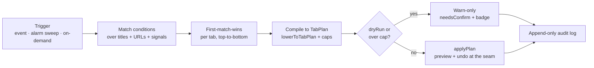
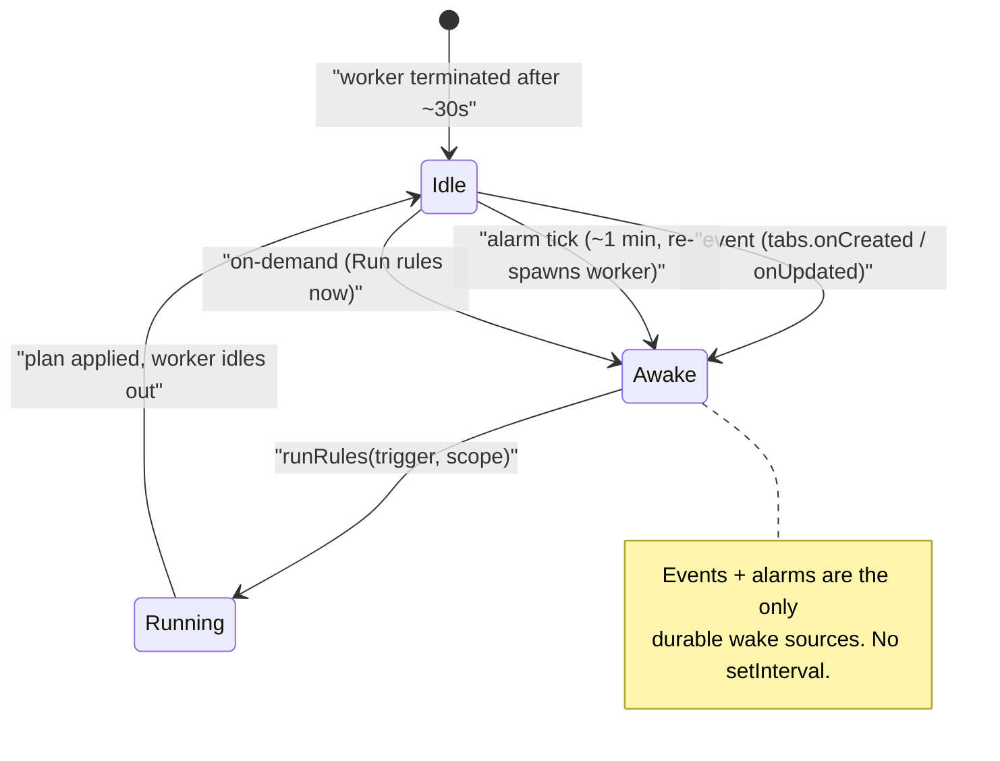
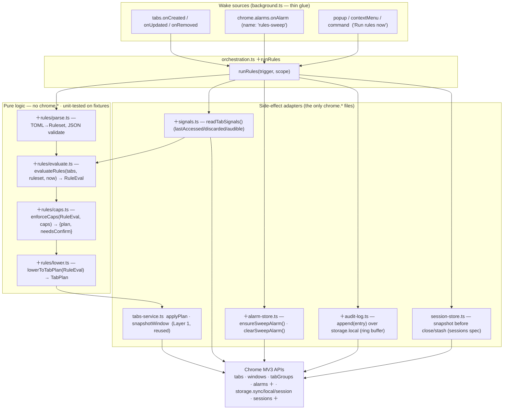
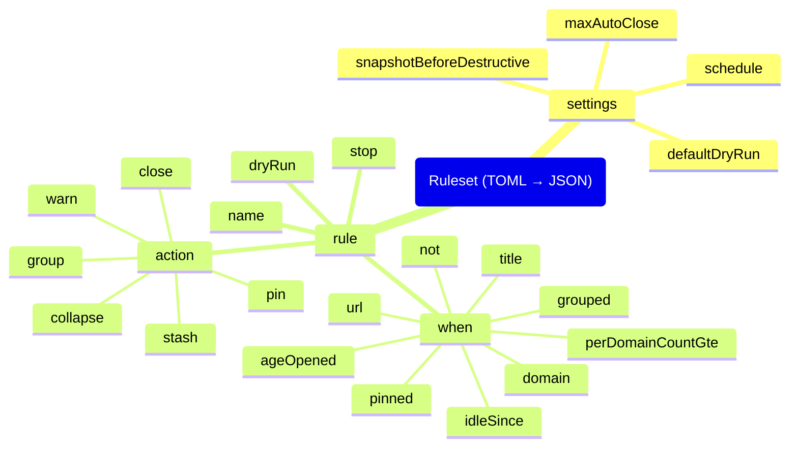
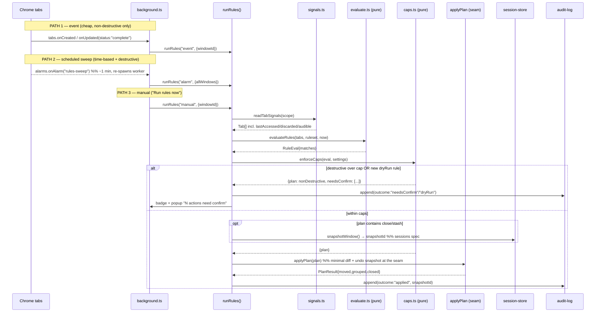
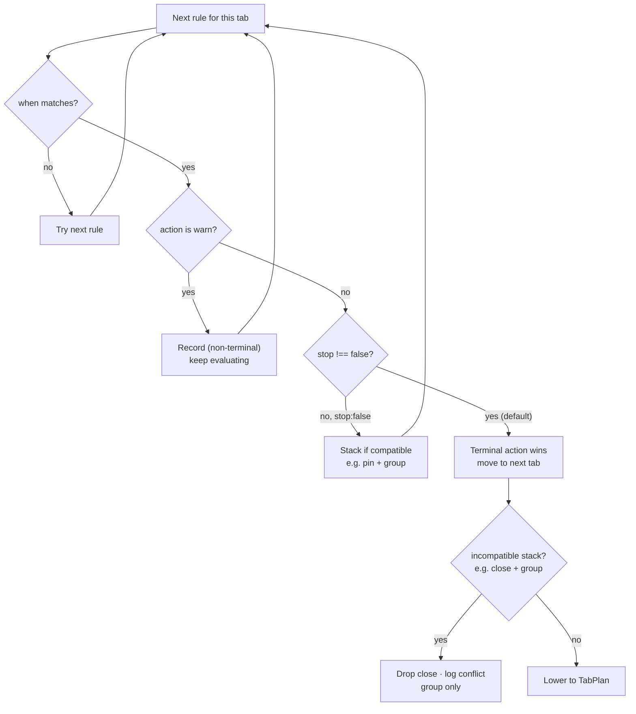
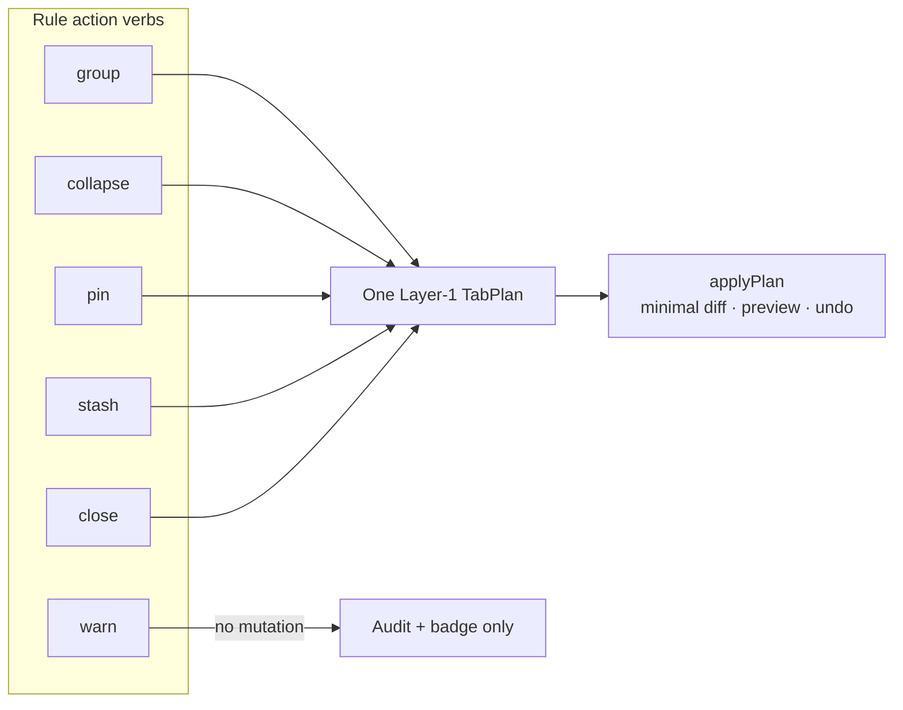

# Surface — Declarative rules engine & scheduled hygiene (design spec)

> [!IMPORTANT]
> **Fact-check corrections (3: 3 refuted, 0 uncertain).** Independent verification corrected the claims below in this spec. Full corrections + sources live in the [PRD index Verification log](../README.md#verification-log); treat these lines as the corrected truth, not the body text they amend.
> - **[REFUTED]** Firefox's tabs.Tab does not expose lastAccessed, so idle-since rules are a no-op on Firefox. — Firefox DOES expose tabs.Tab.lastAccessed.
> - **[REFUTED]** Firefox does not implement chrome.tabGroups, so group/collapse/grouped rules are no-ops on Firefox. — Firefox DOES implement the tabGroups API (exposed as browser.tabGroups / chrome.tabGroups).
> - **[REFUTED]** Chrome refuses to add pinned tabs to a tab group, so group actions can only target unpinned tabs. — Chrome does NOT refuse pinned tabs.


- **Date:** 2026-06-21
- **Status:** Design — build-ready. No code committed yet. Types below are *design*, not edits to `lib/`.
- **Parent vision:** [`../2026-06-21-tab-intelligence-vision.md`](../2026-06-21-tab-intelligence-vision.md) — this is **Pillar F (Automation / rules)** of that map, and a Layer-1.5/Layer-2 surface.
- **Builds on:** the **`TabPlan` IR** defined in [`../2026-06-21-layer1-tidy-groups-undo.md`](../2026-06-21-layer1-tidy-groups-undo.md) and the domain glossary ([`../../../CONTEXT.md`](../../../CONTEXT.md), see *"Where the seam extends"*).
- **Sibling surfaces:** the **sessions/snapshots** surface (snapshot-before-destructive-action; `chrome.sessions`), the **tabctl CLI** and **MCP server** surfaces (they own the same rules file on disk; this engine is the *in-extension* evaluator of it). Where this doc says "see the sessions spec," it means `surfaces/2026-06-21-sessions-snapshots.md`.
- **Verify-before-build flags:** ⚠️ marks the channel/version-dependent facts an implementer must confirm against the live `chrome.*` contract first. Every ⚠️ has a matching row in the PRD index Verification log.

---

## 1. Goal

Keep a window tidy **continuously and unattended**, driven by a **declarative, dotfile-friendly rules file** the user (and their other surfaces — CLI, MCP) can read, diff, and version-control. The engine is a pure **producer of `TabPlan`**: it observes tab signals, evaluates rules, and lowers matched actions to a single `TabPlan` that the *existing* side-effect adapter realizes — with the same preview + universal undo as every other surface. It never touches `chrome.*` directly.

Three things ship together:

1. **A rules schema** (TOML authoring, JSON as the wire/validated form) — match conditions over titles+URLs+coarse tab signals, and a small action verb set.
2. **An evaluation engine** with three triggers — **on-demand**, **event-driven** (`tabs.onCreated`/`onUpdated`), and **scheduled** (`chrome.alarms`) — plus the reason a service worker *cannot* poll.
3. **Safety machinery** — deterministic rule ordering + conflict resolution, hard caps on destructive actions, dry-run/preview, and an append-only audit log.



*The whole engine, end to end: a trigger fires, rules match, the first match per tab wins, matched actions compile to one `TabPlan`, and either warn-only or apply — every outcome lands in the audit log.*

Non-goal: reading page **content**. Rules match titles + URLs + the coarse signals Chrome already exposes on a `Tab`. Content-gated rules are explicitly out of scope until a later, consent-gated capability (see §9).

---

## 2. Locked decisions

| # | Decision | Choice | Rationale |
|---|----------|--------|-----------|
| 1 | Producer, not adapter | The engine emits a **`TabPlan`**; `applyPlan` (Layer 1) realizes it | Inherits preview, minimal-diff, and undo *for free*. One seam, one safety story. |
| 2 | Authoring format | **TOML** on disk (CLI-owned), **JSON** as the validated in-extension form | TOML is dotfile-friendly and comment-friendly; JSON is what `chrome.storage` and `structuredOutput` speak. CLI compiles TOML→JSON; extension stores/validates JSON. |
| 3 | Config of record (in-extension) | Compiled JSON ruleset in **`chrome.storage.sync`** (small) with overflow to `chrome.storage.local` | Sync roams the ruleset across the user's Chrome profiles; local backs large rulesets past the sync item cap. ⚠️ sync quotas below. |
| 4 | Default trigger posture | **Event-driven for cheap actions** (group/pin), **scheduled for time-based actions** (idle/age), **on-demand** always available | A worker can't poll; events cover "new tab arrives," alarms cover "tab went stale." See §2-note. |
| 5 | Minimum schedule granularity | **`chrome.alarms`, ~1 min floor in a packed build** (30 s on Chrome 120+; effectively no floor only when unpacked) | This is the hard ceiling on "continuous." We market it as "checked every minute," not "real-time." ⚠️ alarms floor. |
| 6 | Destructive actions are capped | `close`/`stash` never auto-fire on more than **`maxAutoClose` (default 5)** tabs without an explicit confirm step | "Never silently move 80 tabs" — enforced here *and* re-enforced at the seam. Belt and suspenders. |
| 7 | Snapshot before destruction | Any plan containing `close`/`stash` writes a **session snapshot first** (see the sessions spec) | Destruction is the one near-irreversible op; undo must be able to reopen. |
| 8 | Rule evaluation order | **First-match-wins per tab, top-to-bottom**, with explicit `stop` / `continue` | Deterministic, diffable, no hidden priority math. A tab gets at most one *terminal* action unless rules opt into stacking. |
| 9 | Dry-run is the default for new rules | A freshly added/edited rule runs in **`dryRun` (warn-only)** until the user promotes it | New automation can't surprise you on its first fire. |
| 10 | Scope | **Current window** for on-demand; **all normal windows** for scheduled sweeps | Matches MVP single-window default but lets the nightly sweep cover everything. ⚠️ `windows.getAll` / `tabs.query` shape. |
| 11 | Signals used | **`url`, `title`, `pinned`, `groupId`, `lastAccessed`, `discarded`, `audible`, `active`, `mutedInfo`** only | These are the coarse signals Chrome exposes; reliability flagged in §7e. No content, ever. |
| 12 | No telemetry | Audit log is **local-only**, in `chrome.storage.local`, ring-buffered | Consistent with the repo's no-telemetry, review-friendly posture. |

> **§2-note — why three triggers, not one.** An MV3 background is a **service worker**: it is terminated when idle (Chrome's hard cap is ~30 s of inactivity, extended by activity/`waitUntil`) and has no long-lived timer of its own. ⚠️ So "every 10 seconds, re-scan all tabs" is impossible without a wake source. The two wake sources Chrome gives an extension are **events** (`tabs.onCreated`, `tabs.onUpdated`, …) and **`chrome.alarms`** (which survive worker death and re-spawn it). Time-based conditions (`idleSince`, `ageOpened`) therefore can only be *as fresh as the next alarm tick*, which is ~1 min in a packed build (§5).



*An MV3 worker sleeps when idle; the three triggers are the only ways to wake it and run a sweep.*

---

## 3. Architecture

The engine is a new **pure** producer plus thin adapters for the things only the platform can do (read the clock-adjacent signals, set alarms, persist the log). It reuses Layer 1's `applyPlan`/`snapshotWindow` verbatim.



**The seam is unchanged.** `lowerToTabPlan` is just another producer of the Layer-1 `TabPlan`; `applyPlan` is the only thing that calls `chrome.tabs` / `chrome.tabGroups`. Preview + undo live at that seam, so an over-eager rule becomes a *rejected/undoable plan*, never a silent mutation.

---

## 4. Concrete schemas / types / config formats

### 4a. Authoring format — TOML (`~/.config/tabctl/rules.toml`)

The CLI owns this file; the extension receives the **compiled JSON** (§4c) via native messaging or an "Import rules" file picker. TOML is chosen for comments + dotfile ergonomics.

```toml
# ~/.config/tabctl/rules.toml
version = 1

[settings]
schedule        = "1m"        # alarm period; floored to ~1m packed / 30s on Chrome 120+
max_auto_close  = 5           # destructive cap before a rule must ask
snapshot_before_destructive = true
default_dry_run = true        # new/edited rules start warn-only

# Rules evaluate top-to-bottom, first terminal match wins per tab (decision #8).

[[rule]]
name   = "Group design tools"
when   = { domain = ["*.figma.com", "*.sketch.com", "zeplin.io"] }
action = { type = "group", title = "Design", color = "purple", collapsed = false }
stop   = true

[[rule]]
name   = "Pin the docs I keep open"
when   = { url = "^https://developer\\.chrome\\.com/docs/" }   # url is a JS-regex string
action = { type = "pin" }

[[rule]]
name   = "Stash anything idle for 3 days"
when   = { idle_since = "3d" }          # based on tab.lastAccessed ⚠️
action = { type = "stash", into = "Idle bucket" }
dry_run = false                          # promoted out of warn-only

[[rule]]
name   = "Warn when YouTube takes over"
when   = { domain = "youtube.com", per_domain_count_gte = 6 }
action = { type = "warn", message = "6+ YouTube tabs open" }
```

### 4b. Match conditions — the full surface

A `when` table is an **AND of all present keys**. Arrays inside a key are **OR**. `not` negates a nested `when`. Domain globs are matched against `getDomain(tab.url)` (the existing pure helper — same bucketing as sort/group, including `(chrome)` / `(file)` pseudo-domains); `url` is a JS regex tested against `tab.url` only.

| Key | Type | Meaning | Backing signal | Reliability |
|---|---|---|---|---|
| `domain` | glob \| glob[] | `*.figma.com` style; matched vs `getDomain(url)` | `tab.url` | HIGH |
| `url` | regex string | JS `RegExp` over `tab.url`; reuses the **match safety cap (1000)** | `tab.url` | HIGH |
| `title` | regex string | JS `RegExp` over `tab.title` | `tab.title` | HIGH |
| `age_opened` | duration (`"2h"`,`"3d"`) | time since the tab was *opened* | **derived** (see §7) | MEDIUM ⚠️ |
| `idle_since` | duration | time since last activated | `tab.lastAccessed` | MEDIUM ⚠️ |
| `per_domain_count_gte` | int | window has ≥ N tabs of this tab's domain | computed from query | HIGH |
| `pinned` | bool | pin state | `tab.pinned` | HIGH |
| `grouped` | bool | already in a tab group | `tab.groupId !== -1` | HIGH ⚠️ |
| `audible` | bool | currently emitting sound | `tab.audible` | MEDIUM ⚠️ |
| `discarded` | bool | unloaded to save memory | `tab.discarded` | MEDIUM ⚠️ |
| `active` | bool | the focused tab in its window | `tab.active` | HIGH |
| `not` | when | logical negation | — | — |

### 4c. Validated JSON form + TypeScript types (`lib/rules/types.ts`)

This is the in-extension source of truth and the shape the AI command bar / MCP may emit (structured output). `parse.ts` compiles TOML→this and `zod`-validates; an invalid ruleset is **rejected whole** (non-throwing verdict, mirroring the `match.ts` `PatternVerdict` pattern in CONTEXT.md).

```ts
type Duration = `${number}${"m" | "h" | "d"}`;       // "30m" | "2h" | "3d"
type DomainGlob = string;                              // "*.figma.com", "youtube.com", "(chrome)"

interface MatchCondition {
  domain?: DomainGlob | DomainGlob[];
  url?: string;                  // JS RegExp source, capped at MATCH_SAFETY_CAP (1000)
  title?: string;               // JS RegExp source
  ageOpened?: Duration;         // ⚠️ derived, see §7
  idleSince?: Duration;         // from tab.lastAccessed ⚠️
  perDomainCountGte?: number;
  pinned?: boolean;
  grouped?: boolean;
  audible?: boolean;
  discarded?: boolean;
  active?: boolean;
  not?: MatchCondition;
}

// Action verbs map 1:1 onto TabPlan capabilities (§10). No verb here can do
// something applyPlan can't already realize.
type RuleAction =
  | { type: "group"; title: string; color: GroupColor; collapsed?: boolean }
  | { type: "collapse"; title?: string }              // collapse a group (matched tabs' group)
  | { type: "pin" }
  | { type: "stash"; into?: string }                  // → TabPlan.stash (sessions spec)
  | { type: "close" }
  | { type: "warn"; message: string };                // no mutation; audit + badge only

interface Rule {
  name: string;
  when: MatchCondition;
  action: RuleAction;
  stop?: boolean;          // default true: first terminal match wins (decision #8)
  dryRun?: boolean;        // overrides settings.defaultDryRun for this rule
}

interface RuleSettings {
  schedule: Duration;      // alarm period; floored — see §5
  maxAutoClose: number;    // default 5
  snapshotBeforeDestructive: boolean;  // default true
  defaultDryRun: boolean;  // default true
}

interface Ruleset {
  version: 1;
  settings: RuleSettings;
  rules: Rule[];
}

type RulesetVerdict =
  | { ok: true; ruleset: Ruleset }
  | { ok: false; reason: string; ruleIndex?: number };  // whole-file reject

// --- evaluation output (pure; pre-cap, pre-lowering) ---
interface RuleMatch {
  tabId: number;
  ruleName: string;
  action: RuleAction;
  dryRun: boolean;        // if true → warn-only, never enters the mutating TabPlan
}
interface RuleEval {
  matches: RuleMatch[];
  windowId: number;
  evaluatedAt: number;    // epoch ms = the `now` passed in (testable: inject the clock)
}
```



*The full rule schema at a glance: top-level `settings`, then a list of `rule`s, each a `when` match condition plus one `action` verb and the `stop`/`dryRun` controls.*

### 4d. Audit-log entry (`chrome.storage.local`, ring buffer of ~500)

```ts
interface AuditEntry {
  at: number;                 // epoch ms
  trigger: "event" | "alarm" | "manual";
  ruleName: string;
  action: RuleAction["type"];
  tabIds: number[];
  outcome: "applied" | "dryRun" | "capped" | "needsConfirm" | "undone";
  snapshotId?: string;        // links to the session snapshot if destructive (sessions spec)
}
```

---

## 5. Data flow

### 5a. Why a service worker cannot poll (the central constraint)

There is **no `setInterval` you can trust** in an MV3 background. The service worker is torn down after a short idle window (Chrome's nominal ~30 s, refreshed by events/`waitUntil`); any JS timer dies with it. ⚠️ The only durable schedule is **`chrome.alarms`**, which:

- persists across worker restarts and **re-spawns the worker** to fire `onAlarm`;
- in a **packed/Web-Store build** will not fire a periodic alarm more often than ~**1 minute** historically, relaxed to a **30-second** floor on **Chrome 120+** (`periodInMinutes` < 0.5 is clamped + warned); ⚠️
- has **no floor for *unpacked* (developer-loaded) extensions** — useful for testing, never something to ship a UX promise on. ⚠️

So "continuous hygiene" is honestly **"event-driven for arrivals + a once-a-minute sweep for staleness."**

### 5b. The three trigger paths



**Event-path restriction (decision #4):** the event trigger only ever executes **non-destructive, non-time-based** actions (`group`, `pin`, `collapse`, `warn`). `close`/`stash` and any `idle_since`/`age_opened` rule are deferred to the **alarm sweep**, so a destructive rule can never fire on a half-loaded brand-new tab, and time conditions are evaluated on a predictable cadence. `tabs.onUpdated` is debounced and only acted on at `status === "complete"`. ⚠️ `onUpdated` fires many times per navigation.

### 5c. Conflict resolution (pure, in `evaluate.ts`)

1. Iterate rules top-to-bottom for each tab.
2. On first match whose `stop !== false`, record it as that tab's **terminal** action and move to the next tab.
3. `warn` is **non-terminal by default** (it can coexist with a later terminal action — you can both warn *and* group).
4. Two rules assigning a tab to **different groups** → the first wins (terminal). Two `pin` and `group` on the same tab via `stop:false` stacking → both lower (pin + group are compatible in `TabPlan`).
5. Incompatible stack (e.g. `close` + `group` on the same tab) → **`close` is dropped**, a `"conflict"` audit entry is written, and the tab is only grouped. Destruction never wins a tie it didn't clearly earn.



*Per-tab conflict resolution: `warn` coexists, the first `stop`-terminal action wins, compatible verbs stack, and `close` is the one verb that loses an incompatible tie.*

---

## 6. Permissions & setup delta

| Permission | New? | Why | Staging |
|---|---|---|---|
| `tabs` | existing | read url/title/index/pinned | — |
| `tabGroups` | from Layer 1 | `group`/`collapse` actions | Layer 1 |
| `sessions` | from sessions spec | snapshot-before-destructive + restore-on-undo | with this surface |
| **`alarms`** | **＋ new** | the once-a-minute sweep; the *only* durable schedule | this surface |
| `storage` | existing | ruleset (`sync`/`local`), audit log (`local`), undo (`session`) | — |
| `nativeMessaging` | from CLI spec | only if the CLI pushes `rules.toml` → extension live | deferred to CLI surface |

- **Manifest delta** (`wxt.config.ts`): `permissions += ["alarms"]` (and `"sessions"` if not already added by the sessions surface). New command `run-rules` (suggested `Alt+Shift+R`) and a context-menu "Run rules now." ⚠️ confirm the hotkey doesn't collide with OS/Chrome defaults.
- **No host permissions, no `scripting`.** Content is never read; this stays a titles+URLs surface, preserving the review-friendly posture.
- **Setup (no CLI):** Options → "Rules" tab with a TOML editor (validated live via `parse.ts`), an "Import rules.toml" file picker, and a per-rule dry-run toggle. **Setup (with CLI):** edit `~/.config/tabctl/rules.toml`; `tabctl rules push` ships compiled JSON over native messaging (CLI surface owns the host).

---

## 7. Edge cases & signal reliability (§7e is load-bearing — flag uncertainty)

| Case | Handling |
|---|---|
| Service worker asleep when a tab goes stale | Acceptable: staleness is realized on the next alarm tick (~1 min), not instantly. This is the documented contract. |
| Alarm period set below the floor | `parse.ts` clamps `schedule` to the platform floor and surfaces a warning in the verdict; we never silently honor "10s." ⚠️ |
| `tabs.onUpdated` storm during navigation | Debounce; only act at `status==="complete"`; event path is non-destructive anyway. ⚠️ |
| Rule would close > `maxAutoClose` tabs | Capped → those become `needsConfirm`, surfaced in the popup; nothing closes silently (decision #6). |
| Pinned tab matches a `group`/`close` rule | Pinned tabs are never grouped (Layer-1 invariant) and `close` on a pinned tab requires confirm regardless of cap. |
| Tab in a user-made group matches `group` | Left alone unless the rule names that exact group; mirrors Layer-1 "tidy only claims ungrouped." |
| Ruleset invalid after an edit | Whole ruleset rejected (`RulesetVerdict.ok=false`); the **last valid** ruleset stays active; the engine never runs a half-parsed file. |
| Two profiles, synced ruleset, different tabs | Each profile's worker evaluates against its own live tabs; the ruleset roams, the actions don't. |
| Undo after a scheduled close | The pre-close snapshot (sessions spec) reopens by URL (best-effort) or via `sessions.restore` if that permission is held. Audit entry flips to `outcome:"undone"`. |
| `chrome://`, `file://`, extension pages | Bucketed by `getDomain` as `(chrome)`/`(file)`/`(extension)`; matchable and groupable like any domain. |

### 7e. Which signals are actually available & reliable (do NOT bluff these)

- **`tab.lastAccessed`** (backs `idle_since`): added to `chrome.tabs.Tab` and **stable from Chrome 121**; it is `undefined` on older Chrome and **becomes `undefined` again when a tab is discarded**, and has a reported bug where the value is wrong after a tab is *moved* (~Chrome 122). ⚠️ **Treat `idle_since` as best-effort:** if `lastAccessed` is missing, the rule **does not match** (fail-safe — never stash on missing data). Firefox does not expose `lastAccessed`, so `idle_since` rules are a **no-op on Firefox**. ⚠️
- **`age_opened`** (backs `age_opened`): **Chrome does not expose a tab "opened-at" timestamp.** We must *derive* it — record `Date.now()` in our own `storage.session` map on `tabs.onCreated`. Tabs that existed *before* the extension started (or before the worker last ran) have **no recorded open time** and so `age_opened` does not match them (fail-safe). ⚠️ MEDIUM confidence; this is engine-maintained state, not a platform signal.
- **`tab.discarded`** (backs `discarded`): present on `chrome.tabs.Tab`; reliable as a point-in-time read, but a tab can be discarded/reloaded by Chrome at any moment, so treat as advisory. ⚠️ MEDIUM.
- **`tab.audible`** (backs `audible`): present; reflects sound *in roughly the last couple of seconds*, not a precise "is playing" — flips off shortly after audio pauses. Use for "has media" heuristics, not exact state. ⚠️ MEDIUM. `tab.mutedInfo.muted` is the explicit-mute signal and is reliable.
- **`tab.groupId`** (backs `grouped`): `-1` (the `TAB_GROUP_ID_NONE` sentinel) when ungrouped, else a group id. Reliable on Chrome; **Firefox has no tab groups**, so `grouped`/`group`/`collapse` are no-ops there. ⚠️
- **`tab.pinned`, `tab.active`, `tab.url`, `tab.title`**: HIGH confidence, always present (url/title may be empty/placeholder for a still-loading tab — the event path's `status==="complete"` gate covers this).

---

## 8. Testing (matches the repo's pure-core + fake-browser pattern)

- **Pure, fixture arrays (`evaluate.test.ts`):** inject `now` and a fixed `Tab[]`; assert first-match-wins, AND/OR/`not` semantics, `per_domain_count_gte`, `stop`/stacking, and that missing `lastAccessed` **fails closed** for `idle_since`. No browser mock — the `plan.test.ts` model.
- **Caps (`caps.test.ts`):** `close` over `maxAutoClose` → `needsConfirm`; pinned `close` → always confirm; `close`+`group` conflict → `close` dropped, conflict logged.
- **Parse/validate (`parse.test.ts`):** TOML→Ruleset round-trip; invalid rule → whole-file reject with `ruleIndex`; sub-floor `schedule` → clamp + warning. Mirrors `match.ts`'s non-throwing `PatternVerdict`.
- **Lowering (`lower.test.ts`):** a `RuleEval` lowers to a `TabPlan` whose `order`/`groups`/`close`/`stash` satisfy the Layer-1 invariants (pinned-first, group members contiguous, no pinned id in a group). This is the **integration point** with Layer 1 and the most important property test.
- **Adapter (`@webext-core/fake-browser`):** `ensureSweepAlarm` creates exactly one periodic alarm and is idempotent; `signals.ts` maps a fake `Tab[]`; `audit-log` ring-buffer evicts at capacity; destructive plan writes a snapshot before `applyPlan`.
- **Manual E2E checklist:** load unpacked; add a `group` rule → open a matching tab → see it grouped on `onCreated`; add an `idle_since 1m` stash rule, wait for the sweep, confirm the prompt, undo it.

---

## 9. Open questions

1. **Derived `age_opened` durability.** Storing open-times in `storage.session` loses them across browser restarts (it clears every session). Promote to `storage.local` (survives restart, costs quota + a GC job for dead tab ids), or accept "age resets at browser launch"? Recommend `storage.session` + fail-safe for v1.
2. **Sub-minute responsiveness.** Some users will want "group on arrival" to feel instant — that's the event path and already instant. Is there *any* destructive action worth running on events rather than the alarm sweep? Recommend no.
3. **Ruleset source of truth when both Options-editor and CLI write it.** Last-writer-wins on `storage.sync`, or does the CLI's `rules.toml` become canonical and the Options editor read-only once a CLI push happens? Defer to the CLI surface; lean "CLI push marks the in-extension copy read-only with a banner."
4. **Per-window vs global rules.** Should a rule be scopable to one window (e.g. "only tidy my work window")? Schema-compatible to add later via a `where.window` selector; out of scope for v1.
5. **Content-gated conditions.** A `content_matches` condition is the obvious power-user ask but requires `scripting`/host permissions and per-action consent — explicitly deferred (§1 non-goal).

---

## 10. How it lowers to TabPlan

The engine adds **zero new realize-paths**. `lowerToTabPlan(eval, liveTabs)` folds all non-dry-run matches into one Layer-1 `TabPlan` for the window, then hands it to `applyPlan`. Mapping:

| Rule action | TabPlan effect | Notes |
|---|---|---|
| `group{title,color,collapsed}` | append/extend a `GroupSpec`; member ids placed **contiguously** in `order` | same as Layer-1 tidy; pinned ids excluded by invariant |
| `collapse{title}` | set `GroupSpec.collapsed = true` on the matched group | no `order` change |
| `pin` | move id into the **pinned prefix** of `order` | never-interleave construction keeps the prefix contiguous |
| `stash{into}` | add to `TabPlan.stash` (verb from the vision's verb list) | snapshot first (decision #7) |
| `close` | add id to `TabPlan.close` | only within `maxAutoClose`; snapshot first |
| `warn` | **no TabPlan mutation** — audit entry + action badge only | the only action that never lowers |



*Five verbs fold into a single `TabPlan` realized by the one `applyPlan` seam; only `warn` never lowers — it just writes an audit entry and a badge.*

Worked example — the §4a ruleset against a window of 12 tabs (3× figma, 1 chrome-docs, 7× youtube, 1 idle-5d gmail):

```jsonc
// lowerToTabPlan(evaluateRules(tabs, ruleset, now))  →  one Layer-1 TabPlan:
{
  "windowId": 42,
  "order": [/* pinned-first; docs tab now pinned; figma + youtube contiguous per group */],
  "groups": [
    { "key": "Design", "title": "Design", "color": "purple",
      "collapsed": false, "tabIds": [/* 3 figma ids, contiguous */] }
    // youtube: only a `warn` fired (count 7 ≥ 6) → no group, no mutation
  ],
  "close": [],         // gmail idle-5d → `stash`, not close
  "stash": [/* gmail id */]   // snapshotId written first (sessions spec)
}
// audit: [{rule:"Pin the docs…",action:"pin",outcome:"applied"},
//         {rule:"Group design tools",action:"group",outcome:"applied"},
//         {rule:"Stash anything idle…",action:"stash",outcome:"applied",snapshotId:"snap_…"},
//         {rule:"Warn when YouTube…",action:"warn",outcome:"applied"}]
```

That single `TabPlan` flows through the **one** adapter (`applyPlan`) with its minimal-moves diff, its preview, and its undo snapshot — identical to the popup's Tidy button. The rules engine is, end to end, *just another mouth on the same seam.*

> Technical claims in this doc are fact-checked in the [PRD index Verification log](../README.md#verification-log).
