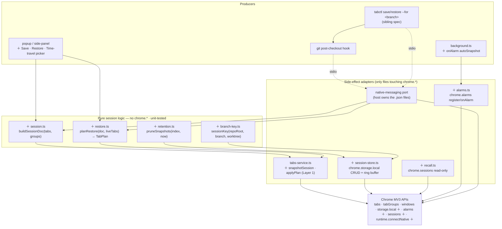
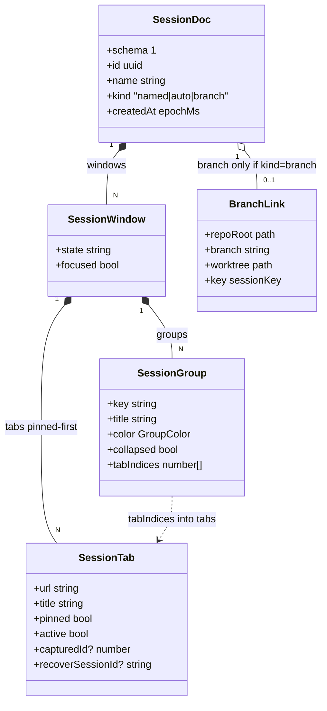
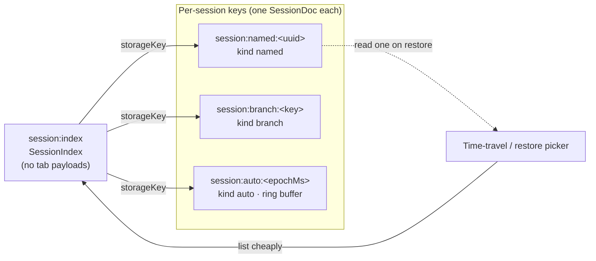
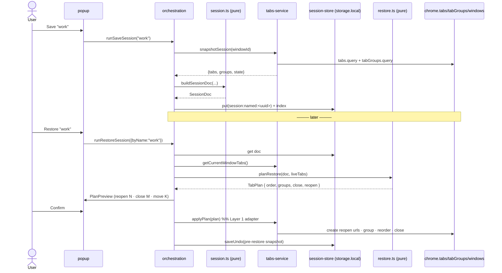
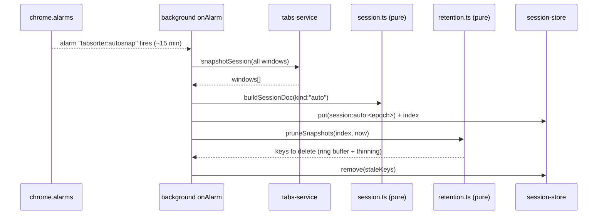
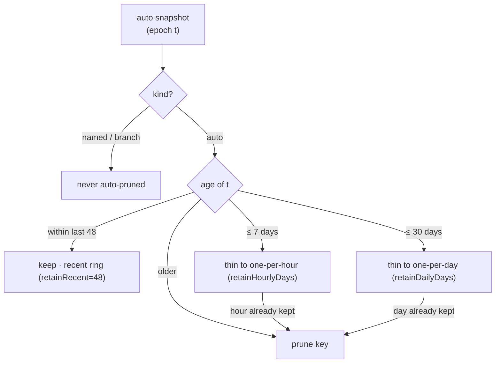
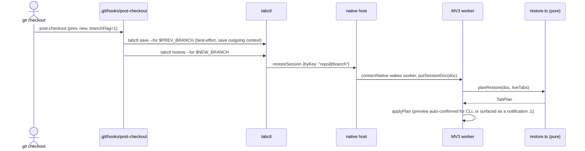
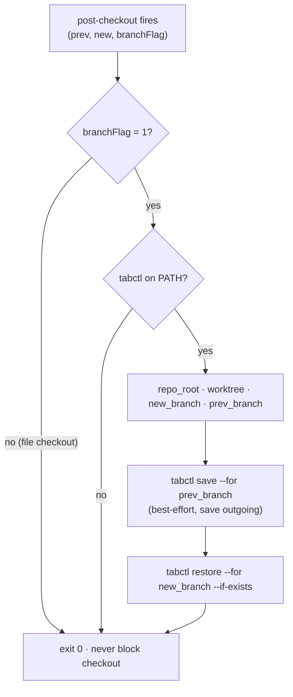
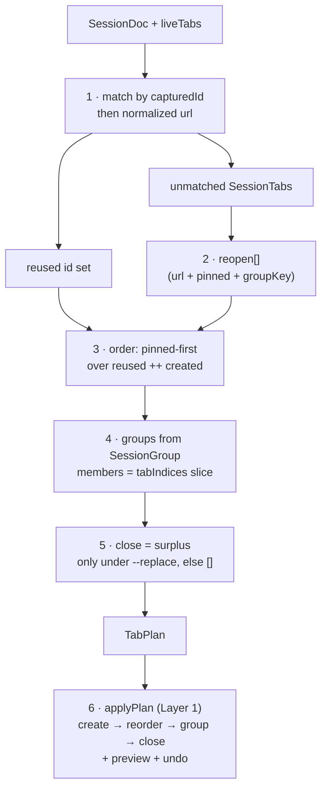

# Surface — Sessions, Time-Travel & Branch-Linked Sessions

> [!IMPORTANT]
> **Fact-check corrections (5: 3 refuted, 2 uncertain).** Independent verification corrected the claims below in this spec. Full corrections + sources live in the [PRD index Verification log](../README.md#verification-log); treat these lines as the corrected truth, not the body text they amend.
> - **[UNCERTAIN]** A tabs.Tab.sessionId from a recently-closed entry stops being valid once the entry ages out past the recently-closed list (bounded by MAX_SESSION_RESU… — The authoritative Chrome and MDN docs confirm the surrounding facts but do NOT explicitly state the sessionId-invalidation claim.
> - **[REFUTED]** chrome.alarms in MV3 enforces a minimum honored period of 1 minute in production (packed) and 30 seconds for unpacked/dev extensions; periodInMinutes… — The official Chrome docs state the production (packed) minimum is 30 seconds, i.e.
> - **[REFUTED]** runtime.connectNative opens a port to a native-messaging host; an incoming message on that port wakes a sleeping MV3 worker. — The first half is correct: chrome.runtime.connectNative() connects to a native application and returns a Port for sending/receiving messages (requires the "nativeMessaging" permission); Chrome starts the host process and keeps it running un…
> - **[REFUTED]** Chrome refuses to add pinned tabs to a tab group, keeping pinned tabs ungrouped and pinned-first. — Chrome does NOT refuse to group pinned tabs and does not leave them ungrouped/pinned-first.
> - **[UNCERTAIN]** chrome.windows.Window.state is one of 'normal' | 'minimized' | 'maximized' | 'fullscreen', and windows.create accepts state/focused which the OS may c… — The first two parts are CONFIRMED by the official docs: Window.state (WindowState enum) is exactly 'normal' | 'minimized' | 'maximized' | 'fullscreen', and windows.create()'s createData accepts both `state` and `focused`.


- **Date:** 2026-06-21
- **Status:** Future capability spec — build-ready design. No code committed yet. Types below are *design*, not edits to `lib/`.
- **Parent vision:** [`../2026-06-21-tab-intelligence-vision.md`](../2026-06-21-tab-intelligence-vision.md) — Pillar C (Hygiene & sessions) + signature workflows #4 (branch-linked context) and #6 (nightly hygiene).
- **Builds on:** [`../2026-06-21-layer1-tidy-groups-undo.md`](../2026-06-21-layer1-tidy-groups-undo.md) (the `TabPlan` IR + `applyPlan` adapter + undo snapshot) and the domain glossary ([`../../../CONTEXT.md`](../../../CONTEXT.md)).
- **Sibling surfaces (parallel specs, referenced by expected path):**
  - `./2026-06-21-tabctl-cli.md` — owns the `tabctl` verb grammar, the native-messaging transport, and the host process. This surface **consumes** `tabctl save/restore --for <branch>` and the host-owned session file; it does not redefine them.
  - `./2026-06-21-mcp-server.md` — exposes `save_session` / `restore_session` as agent tools over the same host.
  - `./2026-06-21-ai-command-bar.md` — an NL producer that may emit a restore/save plan.
- **Verify-before-build flags:** ⚠️ marks channel/OS/version-dependent facts to confirm against the live contract first. Every ⚠️ is in the [Verification log](../README.md#verification-log).

---

## 1. Goal

Make a browser session a **first-class, restorable, time-travelable object**, and bind it to the user's code context. Three capabilities, all producers of `TabPlan`:

1. **Named sessions** — `save "work"` / `restore "work"`: capture a window's full arrangement (order + groups + pinned + urls + group metadata) and rebuild it later, reusing live tabs where possible and reopening the rest by URL.
2. **Time-travel** — periodic auto-snapshots (every N minutes via `chrome.alarms`) with retention, so *"give me my tabs from this morning"* is a real, pickable point in a ring buffer.
3. **Branch-linked sessions** — a git `post-checkout` hook calls `tabctl save --for <branch>` / `restore --for <branch>`, keyed on branch **or** worktree path, so your browser context follows your code context.

The hard constraint: this surface is a **pure producer**. It lowers a save/restore/time-travel intent to a `TabPlan` (verbs `stash` for save, `restore` for rebuild) that Layer 1's `applyPlan` adapter executes with a minimal diff, preview, and undo. It **never** touches `chrome.*` directly, and it stores no long-lived server in the ephemeral MV3 service worker.

---

## 2. Locked decisions

| # | Decision | Choice | Rationale |
|---|----------|--------|-----------|
| 1 | Snapshot grain | **Per-window**: order + groups (title/color/collapsed) + pinned + url/title + active tab | Matches `applyPlan`'s `windowId` grain (Layer 1 §3). Multi-window is a `SessionDoc` with N windows, restored to N windows. |
| 2 | Primary store | **`chrome.storage.local`** for snapshots + named sessions | Async, MV3-worker-safe, structured, no native host required. Default cap **~10 MB** ⚠️ — lifted by the `unlimitedStorage` permission (then bounded only by disk). |
| 3 | `chrome.sessions` role | **Read-only recall aid, not the store** | `chrome.sessions` only exposes *recently-closed* tabs/windows, capped at `MAX_SESSION_RESULTS` (**25**) ⚠️, and you cannot write an arbitrary named session to it. Used to give undo/restore a higher-fidelity reopen (`sessions.restore` keeps history+scroll) when a `sessionId` is still live. |
| 4 | File-of-record | **The native host owns a JSON-per-session file** under `~/.local/state/tabctl/sessions/` (XDG) ⚠️; the extension mirrors into `storage.local` | Branch-linked + dotfile-friendly + CLI-greppable needs a file. The host (sibling `tabctl` spec) is the **only** writer of disk; the worker pushes/pulls via native messaging. |
| 5 | Restore semantics | **Reuse-then-reopen**: match snapshot ids to live tabs first (reuse), reopen the rest by URL, dedupe so a restore never duplicates an already-open url | A restore must converge to the saved state with the *minimal* set of tab creations, reusing `planMoves`-style diffing. |
| 6 | Restore target | **Into the current window by default**; `--new-window` opens a fresh one | Default is least-surprising and reuses tabs; new-window is the clean-slate path. |
| 7 | Auto-snapshot cadence | **`chrome.alarms`, default every 15 min**; min honored period is 1 min prod / 30 s unpacked ⚠️ | 15 min is well above the floor and cheap. Cadence is a pref. |
| 8 | Retention | **Ring buffer**: keep last 48 auto-snapshots + hourly-thinned for 7 days + daily for 30 days; prune on each alarm | Bounds `storage.local` growth deterministically; "this morning" survives, last year doesn't. Named/branch sessions are **never** auto-pruned. |
| 9 | Branch key | **`<repoRoot>@<branch>`**, with **worktree path** as the tiebreaker | A worktree is a distinct working dir on its own branch; keying on path disambiguates two checkouts of the same repo. |
| 10 | Dedupe identity | Normalized URL (reuse Layer 1 `normalizeUrl`: strip hash, lower host, drop trailing slash; query configurable) | One rule for dedupe everywhere; a `#section` or stray `?utm` doesn't fork a session entry. |
| 11 | Privacy | **Titles + URLs only.** No page content, no scroll/form state beyond what `sessions.restore` natively carries. No telemetry. | Consistent with the vision's privacy posture; sessions never widen the data surface. |
| 12 | Safety | **Preview + undo at the seam, always.** A restore is a `TabPlan`; the diff (reopen N, close M, move K) is shown before it runs and writes an undo snapshot. | A restore can close/reopen many tabs — it must be as reversible as tidy. |

---

## 3. Architecture

New boxes marked **＋**. The session **planner is pure** (lowers a `SessionDoc` + live tabs → `TabPlan`); the **store split** is: `storage.local` for the extension's source of truth, native host file for the CLI/branch path, `chrome.sessions` as a read-only fidelity booster.



**Discipline preserved:** `session.ts`, `restore.ts`, `retention.ts`, `branch-key.ts` are pure (plain arrays/objects, no `browser.*`) and unit-tested like `plan.ts`. Only the adapter row touches `chrome.*`. The native host (a separate binary, sibling spec) is the only process holding disk — the MV3 worker is woken on-message and re-sleeps.

---

## 4. Concrete schemas / types / formats

### 4.1 The snapshot model (TypeScript — `lib/types.ts` additions)



*The id-free doc: groups reference tabs by index, so a SessionDoc round-trips across browser runs without live tab ids.*

```ts
import type { GroupColor } from "./types"; // 9-color union from Layer 1

// One tab, frozen. urls+titles only — no content, no scroll (privacy decision #11).
interface SessionTab {
  url: string;
  title: string;
  pinned: boolean;
  active: boolean;
  // Live id at capture time. Used for reuse-matching on restore; absent in a
  // doc loaded from disk on a different browser run, where match falls to url.
  capturedId?: number;
  // chrome.sessions.Tab.sessionId, if the tab was ever recently-closed-recoverable.
  // Lets restore prefer sessions.restore (keeps history+scroll) over a fresh create. ⚠️
  recoverSessionId?: string;
}

interface SessionGroup {
  // Plan-local identity; matches GroupSpec.key in the TabPlan IR.
  key: string;
  title: string;
  color: GroupColor;
  collapsed: boolean;
  // Indices INTO SessionWindow.tabs (not tab ids), so the doc is id-free and
  // survives serialization across browser runs. Contiguous by construction.
  tabIndices: number[];
}

interface SessionWindow {
  // Tabs in absolute strip order, pinned-first (the never-interleave invariant).
  tabs: SessionTab[];
  groups: SessionGroup[];
  // chrome.windows.Window state at capture: "normal" | "minimized" | "maximized" | "fullscreen". ⚠️
  state: string;
  focused: boolean;
}

interface SessionDoc {
  schema: 1;                 // bump on breaking change; migrators keyed on this
  id: string;                // uuid v4
  name: string;              // "work", or auto "snapshot-2026-06-21T09:05"
  kind: "named" | "auto" | "branch";
  createdAt: number;         // epoch ms
  windows: SessionWindow[];  // multi-window = N entries (decision #1)
  // Present only for kind === "branch".
  branch?: BranchLink;
}

interface BranchLink {
  repoRoot: string;          // absolute path, the project dir
  branch: string;            // git branch name at checkout
  worktree: string;          // absolute worktree path (tiebreaker, decision #9)
  key: string;               // sessionKey() output, the storage/file key
}
```

**Snapshot invariants** (guaranteed by `buildSessionDoc`, the pure test surface):
- `tabs` is pinned-first contiguous (mirrors `order`'s invariant).
- Every `SessionGroup.tabIndices` is a contiguous slice of `tabs` and contains no pinned index.
- `tabIndices` reference unpinned positions only; pinned tabs are never grouped.

### 4.2 Storage layout — `chrome.storage.local`

Keyed, not one blob, so a restore reads one session without deserializing all of them (the ~10 MB cap ⚠️ is real without `unlimitedStorage`).



*The index is the cheap list the picker reads; a restore dereferences exactly one per-session key, never the whole store.*

```
session:named:<uuid>      → SessionDoc            (kind "named")
session:branch:<key>      → SessionDoc            (kind "branch"; key = sessionKey())
session:auto:<epochMs>    → SessionDoc            (kind "auto"; ring buffer)
session:index             → SessionIndex          (cheap list for the picker; no tab payloads)
```

```ts
interface SessionIndexEntry {
  storageKey: string;
  id: string;
  name: string;
  kind: SessionDoc["kind"];
  createdAt: number;
  windowCount: number;
  tabCount: number;          // for the picker label "23 tabs"
  branchKey?: string;
}
interface SessionIndex { schema: 1; entries: SessionIndexEntry[]; }
```

### 4.3 Session file JSON (the native-host file-of-record)

One file per session under `${XDG_STATE_HOME:-~/.local/state}/tabctl/sessions/` ⚠️ (Linux/macOS); on Windows `%LOCALAPPDATA%\tabctl\sessions\`. The host owns these; the extension never writes disk. Filename: `<key>.json` for branch sessions (key path-sanitized), `<uuid>.json` otherwise. The on-disk shape **is** `SessionDoc` (§4.1) so CLI and extension share one schema.

```json
{
  "schema": 1,
  "id": "5f1c…",
  "name": "feature/oauth",
  "kind": "branch",
  "createdAt": 1750498000000,
  "branch": {
    "repoRoot": "/Users/f/devv/tab-sorter",
    "branch": "feature/oauth",
    "worktree": "/Users/f/devv/tab-sorter",
    "key": "tab-sorter@feature/oauth"
  },
  "windows": [
    {
      "state": "normal",
      "focused": true,
      "tabs": [
        { "url": "https://github.com/f/tab-sorter/pull/12", "title": "PR #12", "pinned": true, "active": false },
        { "url": "https://developer.chrome.com/docs/extensions/reference/api/sessions", "title": "chrome.sessions", "pinned": false, "active": true },
        { "url": "https://developer.chrome.com/docs/extensions/reference/api/storage", "title": "chrome.storage", "pinned": false, "active": false }
      ],
      "groups": [
        { "key": "developer.chrome.com", "title": "chrome docs", "color": "blue", "collapsed": false, "tabIndices": [1, 2] }
      ]
    }
  ]
}
```

### 4.4 Native-messaging envelope (consumed from sibling `tabctl` spec)

The host relays these over stdio to the worker (`runtime.connectNative` / `onConnectNative`). Native messaging caps a **single message at 1 MB** ⚠️ from app→extension, so a large `SessionDoc` is chunked by the host or transferred file-path-by-reference (the worker reads the doc back via a follow-up `getSession`).

```ts
type HostRequest =
  | { v: 1; cmd: "saveSession";    name: string; kind: "named" | "branch"; branch?: BranchLink }
  | { v: 1; cmd: "restoreSession"; ref: { byName?: string; byKey?: string; byId?: string }; newWindow?: boolean; preview?: boolean }
  | { v: 1; cmd: "listSessions" }
  | { v: 1; cmd: "putSessionDoc"; doc: SessionDoc };   // host → ext, after host read a .json

type HostResponse =
  | { v: 1; ok: true; planPreview?: PlanPreview; result?: PlanResult }
  | { v: 1; ok: false; error: string };
```

### 4.5 Prefs additions

```ts
interface SessionPrefs {
  autoSnapshot: boolean;          // default true
  autoSnapshotEveryMin: number;   // default 15 (decision #7) ⚠️ honored ≥1 min
  retainRecent: number;           // default 48 most-recent auto-snapshots
  retainHourlyDays: number;       // default 7
  retainDailyDays: number;        // default 30
  restoreDedupe: boolean;         // default true (decision #5/#10)
  branchLinked: boolean;          // default false — opt in to the git-hook workflow
}
```

---

## 5. Data flow

### 5.1 Named save → restore



### 5.2 Time-travel auto-snapshot (no user, alarm-driven)



The picker reads `session:index`, shows auto-snapshots on a timeline ("9:05 AM · 23 tabs"), and a chosen one flows into `planRestore` exactly like a named restore.

`pruneSnapshots` enforces the decision-#8 ring buffer on every alarm: keep the freshest 48, thin older snapshots to one-per-hour for 7 days, then one-per-day for 30 days, and drop the rest — but only for `kind: "auto"`.



*Deterministic given `now`: bounded storage where "this morning" survives but last year does not, and named/branch sessions are exempt.*

### 5.3 Branch-linked checkout



---

## 6. Permissions & setup delta

| Permission | Why | Stage | Notes |
|---|---|---|---|
| `storage` | already present | — | named/auto sessions + index in `storage.local`. |
| `sessions` | `chrome.sessions.getRecentlyClosed` + `sessions.restore` for higher-fidelity reopen | this surface | Read-mostly; restores history/scroll when a `sessionId` is still live (decision #3). ⚠️ |
| `alarms` | periodic auto-snapshots | this surface | min honored period 1 min prod / 30 s unpacked ⚠️; default cadence 15 min. |
| `tabGroups` | from Layer 1 | inherited | needed to read/rebuild group title/color/collapsed. |
| `unlimitedStorage` | lift the ~10 MB `storage.local` cap so long retention + big windows don't fail writes | this surface | The QUOTA_BYTES limit is ignored with this permission ⚠️; without it a write that overflows rejects/sets `runtime.lastError`. |
| `nativeMessaging` | branch-linked + CLI file-of-record (sibling `tabctl` spec) | branch feature only | The worker calls `runtime.connectNative`; the host manifest + binary are a documented setup step. |

**Manifest delta:**
```jsonc
"permissions": ["tabs", "storage", "contextMenus",
                "tabGroups", "sessions", "alarms", "unlimitedStorage", "nativeMessaging"],
"commands": {
  "save-session":    { "description": "Save this window as a session" },
  "restore-session": { "description": "Restore a saved session" },
  "time-travel":     { "description": "Open the time-travel picker" }
}
```

**Native-messaging host manifest** (installed by the `tabctl` installer, per sibling spec) — name `com.tabsorter.host`, `"type": "stdio"`, `allowed_origins: ["chrome-extension://<id>/"]` ⚠️, placed in the per-OS NativeMessagingHosts dir.

**Example `post-checkout` hook** (the deliverable script — `tabctl` ships `tabctl hook install`):

```bash
#!/usr/bin/env bash
# .git/hooks/post-checkout — args: $1 prev-HEAD  $2 new-HEAD  $3 branch-flag(1=branch checkout)
[ "$3" = "1" ] || exit 0          # ignore file checkouts
command -v tabctl >/dev/null 2>&1 || exit 0

repo_root="$(git rev-parse --show-toplevel)"
worktree="$(git rev-parse --show-toplevel)"   # path differs per worktree → the tiebreaker
new_branch="$(git rev-parse --abbrev-ref HEAD)"
prev_branch="$(git name-rev --name-only "$1" 2>/dev/null | sed 's/[~^].*//')"

# Save the context we're leaving (best-effort; never block the checkout).
[ -n "$prev_branch" ] && tabctl save --for "$prev_branch" \
  --repo "$repo_root" --worktree "$worktree" >/dev/null 2>&1 || true

# Restore the context for the branch we arrived on, if a session exists.
tabctl restore --for "$new_branch" \
  --repo "$repo_root" --worktree "$worktree" --if-exists >/dev/null 2>&1 || true

exit 0   # a hook must never fail the checkout
```



*Every branch leads back to `exit 0`: the hook saves outgoing context, restores incoming, and can never fail the checkout.*

---

## 7. Edge cases

| Case | Handling |
|------|----------|
| Restore url already open | Dedupe on normalized url (decision #10): reuse the live tab, never duplicate. |
| Snapshot tab closed before restore | Not a survivor; `planRestore` emits it in `reopen` (create by URL). |
| `chrome://`, `file://`, extension pages | URL captured verbatim. `chrome://` and `file://` **may fail to `tabs.create`** ⚠️ (browser-blocked / no file access); restore marks them skipped in the preview rather than throwing. |
| Pinned tabs | Restored pinned and pinned-first (the never-interleave invariant); never grouped. |
| Discarded/lazy tabs at capture | `tabs.query` still returns url+title for discarded tabs ⚠️; snapshot is unaffected. |
| `storage.local` near cap, no `unlimitedStorage` | Write rejects / `runtime.lastError` ⚠️; orchestration surfaces "session storage full — enable unlimited storage or prune". Retention pruning runs first to reclaim. |
| Two worktrees, same branch | Distinct `worktree` path → distinct `sessionKey` (decision #9); they don't collide. |
| Detached HEAD checkout | `git rev-parse --abbrev-ref HEAD` yields `HEAD`; hook keys on the short SHA instead, or no-ops on restore (`--if-exists`). |
| Branch with `/` in name (`feature/x`) | Storage key keeps `/`; **file name** path-sanitizes (`feature__x.json`) to stay one flat file. |
| Worker asleep when alarm fires | `chrome.alarms` wakes the worker to run `onAlarm` ⚠️ — the canonical MV3 pattern; snapshot completes before re-sleep. |
| Worker asleep when CLI calls | `runtime.connectNative` from the host side wakes the worker via the port; ephemeral by design (vision §8). |
| Restore into window with user's own groups | `applyPlan`'s reconciler only touches plan-owned groups (Layer 1); pre-existing groups not in the doc are left alone. |
| Multi-window doc, fewer monitors now | Each `SessionWindow` → one `windows.create`; window `state`/`focused` best-effort, off-screen positions clamped by the OS ⚠️. |
| Auto-snapshot churn (one tab open/close) | Snapshots are cheap (url+title only); retention thinning bounds total count; near-identical adjacent snapshots are *not* deduped in v1 (open question §9). |
| Restore is destructive (closes tabs) | Pre-restore undo snapshot saved; preview shows `close M`; one undo reverses it. |

---

## 8. Testing

Matches the repo's **pure-core (plain arrays) + fake-browser adapter** split.

**Pure, fixture-driven (high value, cheap):**
- `buildSessionDoc` — pinned-first contiguity; `tabIndices` contiguous & pinned-free; round-trips `order`+`groups` from Layer 1 shapes.
- `planRestore(doc, liveTabs)` — reuse-then-reopen: live url present → reused (no create); absent → `reopen`; surplus live tabs not in doc are left/closed per flag; output is a valid `TabPlan` (pinned-first, groups contiguous). Property test: `restore(buildSessionDoc(W)) applied to empty window == W`.
- `retention.pruneSnapshots(index, now)` — exhaustive: keeps last `retainRecent`, one-per-hour for `retainHourlyDays`, one-per-day for `retainDailyDays`; never prunes `named`/`branch`; deterministic given `now`.
- `branch-key.sessionKey` — `repo@branch`, worktree tiebreaker, `/`-safe storage key vs sanitized filename; detached-HEAD fallback.
- `normalizeUrl` dedupe identity (shared with Layer 1).

**Invariant regression guards:** no pinned index in any group; every restore `TabPlan` satisfies Layer 1's invariants (reuse `plan.test.ts` checkers); a restore plan never lists the same id in both `order` and `close`.

**Adapter (`@webext-core/fake-browser`):** `snapshotSession` round-trips through `session-store`; `applyPlan` of a restore plan issues minimal creates + minimal group ops; `alarms` registration + `onAlarm` fires a snapshot + prune; `chrome.sessions` recall path prefers `sessions.restore` when `recoverSessionId` resolves.

**Host/CLI contract (sibling spec owns, cross-checked here):** `saveSession`/`restoreSession` envelope round-trip; >1 MB doc chunking ⚠️; `--for <branch>` key matches `sessionKey`.

**Manual E2E:** save "work", churn tabs, restore (verify reuse + reopen + dedupe + groups + pinned); let auto-snapshot run, time-travel to an earlier point; install hook, `git checkout` between two branches with saved sessions, confirm context swaps; undo a restore.

---

## 9. Open questions

1. **Auto-snapshot dedup:** skip writing a snapshot when it's byte-identical to the previous one (cheaper, fewer ring entries) vs always write (simpler timeline)? Lean: hash the doc, skip identical — but keep timestamps dense for "this morning" granularity.
2. **`sessions.restore` vs create-by-URL default:** prefer history-preserving `sessions.restore` whenever `recoverSessionId` is live, else create-by-URL? Confirm `sessionId` lifetime (it expires once the entry ages past `MAX_SESSION_RESULTS`) ⚠️.
3. **Outgoing save on checkout:** is saving the *previous* branch's context on every checkout (hook step 1) desirable, or surprising churn? Maybe gate behind `branchLinked` + `--save-outgoing`.
4. **CLI restore confirmation:** a terminal `tabctl restore` can't show the popup preview — auto-confirm with undo, or fire a `chrome.notifications` "review plan" ⚠️? Lean: auto-confirm + undo for `tabctl`, since the user invoked it explicitly; surface count in stdout.
5. **Cross-device:** sessions are local-only by decision. Is a `chrome.storage.sync` *index* (names only, no tab payloads — sync's per-item cap is ~8 KB ⚠️) worth it so the picker shows the same names across machines? Out of scope for v1.
6. **Worktree identity drift:** if a worktree is moved on disk, its key changes and the branch session "disappears." Re-key on `repoRoot` git-dir id instead of path? Defer.

---

## 10. How it lowers to TabPlan

This surface is a **producer**: every save/restore/time-travel intent becomes a `TabPlan` (Layer 1 §3) that the *existing* `applyPlan` adapter realizes. No new `chrome.*` path.

- **Save** uses the `stash` verb conceptually but is **non-mutating to the live window** — it only reads (`snapshotSession`) and writes `storage.local`. It produces a `SessionDoc`, not a mutating plan. (A "stash = save then close" variant would emit a `TabPlan` with `close: capturedIds`.)
- **Restore** is the mutating case. `planRestore(doc, liveTabs)` lowers to a `TabPlan` extended with one field the adapter already needs for undo-after-dedupe (Layer 1 open question #1 reopen hints):

```ts
interface TabPlan {            // Layer 1, recalled
  windowId: number;
  order: number[];             // desired order of EVERY resulting tab id, pinned-first
  groups: GroupSpec[];         // rebuilt from SessionGroup (title/color/collapsed)
  close: number[];             // surplus tabs (only with --replace), [] by default
  reopen?: ReopenSpec[];       // ＋ urls to create for snapshot tabs with no live match
}
interface ReopenSpec { url: string; pinned: boolean; groupKey?: string; afterId?: number; }
```

Lowering, concretely:
1. **Match** each `SessionTab` to a live tab by `capturedId` then normalized url → the **reused** id set.
2. Snapshot tabs with no match → `reopen[]` (carry `pinned` + `groupKey`); the adapter `tabs.create`s them (or `sessions.restore` when `recoverSessionId` is live), yielding fresh ids.
3. Build `order` as pinned-first over (reused ids ++ newly-created ids), preserving `SessionWindow.tabs` order — exactly the **never-interleave construction** generalized.
4. Build `groups` from `SessionGroup` (key/title/color/collapsed), members = the reused+created ids for each `tabIndices` slice — contiguous in `order` by construction.
5. `close` = live tabs absent from the doc **only** under `--replace`; empty by default (decision #6, additive restore).
6. `applyPlan` runs its Layer-1 pipeline unchanged: `reopen` creates → `applyOrder` minimal-moves diff → group reconcile (skip already-correct) → `close`. **Preview** shows `reopen N · close M · move K`; **undo** snapshot is written at the seam.



*One producer, one IR: tabctl, the MCP tool, the picker, and the git hook all reach Chrome through this single `SessionDoc → TabPlan` lowering.*

Because restore is *just another `TabPlan`*, the `tabctl restore`, the MCP `restore_session` tool, the time-travel picker, and the branch hook are **all the same producer** — they differ only in how they pick the `SessionDoc`, never in how it hits Chrome. That is the seam doing its job.

> Technical claims in this doc are fact-checked in the [PRD index Verification log](../README.md#verification-log).
