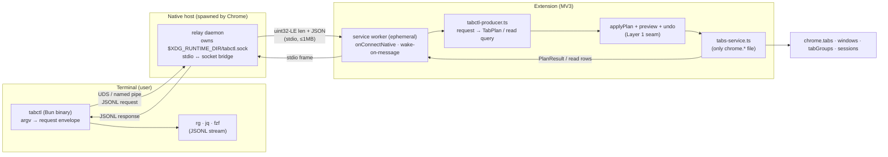
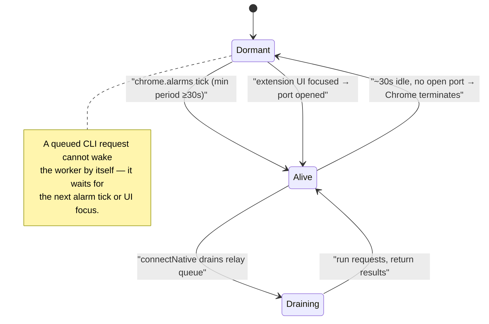
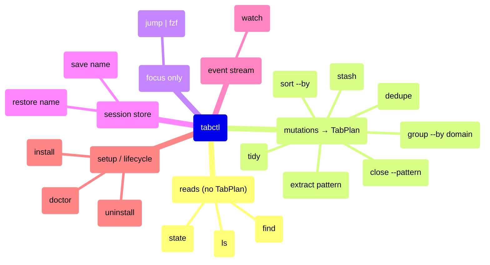
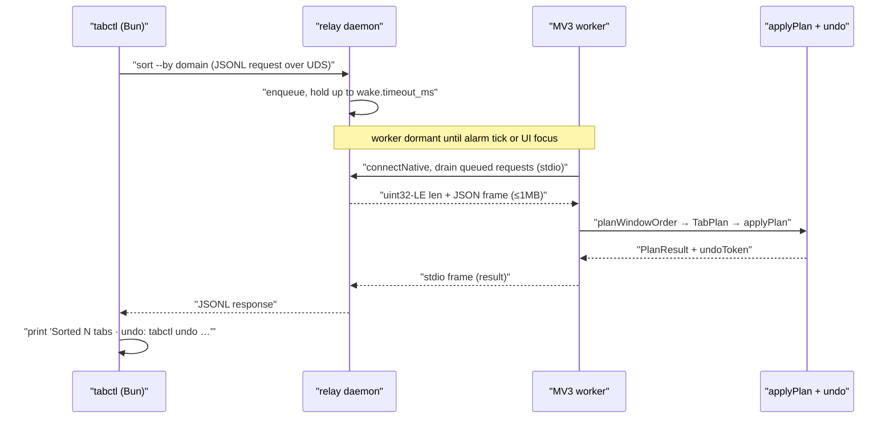
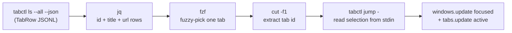
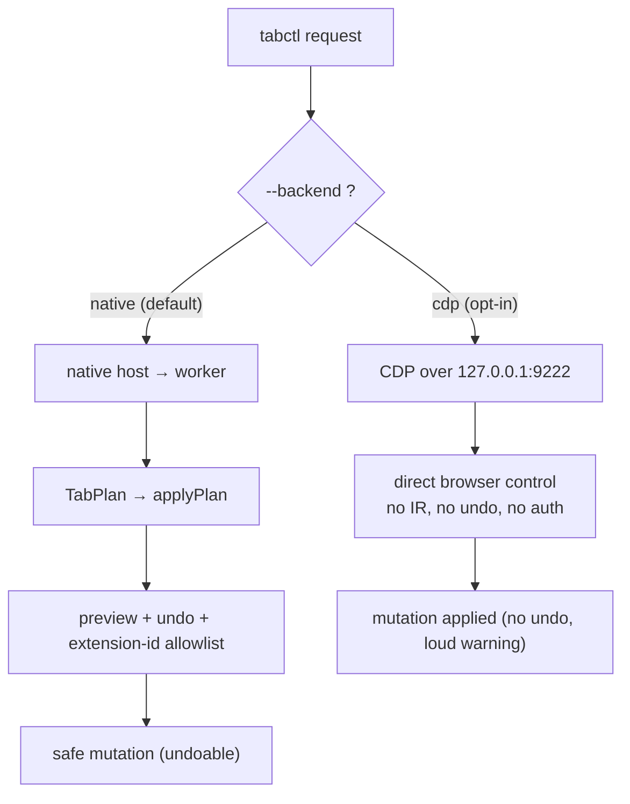

# Surface: `tabctl` — CLI + native-messaging host

> [!IMPORTANT]
> **Fact-check corrections (2: 2 refuted, 0 uncertain).** Independent verification corrected the claims below in this spec. Full corrections + sources live in the [PRD index Verification log](../README.md#verification-log); treat these lines as the corrected truth, not the body text they amend.
> - **[REFUTED]** Receiving a native message can wake an idle MV3 service worker. — Native messaging only keeps an already-running service worker alive; it cannot wake an idle one.
> - **[REFUTED]** Extension-to-host native messages may be much larger, documented up to 4 GB. — The 4 GB figure is the Firefox/MDN (Mozilla WebExtensions) limit, NOT Chrome's.


- **Date:** 2026-06-21
- **Status:** Design — build-ready. Future capability spec. No code committed yet. Types/protocol below are *design*, not edits to `lib/`.
- **Parent vision:** [`../2026-06-21-tab-intelligence-vision.md`](../2026-06-21-tab-intelligence-vision.md) §5.1 (the CLI surface) and §8 (the MV3-ephemerality constraint). This is **Layer 2's** primary surface.
- **Depends on:** [`../2026-06-21-layer1-tidy-groups-undo.md`](../2026-06-21-layer1-tidy-groups-undo.md) — the `TabPlan` IR, `applyPlan`, `snapshotWindow`, and the preview+undo seam. `tabctl` is a **producer of `TabPlan`**; it never touches `chrome.*`.
- **Sibling surfaces (same host process, same IR):** the MCP server (vision §5.2) and the AI command bar (vision §5.3). Cross-references inline.
- **Verify-before-build flags:** ⚠️ marks channel/OS/version-dependent facts an implementer must confirm against the live contract first; each is logged in the [verification log](#how-it-lowers-to-tabplan).

---

## 1. Goal

Give the terminal first-class control of the browser's tab strip. Every Layer-1 verb (`sort | group | tidy | extract | close | stash | save | restore | dedupe | find`) becomes a `tabctl` subcommand, and every read becomes a JSON stream you can pipe through `rg`/`jq`/`fzf`. The flagship is **`tabctl jump | fzf`** — teleport to any tab across all windows without alt-tab hunting.

The hard constraint: an **MV3 service worker is ephemeral** (Chrome terminates an idle worker, by default after ~30s of inactivity, and there is no in-worker long-lived socket or server). So `tabctl` cannot connect to a server *inside* the extension. Instead a tiny **native-messaging host** binary bridges `stdio ↔ extension`, and the worker is **woken on message** by `chrome.runtime.onConnectNative` / `onMessageExternal`-style native ports. `tabctl` is a thin client of that host.

Non-goals: no remote/network access (localhost-only, see §10), no page-content reads (titles+URLs only, inherited from the vision's privacy posture), no telemetry, and no bypass of the preview+undo seam — a `tabctl` mutation is exactly a `TabPlan` handed to `applyPlan`, so it inherits the same minimal diff and undo snapshot as a popup click.

---

## 2. Locked decisions

| # | Decision | Choice | Rationale |
|---|----------|--------|-----------|
| 1 | Default transport | **Native messaging** (`chrome.runtime.connectNative`) | Canonical MV3 bridge; no debug flags; survives worker sleep via wake-on-message. ⚠️ host install is a setup step. |
| 2 | Who owns the long-lived process | The **native host binary** (Bun or Rust), *not* the worker | The worker is ephemeral; the host is the durable endpoint `tabctl` talks to. |
| 3 | Host ↔ extension wire format | Chrome native-messaging framing: **uint32 little-endian length prefix + UTF-8 JSON**, **1 MB cap host→extension**, **4 GB cap extension→host** | Fixed by the platform; not negotiable. ⚠️ confirm caps against current docs. |
| 4 | `tabctl` ↔ host transport | **Unix domain socket** (`$XDG_RUNTIME_DIR/tabctl.sock`, mode 0600) on macOS/Linux; **named pipe** `\\.\pipe\tabctl` on Windows | The CLI is a separate process from the host Chrome spawns; they rendezvous over a localhost-only IPC endpoint. No TCP. |
| 5 | Host lifecycle | **Spawned by Chrome** per `connectNative` connection; a **detached relay daemon** owns the CLI-facing socket and survives between worker wakes | Chrome only spawns the host while a native port is open; the relay holds CLI requests until the worker reconnects. |
| 6 | Mutating commands | Lower to a **`TabPlan`**, run through `applyPlan` → preview + undo snapshot | One safety seam for all producers. `--dry-run` returns the plan/diff without mutating. |
| 7 | Output contract | `--json` emits **one JSON object per line (JSONL/NDJSON)** | Unix-composable; `tabctl ls --json \| jq`, `\| rg`, `\| fzf`. Human format is a separate renderer. |
| 8 | Stdin selection | `-` reads **tab ids (or JSONL lines) from stdin** | `tabctl ls \| rg youtube \| tabctl close -` — tabs-as-stream. |
| 9 | CDP backend | **Opt-in fallback** (`tabctl --backend cdp`, `--remote-debugging-port=9222`) | Works without installing the host, but needs a debug flag and is a bigger security surface; never the default. |
| 10 | Security boundary | **localhost only**; host manifest `allowed_origins` pinned to the **extension id**; socket mode 0600; no network listener | A local CLI for a local browser. No remote control path exists by construction. |
| 11 | Distribution | Shipped as a separate **`tabctl` package** (Bun single-file binary) + an installer that writes the host manifest | The Web Store extension only declares `nativeMessaging`; the host binary is user-installed. ⚠️ may need a "power" build. |
| 12 | Permission delta | Extension manifest `permissions += ["nativeMessaging"]` | Single new permission for this whole surface. |

---

## 3. Architecture

Three processes, two hops. The CLI never imports `chrome.*`; the worker never opens a socket.



Two distinct framings exist and must not be confused:
- **stdio frame** (relay ↔ worker): Chrome's native-messaging framing — `uint32-LE length` + JSON, 1 MB host→extension cap.
- **socket line** (CLI ↔ relay): our own protocol — newline-delimited JSON (JSONL), no length prefix, since UDS/pipe is a reliable byte stream we fully control.

### Why a relay daemon (not just `connectNative`)

`chrome.runtime.connectNative(application)` is called **from the extension side**; Chrome then spawns the host binary and connects its stdio. The host cannot be "always up and waiting for the CLI" purely via `connectNative`, because Chrome only spawns it when the worker opens a port, and the worker is ephemeral. Two-part design:

1. **Relay daemon** — a long-lived user process (started by the `tabctl` installer via `launchd` on macOS / `systemd --user` on Linux / a Startup task on Windows) that owns the CLI-facing UDS/pipe. It buffers CLI requests.
2. **Worker pull** — the worker, on a `chrome.alarms` tick (min period 30s ⚠️) **and** on any extension UI interaction, calls `connectNative("com.tab_sorter.tabctl")`, drains queued requests from the relay over stdio, runs them, returns results, and disconnects. For latency-sensitive `jump`, the relay can also fire a wake via a registered native port that the worker keeps briefly open while the popup/side-panel is active.

> ⚠️ **Worker-wake latency is the central risk.** A purely alarm-driven pull means a cold-worker `tabctl ls` can wait up to one alarm period. Mitigations to validate in a spike: (a) keep a native port open while any extension surface is focused; (b) use a short-lived `connectNative` on each relay request that itself wakes the worker (native-message receipt is a documented worker-wake reason ⚠️); (c) accept the CDP backend for power users who want zero wake latency.



*The MV3 worker oscillates between dormant and alive; only an alarm tick (≥30s) or a focused extension surface pulls it up — a buffered CLI request alone cannot.*

---

## 4. Concrete schemas / protocol / config formats



*The `tabctl` command grammar: reads stream JSONL, mutations lower to a `TabPlan`, plus focus, session, stream, and setup verbs.*

### 4.1 Native-messaging host manifest

A JSON file Chrome reads to learn the host's name, binary path, and which extensions may talk to it.

```json
{
  "name": "com.tab_sorter.tabctl",
  "description": "Tab Sorter native host — bridges tabctl CLI to the extension",
  "path": "/usr/local/lib/tabctl/tabctl-host",
  "type": "stdio",
  "allowed_origins": [
    "chrome-extension://aohghmighlieiainnegkcijnfilokake/"
  ]
}
```

- `name` — reverse-DNS, lowercase; must match `connectNative("com.tab_sorter.tabctl")` and the manifest filename (`com.tab_sorter.tabctl.json`). ⚠️ confirm the allowed character set (`[a-z0-9._]`, no leading/trailing dot).
- `path` — absolute on macOS/Linux; on Windows may be relative to the manifest file. Must be executable by the user.
- `type` — `"stdio"` is the only supported value for Chrome native messaging.
- `allowed_origins` — array of `chrome-extension://<id>/` origins. **The trailing slash is required.** The `<id>` is the 32-char extension id; for a Store build it is fixed, for an unpacked dev build it derives from the `key` in the manifest (pin a `key` so the id is stable). ⚠️ confirm Chrome requires the trailing slash and rejects wildcards.
- Firefox uses the same JSON shape but the key is **`allowed_extensions`** with the extension's `id` (an `@`-suffixed gecko id or AMO id), **not** `allowed_origins`. ⚠️ confirm. The installer writes both variants.

#### Per-OS install paths (user-scope, no admin)

⚠️ All paths below are the documented native-messaging host locations; confirm against current Chrome docs before shipping the installer.

| OS | Chrome user-scope manifest dir |
|----|--------------------------------|
| **macOS** | `~/Library/Application Support/Google/Chrome/NativeMessagingHosts/com.tab_sorter.tabctl.json` |
| **Linux** | `~/.config/google-chrome/NativeMessagingHosts/com.tab_sorter.tabctl.json` (Chromium: `~/.config/chromium/...`) |
| **Windows** | a registry key `HKCU\Software\Google\Chrome\NativeMessagingHosts\com.tab_sorter.tabctl` whose **default value** is the absolute path to the manifest `.json` (Windows uses the registry, not a directory) |

Firefox equivalents (the installer also writes these when a Firefox build is detected): macOS `~/Library/Application Support/Mozilla/NativeMessagingHosts/`, Linux `~/.mozilla/native-messaging-hosts/`, Windows `HKCU\Software\Mozilla\NativeMessagingHosts\com.tab_sorter.tabctl`. ⚠️ confirm.

### 4.2 Host registration / uninstall UX

```
tabctl install            # writes host manifest(s) + relay autostart unit, prints next steps
tabctl install --firefox  # also write Firefox allowed_extensions manifest
tabctl doctor             # diagnose: manifest present? path executable? extension id match? relay up? worker reachable?
tabctl uninstall          # remove manifest(s), stop+remove relay autostart, leave the binary
```

`tabctl install` is idempotent: it detects the installed extension id (or accepts `--extension-id <id>`), writes the manifest with the correct `allowed_origins`, installs the relay autostart unit (`~/Library/LaunchAgents/com.tab_sorter.tabctl.plist` on macOS via `launchctl`, a `systemd --user` unit on Linux, a Startup shortcut/Task on Windows), and prints a one-line confirmation. `tabctl doctor` is the support tool — it walks every link in §3 and reports the first broken one (missing manifest, non-executable path, id mismatch, relay not running, worker not waking).

### 4.3 The stdio length-prefixed protocol (relay ↔ worker)

Chrome's native-messaging framing, used verbatim on the host's stdio:

```
┌──────────────────────┬───────────────────────────────┐
│ uint32 length (LE)   │  UTF-8 JSON payload (length B) │
└──────────────────────┴───────────────────────────────┘
```

- Length is **little-endian** regardless of host architecture. ⚠️ confirm LE is fixed by Chrome.
- **Host → extension** payload is capped at **1 MB**; exceeding it makes Chrome drop the message / close the port. ⚠️ confirm exact cap and failure mode.
- **Extension → host** payload cap is much larger (documented as up to **4 GB**, ⚠️ confirm), but we self-impose 1 MB both ways for symmetry.
- **Paging rule:** because `ls`/`find` over a 500-tab session can exceed 1 MB of JSON, the worker **chunks** large responses into multiple framed messages with `{ "seq", "more": true }` and a final `{ "more": false }`; the relay concatenates before answering the CLI. (Sibling MCP server reuses this chunker.)

Reference encoder (host side, Bun):

```ts
function frame(obj: unknown): Uint8Array {
  const body = new TextEncoder().encode(JSON.stringify(obj));
  const head = new Uint8Array(4);
  new DataView(head.buffer).setUint32(0, body.length, /* littleEndian */ true);
  return new Uint8Array([...head, ...body]);
}
```

### 4.4 Request / response envelope

The CLI ↔ relay ↔ worker payload. One discriminated union for requests, one for responses. **Read queries** (`ls`, `find`, `state`) never produce a `TabPlan`; **mutating commands** carry an `intent` the worker lowers to a `TabPlan` (§10).

```ts
// ---- shared ----
type TabctlProtocolVersion = 1;

interface TabRow {            // the JSONL unit emitted by reads (titles+URLs only)
  id: number;
  windowId: number;
  index: number;
  title: string;
  url: string;
  pinned: boolean;
  active: boolean;
  groupId: number | -1;       // -1 = ungrouped (chrome.tabGroups.TAB_GROUP_ID_NONE) ⚠️
  groupTitle?: string;
  lastAccessed?: number;      // epoch ms; present only if the platform exposes it ⚠️
  audible?: boolean;
  discarded?: boolean;
}

// ---- request ----
interface TabctlRequest {
  v: TabctlProtocolVersion;
  id: string;                 // client-generated correlation id (uuid)
  cmd:
    | "ls" | "find" | "state"                       // reads (no TabPlan)
    | "sort" | "group" | "tidy" | "extract"         // mutations → TabPlan
    | "close" | "jump" | "save" | "restore"
    | "stash" | "dedupe" | "watch";
  args: Record<string, unknown>;   // per-command, see §4.5
  selection?: number[];            // explicit tab ids (from stdin `-`); overrides args filters
  dryRun?: boolean;                // mutation: return plan + diff, do not apply
}

// ---- response ----
type TabctlResponse =
  | { v: 1; id: string; ok: true; kind: "rows"; rows: TabRow[]; more?: boolean; seq?: number }
  | { v: 1; id: string; ok: true; kind: "plan"; plan: TabPlan; diff: PlanDiff }      // dry-run
  | { v: 1; id: string; ok: true; kind: "result"; result: PlanResult }               // applied
  | { v: 1; id: string; ok: true; kind: "event"; event: WatchEvent }                 // watch stream
  | { v: 1; id: string; ok: false; error: TabctlError };

interface PlanResult {        // returned verbatim by Layer-1 applyPlan
  moved: number;
  grouped: number;
  groupsCreated: number;
  closed: number;
  undoToken: string;          // opaque handle the CLI prints; `tabctl undo <token>` reverses it
}

interface PlanDiff {          // human-readable preview for --dry-run
  moves: { id: number; from: number; to: number }[];
  groupsCreated: { title: string; color: string; tabIds: number[] }[];
  closing: { id: number; url: string }[];
}

interface TabctlError {
  code:
    | "NO_HOST"            // host manifest missing / connectNative failed
    | "WORKER_ASLEEP"     // wake timed out
    | "BAD_PATTERN"       // regex failed validatePattern (lib/match.ts)
    | "EMPTY_SELECTION"
    | "PREVIEW_REQUIRED"  // destructive op needs --yes or interactive confirm
    | "MSG_TOO_LARGE"     // would exceed the 1 MB stdio cap and chunking disabled
    | "BACKEND_UNAVAILABLE";
  message: string;
}
```

`TabPlan`, `PlanResult`'s field meanings, and `applyPlan` are defined in [Layer 1 §3–§4](../2026-06-21-layer1-tidy-groups-undo.md). The CLI imports **none** of these types from the extension; the host and CLI share a tiny `@tab-sorter/tabctl-protocol` package so the envelope stays in lockstep with the worker producer.

### 4.5 Per-command `args`

| cmd | key `args` | mutating? |
|-----|-----------|-----------|
| `ls` | `{ window?: "current"\|"all", json?: boolean }` | no |
| `find` | `{ query: string, semantic?: boolean }` (`semantic` is a Layer-3 hook; Layer-2 is fuzzy/regex) | no |
| `state` | `{}` — windows + groups + counts for tooling/`doctor` | no |
| `sort` | `{ by: ("title"\|"domain"\|"recency")[] }` (multi-key) | yes |
| `group` | `{ by: "domain", minSize?: number }` | yes |
| `tidy` | `{ collapse?: boolean, regroupExisting?: boolean }` | yes |
| `extract` | `{ pattern: string, flags?: string }` or `{ domain: string }` → new window | yes |
| `close` | `{ stale?: string /* "7d" */, pattern?: string }` (or `selection`) | yes |
| `jump` | `{ query?: string }` — focuses one tab (`windows.update{focused}` + `tabs.update{active}`) | yes (focus only) |
| `save` | `{ name: string }` — snapshot window+groups+order to the session store | no (writes store) |
| `restore` | `{ name: string }` — re-open a saved session | yes |
| `stash` | `{ pattern?: string }` (or `selection`) — collapse to stored list, `tabs.discard`/close | yes |
| `dedupe` | `{ ignoreQuery?: boolean, ignoreHash?: boolean }` | yes (confirmed) |
| `watch` | `{ events?: ("created"\|"moved"\|"removed"\|"grouped")[] }` — long-poll event stream | no |

### 4.6 Config file (`~/.config/tabctl/config.toml`)

Dotfile-friendly, matches the vision's rules-file direction (§3 Pillar F).

```toml
backend          = "native"      # "native" | "cdp"
extension_id     = "aohghmighlieiainnegkcijnfilokake"
default_window   = "current"     # "current" | "all"
json_default     = false         # treat every command as --json
confirm_destroy  = true          # require --yes for close/dedupe/stash

[cdp]
port = 9222                      # used only when backend = "cdp"

[wake]
timeout_ms = 1500                # how long to wait for a cold worker before NO_HOST
```

---

## 5. Data flow



*A `tabctl sort --by domain` round-trip: the request waits in the relay until the worker wakes, lowers to a `TabPlan` through `applyPlan`, and returns a result plus undo token.*

### 5.1 A read: `tabctl ls --json`

1. CLI parses argv → `TabctlRequest{ cmd:"ls", args:{ json:true, window:"current" } }`, writes one JSONL line to the relay socket.
2. Relay enqueues it; if no worker port is open, it triggers a wake (alarm tick already pending, or an immediate `connectNative` from the worker on its next event loop) and holds the request up to `wake.timeout_ms`.
3. Worker connects via `connectNative`, drains the queue, calls the read path in `tabctl-producer.ts` → `getCurrentWindowTabs()` (existing) plus group metadata; **no `TabPlan`, no mutation, no undo snapshot.**
4. Worker frames the rows (chunked if > 1 MB) back over stdio; relay reassembles and writes each `TabRow` as **one JSON line** to the CLI socket.
5. CLI prints JSONL to stdout → pipe into `jq`/`rg`/`fzf`.

### 5.2 A mutation: `tabctl tidy`

1. CLI → `TabctlRequest{ cmd:"tidy", dryRun:false }`.
2. Worker `tabctl-producer.ts` calls Layer-1 `planTidy(tabs, prefs)` → `TabPlan`.
3. If `dryRun`, worker returns `{ kind:"plan", plan, diff }` and stops — **CLI renders the diff, mutates nothing.**
4. Else worker calls `snapshotWindow()` → `applyPlan(plan)` → `saveUndo()` (the **exact** Layer-1 seam a popup click uses), returns `{ kind:"result", result }` with an `undoToken`.
5. CLI prints `Grouped 23 tabs into 5 · undo: tabctl undo 0f3a…`.

The safety invariant: a CLI mutation and a popup click are the **same `TabPlan` through the same `applyPlan`** — identical minimal diff, identical undo. `tabctl` adds zero new mutation code paths to `chrome.*`.

---

## 6. Permissions & setup delta

| Layer | Delta |
|-------|-------|
| Extension manifest | `permissions += ["nativeMessaging"]` (the only new permission this surface needs). `tabGroups`/`sessions` come from Layer 1. |
| `wxt.config.ts` | add `"nativeMessaging"` to `manifest.permissions`; pin a stable `key` so the unpacked extension id matches `allowed_origins`. ⚠️ |
| New artifacts | `tabctl` binary (Bun single-file via `bun build --compile`), the host binary (can be the same binary in `--host` mode), the host manifest JSON, the relay autostart unit. |
| Worker code | `entrypoints/background.ts` adds `runtime.onConnectNative` / a `connectNative` pull loop on a `chrome.alarms` tick; a new `lib/tabctl-producer.ts` (pure-ish: request → `TabPlan` or read rows). **No new `chrome.*` mutation surface** beyond what Layer 1 already adds. |
| User setup | run `tabctl install` once (writes manifest + relay autostart), reload the extension. `tabctl doctor` verifies. |
| Distribution | a clean Store build declares `nativeMessaging` but works without the host; the host/CLI are a separate download (matches the vision's "power build" note). ⚠️ |

---

## 7. Edge cases

| Case | Handling |
|------|----------|
| Worker asleep when CLI runs | Relay holds the request, wakes the worker (alarm tick / `connectNative`), times out to `WORKER_ASLEEP` after `wake.timeout_ms`. `jump` keeps a port open while the popup is focused to mask this. |
| Response > 1 MB (big `ls`/`find`) | Worker chunks into framed messages (`more:true`…`more:false`); relay reassembles. CLI never sees the cap. |
| Host manifest missing / wrong id | `connectNative` fails → `NO_HOST`; `tabctl doctor` pinpoints (manifest absent vs id mismatch vs non-executable path). |
| Extension id drift (unpacked dev) | `key` pinned in manifest so the id is stable; `tabctl install --extension-id` overrides; `doctor` flags a mismatch. |
| Empty stdin on `close -` | `EMPTY_SELECTION`; no plan, no mutation. |
| Destructive op without confirm | `close`/`dedupe`/`stash` require `--yes` (or interactive TTY confirm); else `PREVIEW_REQUIRED` and a printed diff. Honors `config.confirm_destroy`. |
| Bad regex in `extract`/`close --pattern` | Routed through Layer-1 `validatePattern` (`lib/match.ts`); `BAD_PATTERN`, no mutation. Reuses the `MATCH_SAFETY_CAP` ReDoS bound. |
| Tab vanished between `ls` and `close` | `applyPlan` re-queries a fresh snapshot and drops vanished ids (existing `applyOrder` behavior) — the close is a no-op for that id. |
| Two CLIs at once | Relay serializes requests to the worker (one `connectNative` drain at a time); responses are correlation-id matched, so concurrent `tabctl` invocations don't cross wires. |
| Worker dies mid-mutation | `applyPlan` is issued from the worker; if it dies after `saveUndo` but mid-apply, the next wake's `doctor`/undo can recover from the snapshot. State the partial-apply risk in the toast. |
| Relay daemon not running | CLI gets connection-refused on the socket → `NO_HOST` with "run `tabctl install` / start the relay" hint. |
| Firefox | Same JSON host shape but `allowed_extensions` (gecko id) not `allowed_origins`; installer writes both. ⚠️ |
| CDP backend chosen but Chrome not launched with the flag | `BACKEND_UNAVAILABLE`; CLI prints the exact `--remote-debugging-port=9222` launch hint. |

---

## 8. Unix composability, completions, man page

### 8.1 Tabs-as-stream

`--json` emits **one `TabRow` per line** (JSONL). `-` reads ids (or JSONL lines, `.id` extracted) from stdin as the `selection`.

```bash
# close every YouTube tab
tabctl ls --json | jq -r 'select(.url|test("youtube")) | .id' | tabctl close -

# the user's Rust CLIs (CLAUDE.md): ripgrep instead of grep
tabctl ls | rg youtube | tabctl close -

# the flagship teleport — fuzzy-pick across all windows, focus it
tabctl jump

# under the hood jump is just ls + fzf + focus, fully composable:
tabctl ls --all --json \
  | jq -r '"\(.id)\t\(.title)\t\(.url)"' \
  | fzf --with-nth=2,3 --delimiter='\t' \
  | cut -f1 \
  | tabctl jump -
```



*The teleport pipeline: `jump` is just `ls + fzf + focus` — every stage is a plain Unix filter, so the flagship is fully composable.*

### 8.2 Completions + man page

- **Shell completions** for zsh (the user's shell), bash, and fish: `tabctl completions zsh > ~/.zfunc/_tabctl`. Completes subcommands, flags, and **dynamic** values — saved session names for `restore`, live group titles for `group --into`, by querying `tabctl state` at completion time (guarded so a sleeping worker doesn't block the prompt).
- **Man page** `tabctl(1)` generated from the same command spec (`tabctl --generate-man > tabctl.1`), matching the user's dotfile/man discipline. Installed to `~/.local/share/man/man1/` by `tabctl install`.

---

## 9. The CDP fallback backend

An alternative backend for power users who want zero worker-wake latency or do not want to install the native host.



*Two backends fork on `--backend`: native goes through `applyPlan` for preview + undo behind the extension-id allowlist; CDP bypasses the extension entirely, forfeiting the undo seam.*

- **Enable:** launch Chrome with `--remote-debugging-port=9222` (a startup flag, not a runtime toggle), then `tabctl --backend cdp …` (or `backend = "cdp"` in config).
- **Endpoints used** (HTTP/JSON over `http://127.0.0.1:9222`):
  - `GET /json` or `/json/list` — list targets (tabs) ⚠️
  - `PUT /json/new?<url>` — open a tab ⚠️
  - `GET /json/close/<targetId>` — close a tab ⚠️
  - `GET /json/activate/<targetId>` — focus a tab (powers `jump`) ⚠️
  - `GET /json/version` — handshake / webSocketDebuggerUrl
  - moves/grouping use the **DevTools Protocol** over the per-target WebSocket (e.g. domains for target/page); native **tab groups** are not fully first-class over `/json`, so `group`/`tidy` degrade or are unsupported on this backend. ⚠️ confirm CDP tab-group coverage.
- **Security tradeoffs:** `--remote-debugging-port` opens a **local HTTP+WS debugging server** that grants near-total control of the browser to anything that can reach the port. It binds to `127.0.0.1`, but **any local process (and historically some web pages via DNS-rebinding to `localhost`) can drive it**; it has **no auth**. This is strictly weaker than native messaging's extension-id allowlist. ⚠️ confirm current bind/rebind protections.
- **When to use which:**

| | Native host (default) | CDP fallback |
|---|---|---|
| Install cost | host manifest + relay | just a launch flag |
| Auth boundary | extension-id allowlist | none (port = full control) |
| Tab groups / Layer-1 verbs | full | partial (`group`/`tidy` degrade) ⚠️ |
| Preview + undo seam | yes (goes through `applyPlan`) | **no** — CDP bypasses the extension, so no IR, no undo |
| Worker-wake latency | possible | none |
| Recommendation | default | escape hatch; never the default |

Because the CDP path **does not pass through `applyPlan`**, it forfeits preview+undo. `tabctl` therefore prints a loud one-time warning on first CDP mutation and refuses `tabctl undo` on CDP-applied actions.

---

## 10. Security model

- **Localhost only.** No component opens a network listener. CLI↔relay is a UDS/named pipe (mode 0600, owner-only); relay↔worker is Chrome-managed stdio. Native messaging has no network path by construction.
- **Extension-id allowlist.** The host manifest's `allowed_origins` is pinned to the one extension id; Chrome refuses to connect any other extension to the host. ⚠️ confirm no-wildcard.
- **No remote.** There is no remote-control surface; a `tabctl` request must originate from a process that can open the local socket (i.e. the same user on the same machine).
- **Secrets.** No keys touch this surface. (BYO-key cloud AI lives in Layer 3 and never proxies through the host — consistent with the privacy posture.)
- **Mutation safety.** Every mutating command lowers to a `TabPlan` and goes through `applyPlan` + undo; `--dry-run` and `confirm_destroy` gate the destructive verbs. The CDP backend is the one path that skips this — and is explicitly downgraded (no undo, loud warning).

---

## How it lowers to TabPlan

`tabctl` is a **pure producer**: argv → `TabctlRequest` → (worker) → `TabPlan` → `applyPlan`. It never calls `chrome.*` itself (except the CDP escape hatch, which is out-of-band and undo-less). The lowering table:

| `tabctl` command | `TabPlan` it emits | Layer-1 planner reused |
|------------------|--------------------|------------------------|
| `ls` / `find` / `state` | **none** (read query → `TabRow[]`) | — |
| `sort --by domain,recency` | `{ order, groups:[], close:[] }` | `planWindowOrder` (+ recency key, new) |
| `group --by domain` | `{ order, groups:[…], close:[] }` | `planTidy` (group-only mode) |
| `tidy` | `{ order, groups:[…], close:[] }` | `planTidy` |
| `extract <pattern>` | new-window plan (today's `runExtract`/`moveTabsToNewWindow`) | `matchPattern` + extract |
| `close --pattern` / `close -` | `{ order, groups, close:[…] }` | `planDedupe`-style close |
| `dedupe` | `{ …, close:[…] }` (confirmed) | `planDedupe` |
| `stash <pattern>` | close + write stash store entry | stash planner (Layer 1 Pillar C) |
| `jump` | focus only (`windows.update{focused:true}` + `tabs.update{active:true}`) — not a `TabPlan`, a direct read+focus | — |
| `save` / `restore` | snapshot read / restore plan | `snapshotWindow` / `planUndo`-style restore |
| `watch` | **none** (event subscription → `WatchEvent` stream) | — |

Because the lowering target is identical to the popup's, the MCP server (sibling surface, vision §5.2) and the AI command bar (vision §5.3) share **the same `tabctl-producer.ts` request types and the same `applyPlan` seam** — three mouths, one core. The agent path is "MCP tool → `TabctlRequest` → `TabPlan`"; the CLI path is "argv → `TabctlRequest` → `TabPlan`"; only the front-end parser differs.

---

> Technical claims in this doc are fact-checked in the [PRD index Verification log](../README.md#verification-log).
