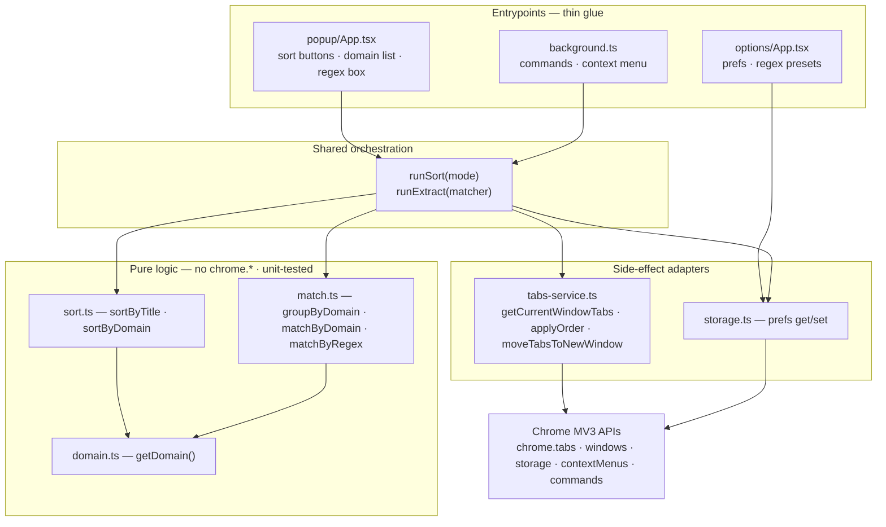
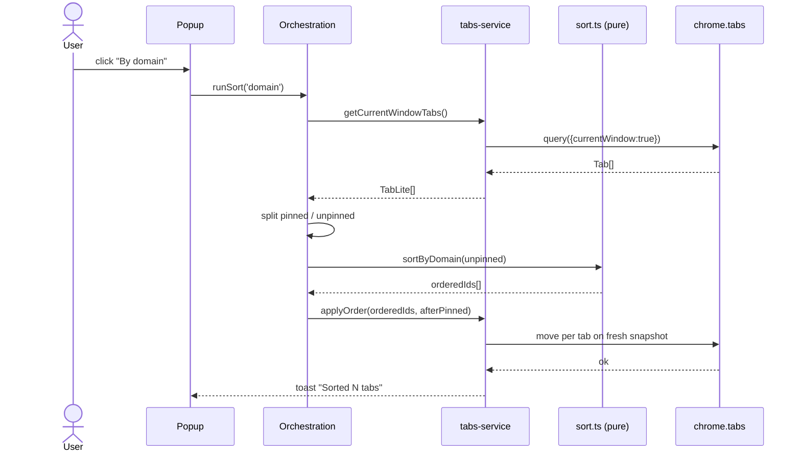
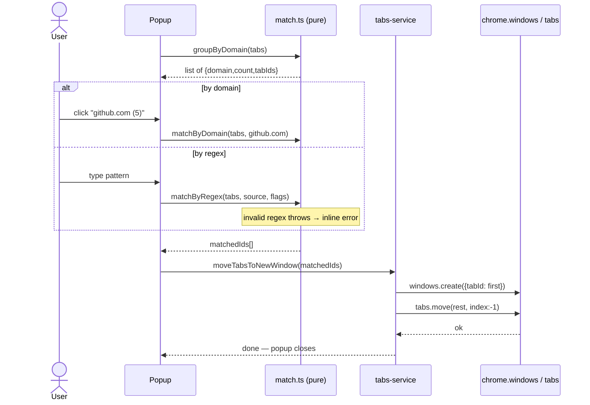

# Tab Sorter — Chrome Extension Design Spec

- **Date:** 2026-06-18
- **Status:** Design approved; scaffold generated. Implementation not yet started.
- **Stack:** Better-T-Stack → WXT addon (React template), Manifest V3, TypeScript, Vite.
- **Repo layout:** npm-workspaces monorepo; extension lives at `apps/extension/`.

## 1. Problem

A Manifest V3 Chrome extension that helps a tab hoarder tame a cluttered window:

1. **Sort** the current window's tabs, either **A→Z by page title** or **grouped by domain** (then by title within each domain).
2. **Extract** tabs matching a **domain** (clickable list) or a **regex/substring** into a **new browser window**.

## 2. Locked decisions

| # | Decision | Choice | Rationale |
|---|----------|--------|-----------|
| 1 | UI framework | **React** (`@wxt-dev/module-react`) | First-class WXT module; zero-friction. Preact would need manual `@preact/preset-vite` wiring. |
| 2 | "Extract" action | **Move matching tabs → new window** | Splits clutter into a focused workspace. (No native Tab Groups, so no `tabGroups` permission.) |
| 3 | Sort scope | **Current window only** | Predictable; never disturbs other windows. |
| 4 | Sort modes | **Two**: `A→Z by title` and `By domain` (domain, then title) | Matches the original "alphabetical OR domain" request. |
| 5 | Match input | **Domain list (with counts) + optional regex/substring** | Click for the common case; regex for power use. |
| 6 | Scope | **Full-featured**: popup + options page + keyboard commands + context menu | User chose the full build. |

## 3. Tech stack & scaffold

Generated with (reproducible):

```
npx create-better-t-stack@latest tab-sorter \
  --frontend none --backend none --runtime none \
  --database none --orm none --api none --auth none --payments none \
  --addons wxt --examples none --db-setup none \
  --web-deploy none --server-deploy none --no-git \
  --package-manager npm --no-install
# WXT addon template: react   (set via create-json addonOptions.wxt.template)
```

Verified: `npm install` + `npm run build` produces a working `chrome-mv3` bundle.

## 4. Permissions (manifest)

| Permission | Why |
|------------|-----|
| `tabs` | Read `url`/`title`, reorder tabs, move tabs to a new window |
| `storage` | Persist options (default sort, ignore-pinned, regex presets) via `chrome.storage.sync` |
| `contextMenus` | Right-click menu actions |
| `commands` | Keyboard shortcuts (declared in manifest) |

**No** `host_permissions`, **no** content scripts, **no** `tabGroups`. Everything runs through extension APIs — privacy-friendly and review-friendly. (The scaffold ships a placeholder `content.ts`; it will be **deleted** during implementation.)

## 5. Architecture

Pure logic is fully separated from Chrome API side effects so the bulk of the
code is unit-testable without a browser.



### Modules (all under `apps/extension/`)

**Shared types — `lib/types.ts`**
```ts
interface TabLite { id: number; url: string; title: string; index: number; pinned: boolean; }
type SortMode = 'title' | 'domain';
interface Prefs { defaultSort: SortMode; ignorePinned: boolean; regexPresets: RegexPreset[]; }
interface RegexPreset { label: string; source: string; flags: string; }
```

**Pure — no `chrome.*`, unit-tested**
- `lib/domain.ts` — `getDomain(url): string`. Strips `www.`; maps `chrome://`, `about:`, `file://`, extension pages to a stable `(scheme)` bucket so nothing falls through.
- `lib/sort.ts` — input `TabLite[]` → output ordered `number[]` (tab ids).
  - `sortByTitle(tabs)` — `Intl.Collator({numeric:true, sensitivity:'base'})` on title; URL as tiebreaker.
  - `sortByDomain(tabs)` — group by `getDomain`, domains A→Z, then `sortByTitle` within each.
- `lib/match.ts`
  - `groupByDomain(tabs): {domain, count, tabIds}[]` — feeds the popup's domain list (sorted count desc, then name).
  - `matchByDomain(tabs, domain): number[]`
  - `matchByRegex(tabs, source, flags): number[]` — tests `title + '\n' + url`; **throws `InvalidPatternError`** on a bad pattern.

**Side-effect adapter — the only file that touches `chrome.*`**
- `lib/tabs-service.ts`
  - `getCurrentWindowTabs(): Promise<TabLite[]>` — `chrome.tabs.query({currentWindow:true})`.
  - `applyOrder(orderedIds, opts): Promise<void>` — moves unpinned tabs into the computed order, **after** the pinned block; runs on a fresh snapshot and ignores ids that vanished mid-move.
  - `moveTabsToNewWindow(tabIds): Promise<void>` — `chrome.windows.create({tabId: first})` then `chrome.tabs.move(rest, {windowId, index:-1})`; focuses the new window.
- `lib/storage.ts` — typed `getPrefs()` / `setPrefs()` over `chrome.storage.sync`, with defaults.

**Orchestration — `lib/orchestration.ts`** (shared by popup, background, context menu)
- `runSort(mode)` and `runExtract(matcher)` — read tabs, apply the pinned split once, call pure logic, then the adapter. No logic is duplicated across entrypoints.

**Entrypoints**
- `entrypoints/popup/` — React UI: two sort buttons, the domain list, regex box (live match-count preview), preset chips.
- `entrypoints/options/` — React UI for `Prefs` + preset management.
- `entrypoints/background.ts` — registers `commands` (hotkeys) and `contextMenus`; both call into `orchestration.ts`.

### Pinned-tab rule (one place, honored everywhere)
Default pref `ignorePinned: true`. Pinned tabs are **excluded** from sorting (kept fixed at the front) and **skipped** by extract. The split happens once in the orchestration layer.

## 6. Data flows

### Sort


### Extract


## 7. Options (chrome.storage.sync)

- `defaultSort: 'title' | 'domain'` — used by the default-action hotkey / context menu.
- `ignorePinned: boolean` (default `true`).
- `regexPresets: { label, source, flags }[]` — surfaced as one-click chips in the popup.

## 8. Keyboard commands & context menu

- **Commands:** `sort-by-title` (suggested `Alt+Shift+T`), `sort-by-domain` (suggested `Alt+Shift+D`) — run the sort orchestration against the focused window without opening the popup.
- **Context menu** (page context): "Sort tabs A→Z", "Sort tabs by domain", and "Extract this site (`<domain>`) → new window" using the clicked tab's domain.

## 9. Edge cases & error handling

| Case | Handling |
|------|----------|
| Invalid regex | `matchByRegex` throws `InvalidPatternError`; popup shows inline red message, no action taken |
| Zero matches | "No tabs match" notice; no window created |
| 0–1 tabs / already sorted | No-op, graceful toast |
| Tab closed mid-operation | `applyOrder`/move runs on a fresh snapshot; stale ids ignored |
| `chrome://`, `file://`, extension pages | `getDomain` buckets them as `(scheme)`; still sortable/movable |
| Pinned tabs | Excluded from reorder (kept at front); skipped by extract when `ignorePinned` |

## 10. Testing

- **Vitest unit tests** on `domain.ts` / `sort.ts` / `match.ts` with fixture `TabLite[]` arrays — this is where nearly all logic lives, so coverage is cheap and high-value.
- **Adapter** (`tabs-service.ts`) kept thin; mock the `browser`/`chrome` global with `@webext-core/fake-browser` or `sinon-chrome`.
- **Manual E2E checklist** loading unpacked from `apps/extension/.output/chrome-mv3`.
- Playwright popup smoke test is **future**, not MVP.

## 11. Project structure (as scaffolded)

```
tab-sorter/                      # npm workspaces monorepo
├── apps/extension/              # the WXT + React extension
│   ├── entrypoints/
│   │   ├── background.ts        # commands + context menu (to be wired)
│   │   ├── content.ts           # DELETE — design uses no content scripts
│   │   └── popup/               # React popup (App.tsx, main.tsx, index.html)
│   │   └── options/             # TO ADD — React options page
│   ├── lib/                     # TO ADD — domain/sort/match/tabs-service/storage/orchestration
│   ├── public/icon/             # extension icons
│   ├── wxt.config.ts            # manifest, permissions, commands
│   └── package.json
├── packages/config/             # shared TS config
├── docs/superpowers/specs/      # this spec
└── package.json                 # workspace root
```

## 12. Open questions for review (intentionally surfaced)

- Is **move-to-new-window** the right primitive for "extract", versus native **Tab Groups**?
- Are the four permissions minimal and justifiable for Chrome Web Store review?
- MV3 **service-worker lifecycle**: top-level `commands`/`contextMenus` listener registration, and `chrome.tabs.move` ordering for batched moves.
- Is **Better-T-Stack + WXT** overkill versus a hand-rolled Vite + CRXJS setup at this scope?

## 13. Next step

Implementation plan via the `superpowers:writing-plans` skill, then build the
`lib/` modules test-first, wire entrypoints, and remove the placeholder content script.
