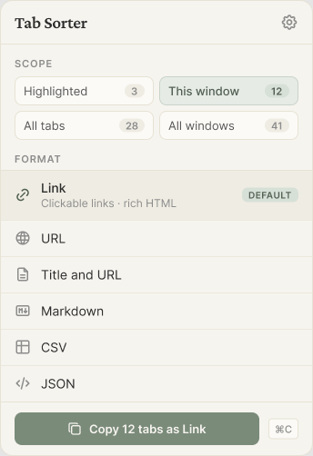

# Design — Tab Copy engine (sub-project A)

**Date:** 2026-06-26
**Status:** Approved design, ready for implementation planning
**Sub-project:** A of 4 (see "Decomposition" below)

## 1. Context

`tab-sorter` (`apps/extension`) is a working, fully-tested WXT/React Manifest V3
extension that **sorts** tabs (A→Z, by domain), **extracts** matching tabs to a
new window, and **exports** tab URLs as Markdown/plain-text. Its architecture is
pure logic (`domain/sort/match/export`) + a single Chrome adapter
(`tabs-service`) wired by `orchestration`, with thin React entrypoints and a
background worker. Design language is **"Soft Editorial"** (warm paper, sage
accent, Crimson Pro + Inter — see `design/stitch/SOFT-EDITORIAL.md`).

`tab-copy-master/` is the mature donor: the "Tab Copy" extension that copies tabs
to the clipboard in many **formats** (Link, URL, Title & URL, Title, Markdown,
CSV, JSON, HTML) with text **and** rich-HTML clipboard output, format **opts**, a
**custom-format template engine**, **scopes** (tab / window / all), **context
menus**, and **keyboard shortcuts**.

This sub-project ports the donor's copy engine into `tab-sorter`.

### Decomposition (the full request)

The original ask spans four independent subsystems plus a cross-cutting design
pass. Each gets its own spec → plan → build cycle:

- **A — Copy / Export engine** (this doc): port the format + clipboard engine.
- **B — Destinations**: cloud backup (iCloud / Dropbox / Drive), Airtable API,
  Google Sheets. Built as additional **Sinks** on the seam A establishes.
- **C — Declutter / de-dup**: find and close duplicate / stale tabs.
- **D — AI-native surface**: MCP server / CLI / "code mode" exposing A/B/C.

Design (Figma + Stitch) is not a sub-project; it rides along with each piece's UI.

## 2. Goals / non-goals

**Goals**
- Full-parity port of the donor copy engine: all builtin formats, custom-format
  templates, rich text+HTML clipboard, scopes, context menus, keyboard shortcuts.
- Re-implemented in `tab-sorter`'s pure-logic + single-adapter style with TDD —
  not a verbatim lift. Donor format specs are the reference for **correct output**.
- Establish a **Sink seam** so sub-project B is "add a sink", not "re-architect".
- The new Copy UI in the established Soft Editorial language.

**Non-goals (this cycle)**
- The actual record/cloud sinks (Airtable / Sheets / Drive) — that's B. A builds
  only the structured `entries[]` producer and the Sink interface.
- Declutter/de-dup (C) and the AI-native surface (D).
- Migrating donor-extension users' settings (different extension id).

## 3. Key decisions

| Decision | Choice |
|---|---|
| Port scope | **Full parity** — everything the donor does |
| Port strategy | **Re-implement** in tab-sorter pure-logic style, TDD |
| Parity bar | **Byte-for-byte by default + a documented deviations log** |
| Sink seam | **Build this cycle** — refactor `export.ts` behind a `Sink` interface |
| Delivery | **Phased, 3 milestones** (M1 usable copy fast → M3 full parity) |
| UI | **Soft Editorial primary**; keyboard-first "command palette" documented as companion |

## 4. Architecture

### 4.1 The core seam

Separate **what content** (pure render engine) from **where it goes** (sinks):

```
  Scope ─┐
  Format ├─► gather tabs ─► render(format, opts) ─► CopyPayload ─► Sink
  + opts ─┘    (scopes,                                             • clipboard   (M1)
               grouping)                                            • file download (M1, refactor of export.ts)
                                                                    • record sinks: Airtable / Sheets / cloud (sub-project B)
```

### 4.2 CopyPayload (verified — corrected from the naive `ExportEntry` reuse)

Clipboard/file want a rendered string; record sinks (Airtable/Sheets) want
structured per-tab rows. The payload carries **both** channels and is
**discriminated by scope** (a flat list cannot express window grouping):

```ts
type CopyPayload =
  | { scope: "tab";    entries: TabRecord[]; rendered?: Rendered }
  | { scope: "window";
      windows: { windowSeq: number; entries: TabRecord[] }[];
      entries: TabRecord[];          // flattened, for flat record sinks
      rendered?: Rendered };

type TabRecord = {
  title: string; url: string;
  favIconUrl?: string; domain?: string; pinned?: boolean; index?: number;
  windowSeq?: number; windowTabSeq?: number; globalSeq: number;  // engine-computed
};

type Rendered = { text: string; html?: string };   // text always; html iff format defines an html transform
```

`filename`/`mime` are **sink-side** decisions (a `FileSink` derives them from the
format) — they are deliberately NOT in the engine payload, so the engine stays
ignorant of sinks. `Sink` is one method: `consume(payload: CopyPayload): Promise<void>`.
String sinks read `rendered`; record sinks read `entries`/`windows`.

### 4.3 Clipboard: two mechanisms (verified against donor)

MV3 forces **two distinct write paths** — do not unify them:

- **Popup (focusable):** `navigator.clipboard.write([new ClipboardItem({ "text/plain": Blob, "text/html": Blob })])`.
- **Background (context-menu / command / one-click action):** route to an
  **offscreen document** that writes via **legacy `document.execCommand('copy')`**
  + `clipboardData.setData('text/plain'|'text/html', …)`. Offscreen documents
  **cannot be focused**, so `navigator.clipboard` is unavailable there.

**Manifest deltas required** (none present today): `offscreen` and
`clipboardWrite` permissions (the latter is what makes `execCommand('copy')`
succeed — it returns `false` without it even when the Clipboard web perm is
granted), `minimum_chrome_version: "116"`. Optional: `notifications`.

**Offscreen lifecycle (port verbatim — these are high-severity races):**
`offscreen.html` contains a `<textarea id="clipboard">`; a `creatingOffscreenDoc`
concurrency guard; a `getContexts` existence check with a "doc-exists-but-pending"
await branch; a 5000 ms delayed `window.close()` reset by `clearTimeout` on every
inbound message; `return true` for async `sendResponse`.

Hard routing rule: **never call `navigator.clipboard.write` from the service
worker** — it fails silently (unfocused).

### 4.4 Type design (serves the repo's TS type-design mission)

Port the donor's four patterns AND tighten them:
- Format registry: `as const satisfies Format[]` → derived `FormatId` union.
- `FormatOpts`: key-remapped mapped type (per-id opts; opts-less formats map to
  `?: undefined`). Only `link`, `titleUrl1Line`, `json`, `htmlTable`, and custom
  carry opts — preserve the `undefined` branch.
- `getFormat<T>`: conditional/narrowing return; made **sound** (branch on
  `isCustomFormatId`, typed lookup) rather than the donor's `as` assertion.
- Type guards (`isFormatId`, `isCustomFormatId`, `parseActionMenuId`, …) at every
  string→union boundary.

The donor is **not** `any`-free (`Format<T extends Record<string, any>>` + ~8
`as` casts). The re-implementation uses a `defineFormat<O>()` helper that
**infers** `O` from the opts literal, so each format's callbacks receive a
precisely-typed `opts` — eliminating the casts (compile-time only; output
identical). One unavoidable cast remains at the **storage boundary** (persisted
opts are untrusted JSON) — documented, isolated to the storage adapter.

### 4.5 Module map

Pure logic (`lib/copy/`, fully unit-testable):

| Module | Job |
|---|---|
| `scope.ts` | 4-scope catalog + `isTabScopeId`; `selectScope()` with **per-scope filter divergence** (highlighted-tabs bypass the pinned filter), empty-window drop, tab-flat vs window-grouped `ScopeSelection` |
| `format.ts` | registry via `defineFormat`; per-format text/html transforms, default opts, `isInvalid` |
| `template.ts` | custom-format token engine; per-field token allow-lists; literal-survival; injected `Clock` + `parseUrl` |
| `configured-format.ts` | **whole-object** opts overlay (not per-key merge); `FormatOpts`; injected `getFormatById` resolver for link's fallback (+ recursion guard) |
| `render.ts` | assembly walk (`start`/`windowStart`/`tab`/`tabDelimiter`/`windowEnd`/`windowDelimiter`/`end`); `globalSeq`/`windowSeq`/`windowTabSeq`; empty-selection-still-renders |
| `entries.ts` | grouped tabs → `TabRecord[]` (+ `windows[]`) for record sinks (feeds B) |
| `menu-id.ts` | `ActionMenuId` codec `${copyMenuId}/${copySubject}/${formatId}` + guards |
| `menu-structure.ts` | pure `buildCopyMenuTree` (Branch A/B), `&`→`&&` accelerator escaping |
| `commands.ts` | `commandNameScopeId`, `resolveCommandScope`, `getDummyTab` (link/image/video/audio subjects) |
| `prefs.ts` | visibility/order/default algebra; add/remove custom format; `MIN_VISIBLE_FORMAT_COUNT=3`, `MIN_VISIBLE_SCOPE_COUNT=1` |
| `options-spec.ts` | the 9 boolean options + sub-option gating + guards |
| `ids.ts` | `custom-${nanoid}` creation |
| `string.ts`, `csv.ts` | shared `sentenceCase`/`indent`/`encodeHtml`/CSV quoting (used by format **and** template — own modules to avoid a format↔template dependency) |

Adapters (`lib/`):

| Module | Job |
|---|---|
| `tabs-service.ts` *(extend)* | `getScopeSnapshot`: `tabs.query` (highlighted) + `windows.getAll({populate:true})`; `toTabLite` adds `favIconUrl`, `highlighted` |
| `clipboard/clipboard-item.ts` | pure: build the ClipboardItem / mime map |
| `clipboard/navigator-clipboard.ts` | adapter: popup-path write |
| `clipboard/offscreen-client.ts` | adapter: background-side offscreen lifecycle + message passing |
| `sinks/sink.ts`, `sinks/clipboard-sink.ts`, `sinks/file-download-sink.ts` | `Sink` interface; first two sinks (file sink owns filename/mime; refactor of `export.ts`) |
| `orchestration.ts` *(extend)* | `runCopy(trigger, scopeId, formatId, sink)`; enumerate trigger surfaces; popup-vs-legacy write-path selection |
| `storage.ts` *(extend)* | persist copy prefs |

Entrypoints:

| Entry | Job |
|---|---|
| `background.ts` *(extend)* | context-menu register + refresh-on-storage-change; `onCommand`; **`action.onClicked`** one-click (when popup disabled); `setIconAction`/`setPopup`; icon-flash feedback |
| `offscreen.ts` *(new)* | offscreen doc: `<textarea id="clipboard">`, legacy write, 5 s close race |
| `popup/`, `options/` | React UI (§6) |

`TabLite` gains `favIconUrl?` and `highlighted?` (or a snapshot carrying highlighted ids).

## 5. Subsystem notes (parity-critical details)

- **Formats** (exact output shapes captured in the donor map): `link` (delegates
  its text channel to a fallback format; html = anchor tags; opt
  `plaintextFallback` default `'url'`, no self-reference), `url`, `titleUrl1Line`
  (opt `separator` default `': '`), `titleUrl2Line`, `title` (empty title → url),
  `markdown` (`[` `]` title-escape, `(` `)` url-escape), `csv`, `json`
  (`favIconUrl`; opts `properties`/`pretty`/`indent` 1..10 + `isInvalid`),
  `htmlTable` (opt `includeHeader`), custom. Window scope fires
  `windowStart`/`windowEnd`/`windowDelimiter` and emits "Window N" headers/columns;
  tab scope skips them.
- **Whole-object opts overlay**: stored opts **replace** the default opts object,
  not deep-merge — parity-critical.
- **Templates**: 7 fields, each with a token allow-list; an out-of-allow-list
  token survives **literally** as `[token]`. `[date]`/`[time]` use locale/TZ —
  pin in tests. Inject `Clock` + `parseUrl`.
- **Scopes**: highlighted-tabs uses **unfiltered** tabs (pinned-immune); other
  scopes apply the pinned filter; empty windows dropped after filtering; all-tabs
  flat vs all-windows-and-tabs grouped.
- **Menus/commands**: two top-level menus, full teardown/rebuild on change,
  Branch A (per-format submenus) vs Branch B (single action), the action-menu id
  codec, `getDummyTab` for non-tab copy subjects, command ids `1copy-…`–`4copy-…`.
- **Feedback**: donor writes copy status to storage (popup `close()` interrupts
  runtime messaging) → icon flash + optional notification. We keep icon-flash +
  in-popup confirm; notification behind the `notifications` perm.

## 6. UI / UX

**M1 — Copy popup** (Soft Editorial; real Figma file:
`https://www.figma.com/design/4cqqFsI0Bu32nD5wGFabsV`):
header (Crimson Pro title + settings gear) · **Scope** 2×2 tiles with live count
badges (active tile sage-tinted) · **Format** list (visible formats; default
pinned with a "Default" pill; sage-tinted active row) · footer sage **Copy** action
+ `⌘C` chip. Clicking a format copies the current scope in that format and shows
"Copied N tabs".



*M1 Copy popup, built in Figma in the Soft Editorial language ([live file](https://www.figma.com/design/4cqqFsI0Bu32nD5wGFabsV)).*

**M3 — Options page**: format manager (drag-reorder, visibility toggles,
set-default, per-format opts editors, **custom-format template editor with live
preview**), scope visibility, and the 9 settings toggles with sub-option gating.

**Design artifacts**: Figma (tasteful primary, link above);
`design/stitch/copy-popup-soft-editorial.html` (primary mockup);
`design/stitch/variants/5-tab-copy-command-companion.html` (keyboard-first
companion / future power-user mode).

## 7. Milestones (all within sub-project A)

- **M1 — Usable copy.** `scope` + `format` + `template` + `configured-format` +
  `render` + `entries` pure core; `clipboard-item` + `navigator-clipboard` +
  popup; `sinks/` (clipboard + file-download, refactor `export.ts`); the Copy
  popup. Result: pick scope + format in the popup → copies.
- **M2 — Background surfaces.** context menus (`menu-id`, `menu-structure`,
  subjects, `getDummyTab`), keyboard commands (`commands`), `action.onClicked`
  one-click, the offscreen path (`offscreen.ts` + `offscreen-client`), manifest
  permission deltas, icon-flash feedback.
- **M3 — Management.** `prefs`, `options-spec`, `ids`, storage persistence, and
  the options page (format manager + custom-format editor + settings).

## 8. Parity test strategy (TDD)

Fixed synthetic fixture dataset covering edge cases: untitled tab, `about:`/`chrome:`
URL, pinned tab, favicon present/absent, bracket/paren/special-char titles, empty
selection, single- and multi-window. For every builtin format × opt combination ×
scope, capture the donor's exact output as a **golden string** (derived from the
mapped output shapes, cross-checked by running the donor's pure transforms under
Vitest where feasible). Tests assert `render() === golden`, plus: window grouping,
sequence numbering, empty-selection-still-renders, template token allow-lists and
literal-survival, whole-object opts overlay, link fallback + recursion guard.
Adapters (clipboard/offscreen/tabs) get thin integration/smoke tests; the pure
logic carries the suite. Locale/TZ pinned for date/time tokens.

## 9. Deviations log (deliberate, byte-affecting where noted)

1. Skip `v3-migration` — different extension id, no donor users to migrate.
2. Copy gets its **own** `includePinned` flag defaulting to donor behavior
   (include pinned); tab-sorter's `DEFAULT_PREFS.ignorePinned: true` would
   otherwise silently break byte-parity.
3. Drop the `nxs` web custom format (dead code in donor).
4. `defineFormat<O>()` opts inference removes the donor's `Record<string, any>` +
   ~8 `as` casts — compile-time only, output identical.
5. Malformed-URL custom tokens (`about:`/`chrome:`/empty) emit **empty**, not
   throw mid-copy (donor throws). Byte-deviation on those tabs.
6. Feedback defaults to icon-flash + in-popup confirm; notification behind the
   `notifications` permission.
7. Donor-parity Markdown becomes canonical; the existing `export.ts`
   domain-grouped Markdown is demoted to a future format opt (avoids two
   incompatible Markdowns).
8. The donor builtins `bbcode` and the standalone `html` (single `<h2>`-style)
   format are intentionally **not ported** — the 9 ported builtins (`link`,
   `url`, `titleUrl1Line`, `titleUrl2Line`, `title`, `markdown`, `csv`, `json`,
   `htmlTable`) are the scoped set for M1 work. Byte-deviation on any copy
   request that referenced those two formats in the donor.
9. Module K uses a **separate copy-engine `TabLite`** in `lib/copy/types.ts`
   (carrying `favIconUrl` and `highlighted`) rather than widening the sort
   feature's `lib/types.ts` `TabLite`. The sort and copy pipelines never bridge,
   so duplicating the fields in the sort type would be confusing. This diverges
   from the plan's file-table wording (which listed both features sharing one
   `TabLite`) — that wording is an inaccuracy in the plan, not an intent to
   couple the pipelines.

## 10. Permissions / manifest deltas (`wxt.config.ts`)

Add permissions `offscreen`, `clipboardWrite` (and optional `notifications`);
`minimum_chrome_version: "116"`; commands `1copy-highlighted-tabs`,
`2copy-window-tabs`, `3copy-all-tabs`, `4copy-all-windows-and-tabs`.

## 11. References

- Donor source: `tab-copy-master/src/` — `format.ts`, `configured-format.ts`,
  `template-field.ts`, `scope.ts`, `copy.ts`, `offscreen.ts`,
  `offscreen-actions.ts`, `copy-menus.ts`, `keyboard.ts`, `storage.ts`,
  `options.ts`, `util/{clipboard,csv,string,nxs-mime-type}.ts`.
- Target: `apps/extension/lib/`, `apps/extension/entrypoints/`, `wxt.config.ts`.
- Design system: `design/stitch/SOFT-EDITORIAL.md`.
- Grounding pass: workflow `tabcopy-parity-map` (7 subsystem maps + 4 adversarial
  verifiers + completeness critic) — verified the CopyPayload shape, the
  offscreen/`clipboardWrite` mechanism, the type model, and decomposition gaps.
